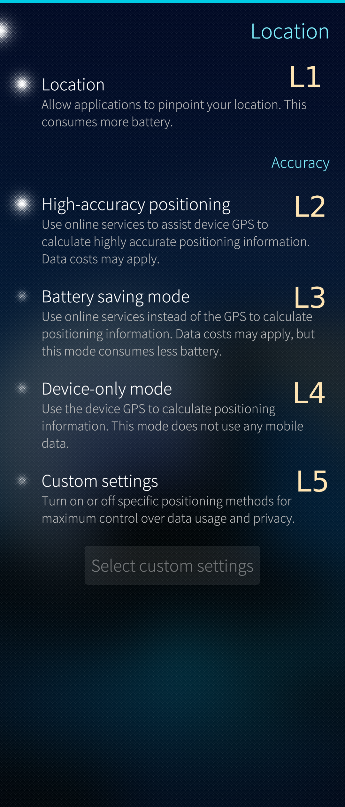
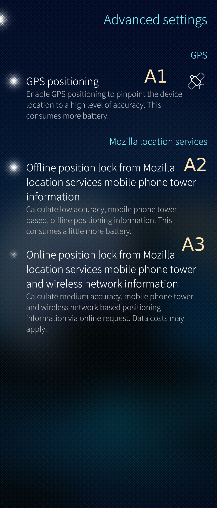
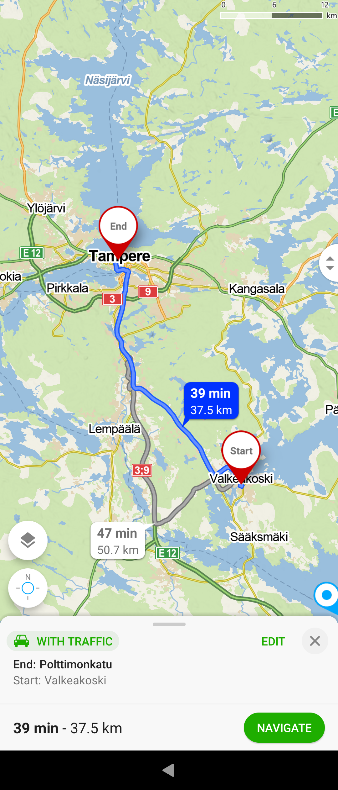
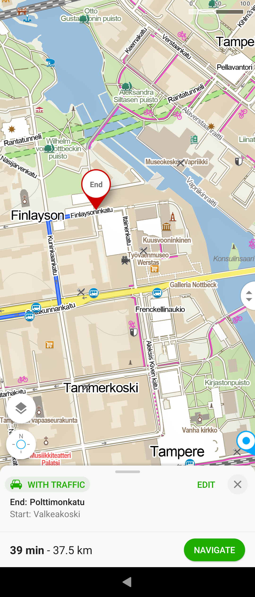

# Location service 

The location service on Sailfish devices is similar to that commonly used on mobile phones. It relies on the satellite navigation and on assisting services (offline or online).

Satellite navigation is implemented with the Global Navigation Satellite System (GNSS)[^1]. A mobile phone has a built-in receiver for one or more GNSS satellites. The phone calculates its location from the data sent by the satellites. For a satisfactory accuracy, strong signals from at least four satellites are required. When the phone was able to calculate the coordinates we say that it "got the fix". An open map app should be able to show your location. Note that GNSS reception may not work well enough inside buildings.

Assisting services are mostly based on the known locations of the base stations of mobile telephone networks. Also, the known locations of WiFi stations can be used. These services can be "offline" if the phone has some preloaded data, or "online" when the phone is searching for relevant data from the internet while determining the location. Assisting data helps the phone calculate a coarse location first, after which it is less demanding the calculate accurate location with the help of the satellite signals.

Sailfish OS does not have access to the Google services, so some Android apps requiring that may not work well or at all. 

## Settings of the location service

Switch L1 [(see Pic 1)](#picture_1) dictates if the location service runs on your device or not. Switches L2 to L5 provide different ways to calculate the location.
* **L2 is the option to ensure the best speed and accuracy** in getting the location of the device. **We recommend using this option**.
* L3 helps to save battery power by turning the GNSS service ("GPS") off. However, it may take long to get the location by using the online services.
* L4 is to save data costs by not using the online services. The location is calculated by using the GNSS data only. It may take time to do it.
* L5 is the switch to the advanced settings ([Pic 2](#picture_2)). Enable L5 and tap the button "Select custom settings" [^3].

The purpose of the advanced settings is to select the used services with more precise granularity.
* A1 means "GNSS only" if used alone. This corresponds to L4. A1 can be complemented with A2 and A3.
* A2 relies the offline Mozilla location services [^3]. It could be combined to A1 or used alone.
* A3 enables using the online Mozilla location services [^3]. A3 is bundled with A2 (for an unknown reason).

* 
  
    Pic 1: Basic location settings
  
* 
  
    Pic 2: Advanced location settings
  

## Assistance

Jolla Store has some assisting data sets that one can download and install on the phone. They make the calculation of location faster. The following data sets are available:
* Positioning - Australia
* Positioning - India
* Positioning - Eastern Europe
* Positioning - Northern Europe
* Positioning - Southern Europe
* Positioning - Western Europe

 You get the benefit of these data sets by choosing option L2.

# Map apps

Sailfish OS devices are run both native Sailfish map apps and Android apps. [Jolla Store](/Support/Help_Articles/Jolla_Store/) has some native apps and the [Open Repos](https://openrepos.net/category/city-guides-maps) distribution some more. Android stores have a good variety of Android map apps.

Switches L1 and L2 shall be enabled to make the location data available for map apps [(see Pic 1)](#picture_1).

## Sailfish apps

There are the two popular Sailfish map apps available for all devices in Jolla Store. More recent versions of them may be available in the Open Repos distribution.
Both of these apps rely on [Open Street Maps](https://www.openstreetmap.org/about).

* Pure Maps
* OSM Scout (with or without OSM Scout Server [^2])

In addition, the good old Sailfish Maps is available for Jolla Phone, Jolla Tablet and Jolla C but not for other devices.

There is one more app worth trying, the GPSInfo. This is not a map app but a handy tool for observing satellites and for following how the phone gradually gets the fix.

* 
  
    Pic 3: Pure Maps searching for location
  

## Android apps

The apps below belong to the author's favourites. The first one, Here WeGo, is also available in Jolla Store, however, as that version is quite old we recommend getting the app from one of the [Android app stores](/Support/Help_Articles/Android_App_Support/).

The rest of these apps use Open Street Maps.

* Here WeGo (good voice-navigation app)
* Mapy.cz   (easy to use, beautiful and simple graphics)
* OsmAnd    (an abundance of settings and views, takes time to learn it)
* Organic Maps
* Waze

* 
  
    Pic 4: Mapy.cz showing the route to Tampere
  
* 
  
    Pic 5: End of route zoomed in
  

-----
[^1]: GNSS is the common name for the satellite navigation systems of various countries and organisations, including GPS, Glonass, Galileo, BeiDou, and some others. A mobile phone can typically use the signals of several navigation systems. In everyday speech, we tend to talk about "GPS" when we actually mean GNSS, the combination of different systems.
[^2]: Helps downloading offline maps of wanted regions
[^3]: Mozilla has changed their policy since 2020, and therefore their service may not work. We recommend using option L2.

