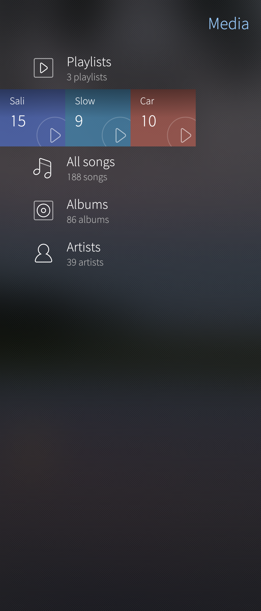
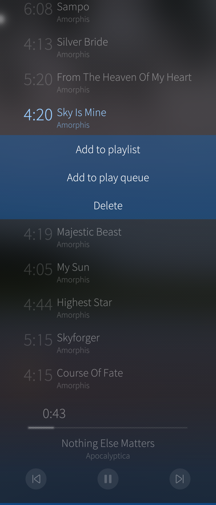
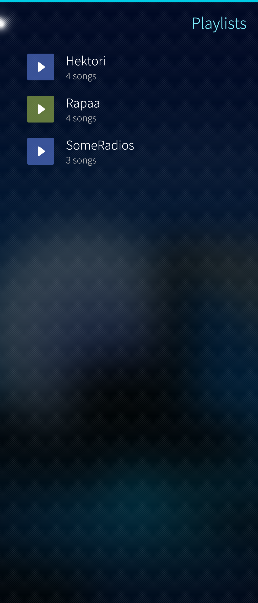
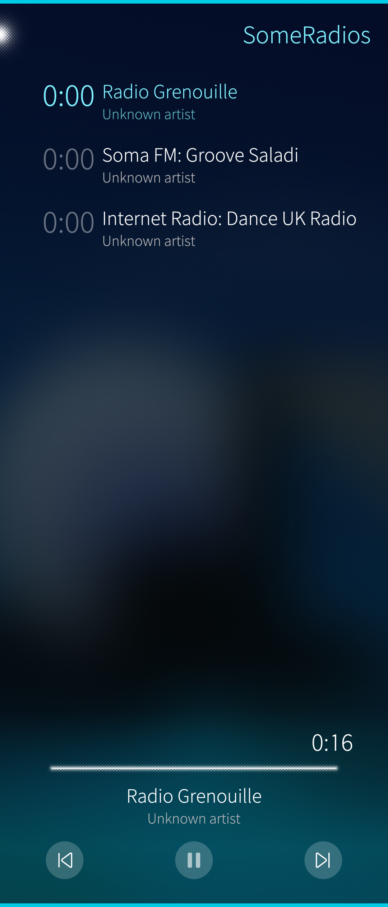

This article is about the Media application that can be download from the Jolla Store.
It is possible to add music to your Sailfish device, either to the Mass storage or to a micro SD memory card in the device. More information about the SD card can be found [here](/Support/Help_Articles/SD_Card_Format_and_Encryption/).

# Media application

Media application main view has following content

<div class="flex-images" markdown="1">

* <a href="Media_main_view.png" class="narrow-image"></a>
  <span class="md_figcaption">
  </span>
</div>

In that view you can see all playlists, songs, albums and artist on your Sailfish device. You can create new Playlists by tapping "Playlists" and from then Playlist view you can add playlist from the pulley menu, you can also use search.

From the All songs view songs can be added to playlists, added to play queue or can be deleted (note that the delete actually removes the song from the device). From the pulley menu songs can be also shuffled and searched, search is also available under Albums and Artists. Please note that songs in the queue will be removed when the Media application is closed.

<div class="flex-images" markdown="1">

* <a href="All_songs.png" class="narrow-image"></a>
  <span class="md_figcaption">
  </span>
</div>

# Instructions for Windows and Linux PCs to transfer music to your Sailfish device.
1. Connect your Sailfish device to your computer using a USB cable
2. Choose 'Media transfer (MTP)' in the dialog that appears on the screen of the Sailfish device.
3. Your Sailfish device appears on the PC, there are 'Card' and 'Mass storage'.
4. Copy your mp3 files from the PC to folders in the device memory or in the memory card.
5. Prefered location for the music files is the default folder 'Music'.
6. Once you have copied the music files check with PC that the files appear on their target folders on the Sailfish device.
7. Disconnect the USB cable from the device as soon as you are sure that the files have been copied.
8. Wait a couple of minutes so that the indexing of the files gets done.
9. You now have the music files in the device, and they appear in the Media application.

You can read more about [moving files between a PC and a Sailfish Device](/Support/Help_Articles/Moving_Files_Between_PC_and_Sailfish_Device/) and [moving files between a Mac and a Sailfish Device](/Support/Help_Articles/Moving_Files_between_Mac_and_Sailfish_Device/)

# Backups and music files

Sailfish OS does not currently include any music files to the Backup. Therefore we recommend keeping the music in the SD card - Media app can find and play the music in the card equally well. If you have music in the device memory it is best to make sure that your only copy of the music is not in Sailfish device memory. However playlists are included in the backups.

# Adding a playlist for Internet streaming

The Media app supports Internet streaming (e.g. Internet radio stations) but there is no support for this in the user-interface of this app. 

This chapter has the instructions for adding a playlist for Internet streaming. The playlist makes it easy to use the streaming as the list appears among the song playlists and can be used in the same way.See the two pictures below.

Making the streaming playlist requires that some lines of text are written to a new playlist file in directory ```/home/defaultuser/Music/playlists/```. We have given the name "SomeRadios.pls" for the file but feel free to change it (the extension must remain as pls). You will need to enable the **[Developer mode](/Support/Help_Articles/Enabling_Developer_Mode/)** on your phone.
Get the root permissions and create/edit the file like this:

```
devel-su
vi /home/defaultuser/Music/playlists/SomeRadios.pls
```

Our example file below has three examples (a random selection) of radio stations streaming music. The file must have the section name `[playlist]` on the first line and `NumberOfEntries=` with the correct digit on the last line. 
```
[playlist]
File1=http://live.radiogrenouille.com:80/live
Title1=Radio Grenouille
File2=http://ice1.somafm.com/groovesalad-128-mp3
Title2=Soma FM: Groove Saladi
File3=http://uk2.internet-radio.com:8024/listen.pls&t=.pls
Title3=Internet Radio: Dance UK Radio
NumberOfEntries=3
```

<div class="flex-images" markdown="1">

* <a href="playlists_showing_streaming_pl.png"></a>
  <span class="md_figcaption">
    Streaming playlist in the playlist view
  </span>
* <a href="media_streaming_playlist.png"></a>
  <span class="md_figcaption">
    Example of a streaming playlist with 3 radio stations
  </span>
</div>


# Related articles

[Ringtones and Notifications](/Support/Help_Articles/Ringtones_and_Notifications/).

[Multimedia: Which kind of media, music & video files does Jolla support?](/Reference/Core_Areas_and_APIs/Multimedia/).

[What kind of SD cards and formats are supported](/Support/Help_Articles/SD_Card_Format_and_Encryption/).
