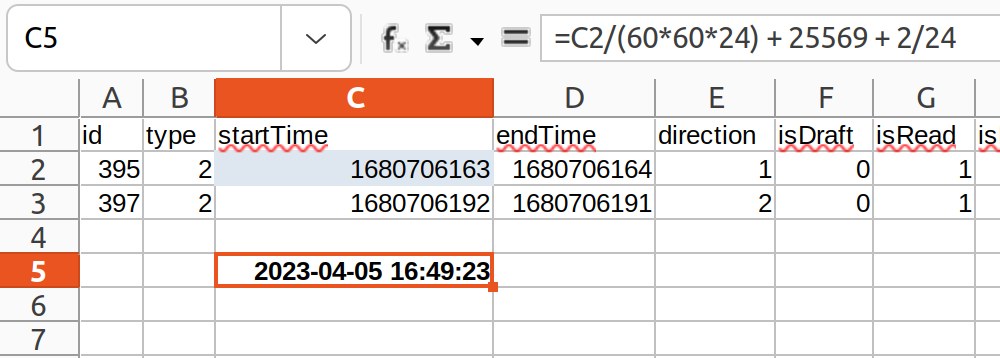

This document explains how to copy the text of SMS, MMS and IM messages from the SQLite database of the Sailfish OS to CSV files, making it possible to **process the text** further with a spreadsheet program. Note: the attachments of MMS messages must be handled separately - they cannot be included in the CSV files.

If you just want to save your messages without the need to edit the texts, use the Sailfish **[Backup](https://docs.sailfishos.org/Support/Help_Articles/Backup/)**. A backup restored to the phone will make the saved messages appear in the Messages app again. Alternatively, save a dump from the database to a file and import it back to the phone later by following **[these instructions](https://docs.sailfishos.org/Reference/Sailfish_OS_Cheat_Sheet/#messages)**.

# Preparations

Enable the [**Developer Mode**](/Support/Help_Articles/Enabling_Developer_Mode/).

Open the Terminal app on your computer and create an SSH connection to your Sailfish device
* SSH over USB from Windows to Sailfish: **[read this](/Support/Help_Articles/SSH_and_SCP/SSH_and_SCP_Windows/)**
* SSH over USB from Ubuntu to Sailfish: **[read this](/Support/Help_Articles/SSH_and_SCP/SSH_and_SCP_Linux/)**

Install the `sqlite` utility:

```
devel-su
pkcon refresh
pkcon install sqlite
exit
```

# Accessing the messages database

Give the following commands to access the SQL database and to save the messages to CSV files. 

```
sqlite3 $HOME/.local/share/commhistory/commhistory.db

sqlite> .headers on
sqlite> .mode csv

sqlite> .output SMS.csv
sqlite> select * from events where type = 2;

sqlite> .output MMS.csv
sqlite> select * from events where type = 6;

sqlite> .output IM.csv
sqlite> select * from events where type = 1;

sqlite> .quit  
exit

```

# Collecting the data and transferring it to the computer
 
* Exit SSH
* Disconnect the USB
* Use SCP or MTP to move the CSV files from the phone to the computer

# Processing the data with a spreadsheet program

Open a CSV file with Libre Office or Excel. Do the "Text to Columns" operation for column A using a comma as the delimiter (this may be automated).

The message texts are in column P.

<div class="flex-images" markdown="1">

* <a href="Message_texts.png"></a>
  <span class="md_figcaption">
    The message texts
  </span>
</div>

The columns "startTime" and "endTime" contain the timestamps related to each message. The date and time of the messages are given in the Unix timestamp ("Epoch format") as "seconds from 1970-01-01".

It is possible to create a formula for LibreOffice (or Excel) to do the conversion automatically [^1]. Sailfish OS has those time values in seconds and corresponding to the UTC time. Hence the initial conversion formula is:

```
C5 = C2/(60*60*24) + 25569
```

where cell C2 holds the value in seconds from Sailfish and C5 is the result in days. The weird constant 25569 is the number of days from the epoch date 1899-12-31, used in the spreadsheet app, to the Unix epoch date 1970-01-01 (70 years = 25569 days). You probably want to convert the result to your time zone, too. If you are located 2 hours east of the UTC zone, for instance, you'll need to add 2/24 days to the formula, making it to:

```
C5 = C2/(60*60*24) + 25569 + 2/24
```

Show the C5 value on LibreOffice (or Excel) using the data and time format of your liking (e.g. YYYY-MM-DD HH:MM:SS).

<div class="flex-images" markdown="1">

* <a href="Local_time.png"></a>
  <span class="md_figcaption">
    Time value converted to local time
  </span>
</div>

----
[^1]: [https://unix.stackexchange.com/questions/421354/convert-epoch-time-to-human-readable-in-libreoffice-calc](https://unix.stackexchange.com/questions/421354/convert-epoch-time-to-human-readable-in-libreoffice-calc)
