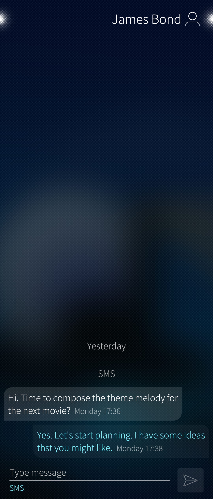
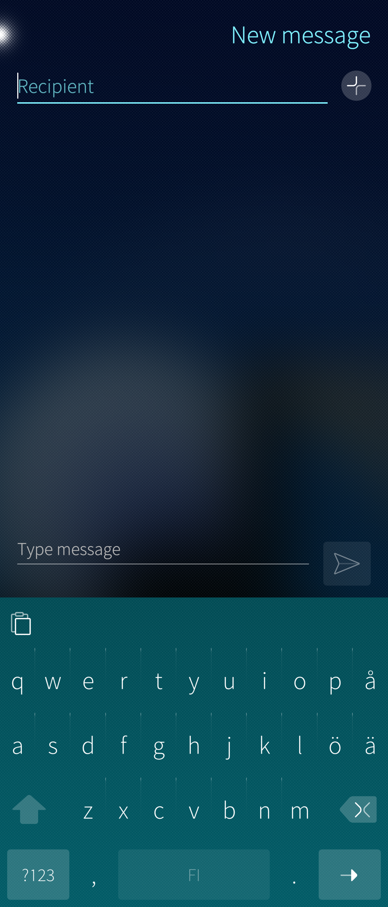
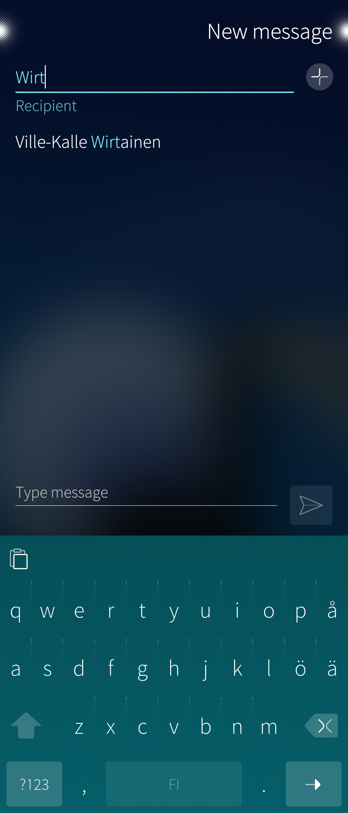
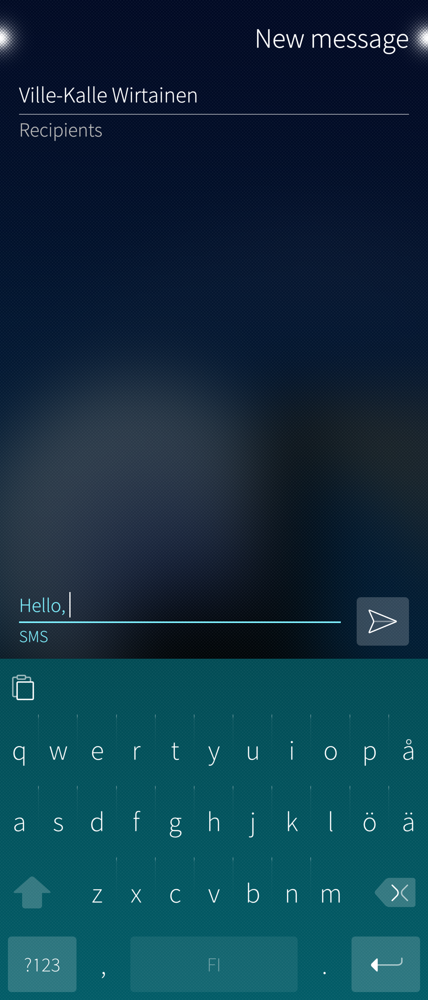
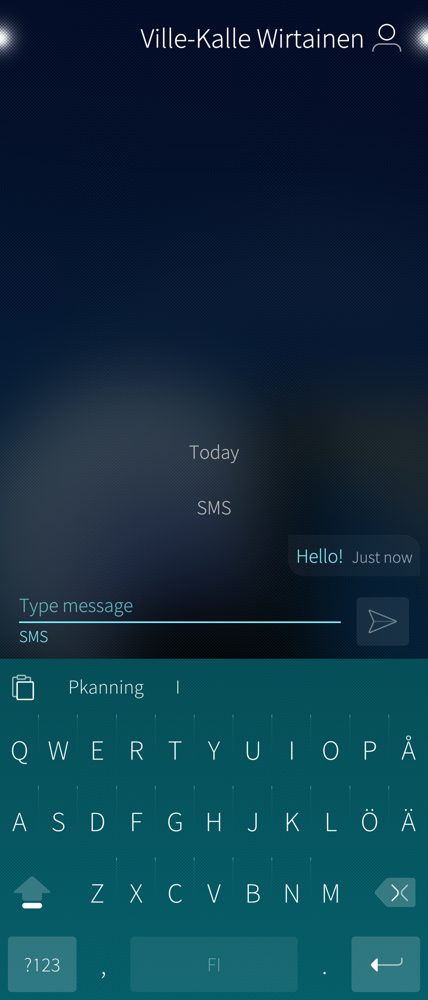
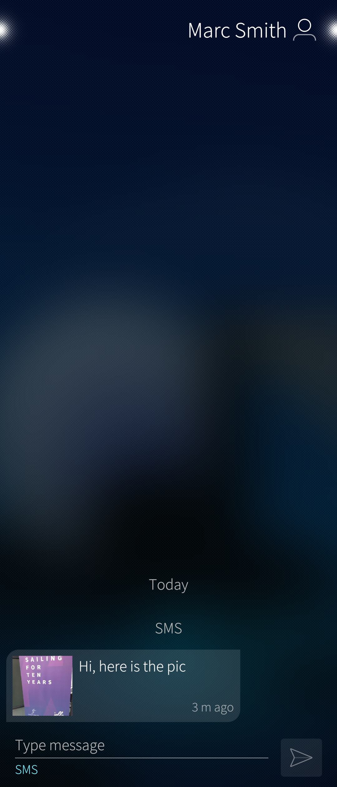
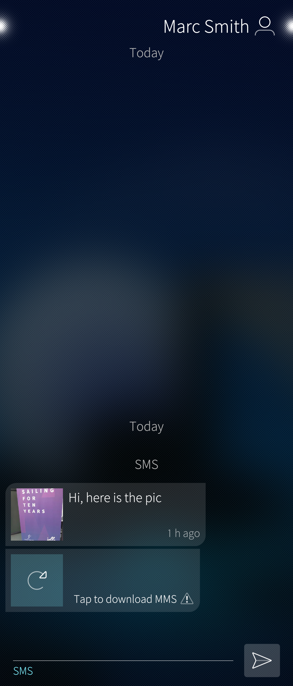
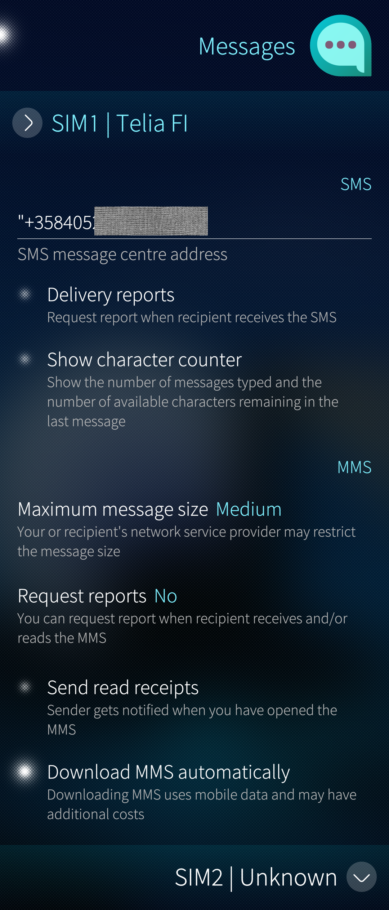
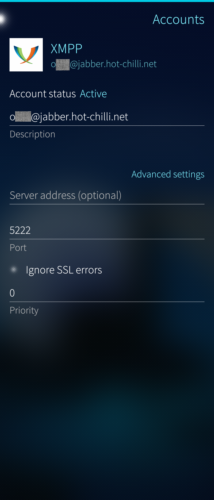
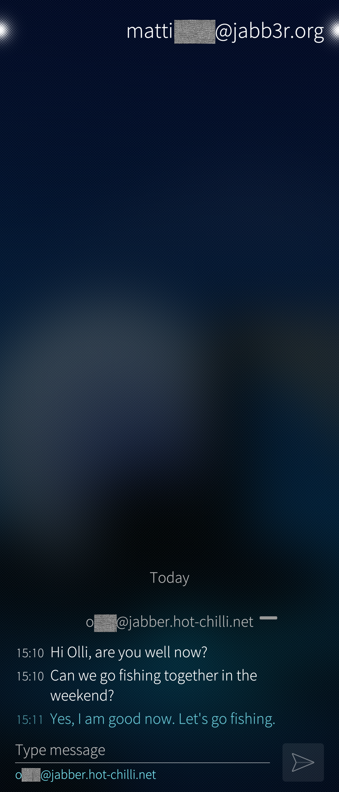

The Messages app is one of the default apps of Sailfish OS. It is used for sending and receiving GSM text and multimedia messages (SMS and MMS). This app has basic support for Instant Messaging (IM), too. It is also possible to respond to XMPP messages received earlier.

Both message types (SMS, MMS) are subject to size limitations set by the GSM specifications and by the network service providers. The maximum length of text messages varies from 160 to a few hundred characters. The maximum size of an MMS message (including the multimedia attachment) is from 100 kilobytes to 1000 kilobytes.

# Inbox view and conversation view

The first picture below (Pic 1) shows the inbox view of the Messages app (a.k.a. the home view). Each previous contact has an item showing a brief quote about the chat and the time of the last conversation.

Tapping an item opens up the conversation view showing the discussion with this contact (Pic 2). The text of the contact is aligned to the left while the text written on this phone is aligned to the right and shown in the ambience colour.

* 
  
    Pic 1: Inbox view
  
* 
  
    Pic 2: Conversation view
  

The conversation view has the lit _page navigation indicator_ near the top right corner of the display. This indicator suggests that there is more information on the next (horizontal) page. Swipe the current page to the left to move the focus to the next one. It shows the contact card of the sender of the message. The card is either a template to fill in and save to your phonebook, or in the case of a previously saved contact, it has the details of the sender.

# Writing and sending a message

Start composing a new message by pulling down "New message". The view of Pic 3 appears. What needs to be done is to add the recipient, type the message and tap the "Send" button (arrowhead).

* 
  
    Pic 3: Template for a new message
  

## Selecting recipients

Use the recipient line in one of the following ways to find and set one or more recipients for the new message:

a) type a phone number (any number or a number in the phonebook)

b) type a name (a part of a aname) in the phonebook

c) tap the '\+' button to open the People app and to search in the phonebook

When typing in cases a) or b), the potential matches (compared to the phonebook) appear under the recipient line (see Pic 4 below). Tap the matching name if it is correct. It will move above the recipient line and let you search for and add more recipients (Pic 5).

* 
  
    Pic 4: Find recipients
  
* 
  
    Pic 5: Set recipients
  

As soon as you have all the recipients in place, type the message on the "Type message" (or "SMS") line (Pic 6).

Send the message by tapping the arrowhead button. This makes the conversation view appear (Pic 7). It has the sent message just above the "Send" button.

* 
  
    Pic 6: Writing the message
  
* 
  
    Pic 7: Message sent
  

## Sending MMS messages

The Messages app does not support adding multimedia attachments to outgoing messages. Hence, sending MMS messages directly from the Messages app is not possible. Instead, MMS messages must be initiated from the content apps by sharing some content via Messages/MMS.

Let's discuss an example. We will send an MMS message with a picture attached to it. Open the Gallery app first. Select a picture to send and apply the Share button. Select "Messages MMS" in the popup menu (Pic 8). This makes the Messages app appear. It shows the template of a new message with the picture attached.  Fill in the recipient, type the greetings and tap the Send button (Pic 9). The resulting conversation will be shown in the Messages app.

* 
  
    Pic 8: Sharing a picture as MMS
  
* 
  
    Pic 9: Writing the text of an MMS
  

In the same way, one can send a contact card from the People app in an MMS message. Sending videos is not possible as the size of the message would easily exceed the limits set for MMS messages.

# Receiving and reading messages

The incoming SMS and MMS messages appear automatically in the home view of the Messages app as soon as the phone is in connection to the GSM network.

A notification banner is shown briefly at the top of the display on every incoming message.

Incoming messages are also indicated in the **[Events view](https://sailfishos.org/design/ux-framework/)**. Tap the arrowhead on this item followed by the "Reply" button (see Pic 10) and the message gets opened for you in a few seconds.

You can always open the Messages app at the App Grid, too, by tapping its icon.

* 
  
    Pic 10: New message shown in Events view
  

## Receiving MMS messages

Depending on the type of your connection and on the contract you have, downloading MMS messages (and their attachments in particular) may incur costs for you. Decide if you want to download MMS messages to your phone automatically or by your request only. See the last item in the picture of **[this chapter](#generic-app-settings)**.

This message (pictures 11 & 12) was automatically downloaded:

* 
  
    Pic 11: MMS received. Conversation view.
  
* 
  
    Pic 12: MMS attachment
  

When receiving the lower message of Pic 13, the automatic download was turned off. After tapping the message (i.e., manual download), it appeared in the same way as an automatically downloaded message.

* 
  
    Pic 13: Manual download of MMS in use
  

## Replying to a message

In its simplicity, open the message (SMS or MMS), type your reply on the "Type message" line and tap the "Send" button.

# Settings

## Generic app settings

The settings of the Messages app are located in "Settings > Apps > Messages". Note that there are two sets of these settings if the phone has two SIM cards inserted and enabled.

All of these settings are optional and well-explained next to the menu items.

See chapter ["MMS settings"](#mms-access-point-settings) for the access point settings.

* 
  
    Pic 14: Settings of the Messaging app
  

## MMS access point settings

The technical settings for MMS should automatically arrive from the service provider. Normally there should not be any need to check them. However, if there are problems with sending or receiving MMS messages, it is good to compare the saved settings with the recommendations of the service provider at their website.

Sailfish has these settings at "Settings > Mobile network > MMS access point".

* 
  
    Pic 15: MMS access point settings
  

# Instant messaging with XMPP

The Messaging app has basic support for instant messaging (IM), too, but unfortunately, it is well hidden. Proper user interface is missing.

There are the following drawbacks to the native implementation of the _Extensible Messaging and Presence Protocol  (XMPP)_ [^1] [^2] in SailfishOS:

* Encryption is not implemented
* One can only reply to incoming messages but not create messages to new/other recipients
* There is no dedicated IM field in the contacts of the People app.

It is possible, however, to attend an instant messaging conversation in this way:

* Sign in to your XMPP/Jabber account in "Settings > Accounts > Add account"

* 
  
    Pic 16: XMPP account
  

* Ask your conversation buddy to send you a Jabber message
* Reply to the message

The following pictures (17 & 18) show an IM item in the inbox view of the Messages app and the conversation view of the IM item.

* 
  
    Pic 17: Inbox with one IM item
  
* 
  
    Pic 18: Conversation view of instant messaging
  

Our Forum has a post [^3] about experiments with XMPP.

\_\_\_\_\_\_\_

[^1]: [https://en.wikipedia.org/wiki/XMPP](https://en.wikipedia.org/wiki/XMPP)

[^2]: [https://xmpp.org/about/technology-overview/](https://xmpp.org/about/technology-overview/)

[^3]: [https://forum.sailfishos.org/t/xmpp-in-sailfish-how-to-start/12960](https://forum.sailfishos.org/t/xmpp-in-sailfish-how-to-start/12960)
