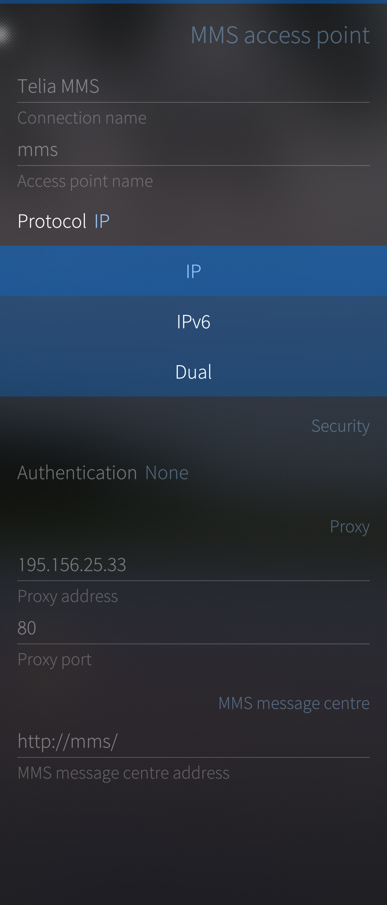

This help article is meant to work as an MMS troubleshooter. The multimedia messaging service (MMS) is a fairly complicated system, to which different cellular operators (carriers) bring the flavours of their own. Conflicts may occur.

# Check the settings first and prepare for logging
To troubleshoot your MMS issue, please confirm the steps below:

* **System version:** please make sure, that you are running the latest version of Sailfish OS available for your device. Check this in "Settings > System> Sailfish OS updates" by pulling down "Check for updates".

* **Check the app settings** at "Settings > Apps > Messages > MMS".  Compare "Maximum message size" to the size of the picture you are trying to send. In case of reception problems, see that you have enabled "Download MMS automatically" (at least temporarily for testing purposes). [^1] 

* **Check the network settings** at "Settings > System > Mobile network > MMS access point" (see the picture below). Ensure that they match with the information available at the Internet service of your cellular operator [^1]. In particular, check the IP protocol whether IPv4 or IPv6 should be used.

* **Check the service terms with your operator.**  Please make sure that you have no restrictions in your subscription regarding the use of mobile data or MMS.

* **Send an MMS on another device:** please confirm, that sending MMS messages with the same SIM card on another device is possible.

* Download and install the **"MMS Logger"** app from Jolla Store. It helps to collect MMS logs from your phone and to save them to your phone for sending them over to Jolla customer support. Please find the detailed instructions at the end of this article, [MMS Logger](#mms-logger).

* 
  
  

# Some more details to check

* If you can send but not receive MMS messages, or vice versa, usually your settings are correct. Please check with your operator that no blocks are in place. Also, make sure you aren't roaming.

* In the MMS settings, remove any leading zeros from the proxy address (e.g.  183.012.333.002 shall be fixed to 183.12.333.2)

* In the systems of some operators, it is necessary to send one MMS message before the reception of them starts working. Share a picture from the Gallery as an MMS message with somebody

* If you have multiple SIM cards in different phones operated with the same phone number, then MMS will typically work with the primary SIM card only.

* If you are able to receive MMS messages but not the contents of them, then visit the menu "Settings > Apps > Messages".  At the end of the options, there is the button "Download MMS automatically" that dictates when the message content is downloaded.

* If you use VPN to protect your Internet connections, it is important to set the MMS proxy address (at "Settings > System > Mobile network > MMS access point") according to the advice of your mobile network operator. Without the proxy address, the MMS download URL might get routed to a wrong (i.e., the VPN) interface.

# Finding help from the Sailfish OS Forum
If you are facing problems sending MMS after updating your OS to the latest Sailfish version, we recommend to seek guidance from [Sailfish OS Forum](#https://forum.sailfishos.org/), since they are very active and many of our developers are there as well, so most likely you will find help and answers from there relatively fast.

# Contacting Jolla customer support
If you are still facing problems sending MMS, please submit a Jolla customer support request and tell us the following details:

* In what country are you using your Sailfish device when the MMS issue occurs? Are you roaming, i.e., using a foreign operator, or are you in your home network?

* What mobile operator (carrier) are you using?

* Is there a problem with sending MMS or with receiving MMS, or are both of them broken?

* In what way did you obtain your MMS settings:
	* The phone got them automatically during the first startup - I did not do anything
	* I requested the settings from the operator over the air (with an SMS message)
	* I visited the web service of my operator to check the correct settings. Then I edited them to my phone in the menu "Settings > System > Mobile network > MMS access point".

* Please do also check your current MMS Settings on your device: "Settings > System > Mobile network > MMS access point". Then take a screenshot of the MMS settings (see this how-to) and deliver the picture to us in Jolla customer support.

# MMS Logger
Jolla Store has an application called MMS Logger. 64-bit architecture version can be found from [Openrepos](https://openrepos.net/content/slava/mms-logger/). It makes it easier to collect MMS logs from the phone. It is to be used in this way:

1. Install MMS Logger.

2. Launch MMS Logger.

3. Launch Gallery, view pictures and open one picture (not a private picture).

4. Tap the Share button on the tools row. Tap MMS in the view of sharing options.

5. Type your mobile number to the Recipient field to send the picture to yourself.  Wait 2-3 minutes (as MMS may work slowly).

6. Now go back to MMS Logger app. Pull down (or push up) and take "Pack and send"

7. Pull down "Save to documents"

8. Find the compressed log file "mms20*.tar.gz" in the Documents folder of your phone and send it to us, please.

Our MMS expert would then take a look at your log data to find the culprit for the problem. 

[^1]: NOTE concerning dual-SIM phones. Both of the mentioned menu pages contain support for two SIM cards. However, only one SIM card can be active for outgoing messages (phone calls) at a time, as selected in the menu "Settings > System > SIM cards > Call and messages".  Incoming messages (calls) work to both SIM cards.

