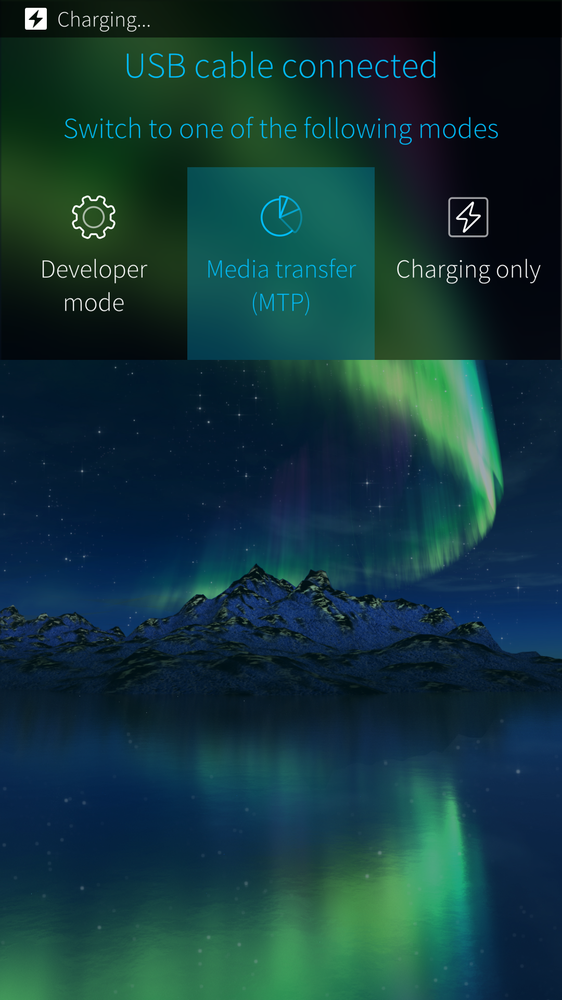

_This document explains how to transfer files between your Sailfish device and your computer. There are multiple ways to do it, including USB, Bluetooth, WLAN, and cloud services._

* Connecting your Sailfish device to a computer using a USB cable is best supported on Windows and Ubuntu systems.
* Windows 10 & 11 support the media transfer (MTP) protocol by default
* Depending on your Linux distribution it should be possible to form a connection between your PC and Sailfish without additional preparations. Should you have problems with media transfer (MTP), you might find help e.g. [**here**](https://askubuntu.com/questions/146529/how-to-connect-mtp-devices-via-usb).
* There is a support article for **[file transfer between Sailfish and Mac](https://jolla.zendesk.com/hc/en-us/articles/201440867)** that hopefully works around the limitations.


# Transferring files over USB with MTP


* Connect the USB cable to your Sailfish device and then to the PC.
* The dialogue of the picture below will appear on the Sailfish device. You are to choose how to use the USB connection:   for charging only or for Media transfer. You might also see the Developer mode item there.

<div class="flex-images" markdown="1">

* <a href="USB_cable_connected.png" class="narrow-image"></a>
  <span class="md_figcaption">
    Options for using the USB connection
  </span>
</div>

* Choose  "**Media transfer (MTP)"**
* Your Sailfish device should appear by its name, e.g., as "Xperia XA2 - Dual SIM" device (or whichever device running Sailfish OS you may have) under "This PC" on Windows 10.  The File Manager of Ubuntu has a similar view. In case of trouble, various websites (e.g. **[this one](https://www.howtoforge.com/tutorial/how-to-connect-your-android-device-on-linux/)**) may provide help for you.
* Click on the device name (on the left). You should now see **Mass storage** (residing inside the device) and **SD Card** if you have connected a memory card to your device. The nickname of the card is shown (if exists) - in the picture below it is "SD128GB".

<div class="flex-images" markdown="1">

* <a href="Win10_File_Manager.png"></a>
  <span class="md_figcaption">
    Sailfish Phone shown at Windows File Explorer
  </span>
</div>


* You are now able to browse your Sailfish device on your PC. Move files using the well-known copy/paste method between the phone memory, the SD card, and the PC.
* When the transfer of data is complete you can detach the USB cable. Make sure that no video transfer (or other long-lasting one) is still ongoing.

## Changing the default action for attaching the USB cable

In Settings, you can edit your preferences on what your Sailfish device should do when you connect to a PC:

1.  Go to "Settings  > System > USB" (under Connectivity)
2.  Tap on 'Default USB mode'
3.  Tap on the action you wish to perform automatically when connecting a USB cable. Take 'Always ask' if you are in doubt.

# Transferring files over Bluetooth


1.  Switch Bluetooth ON on your device in "Settings > System > Bluetooth".
2.  Switch Bluetooth ON on your computer.
3.  Pair your devices.
4.  Transfer files between your devices. Most likely this works best if you initiate the transfer from the PC.
5.  Location of transferred files on a target device:
    * From Sailfish to Windows PC: To the folder set at "Bluetooth > FIle transfer menu". You will need to set the PC to receive a file or else the transfer will fail.
    * From Sailfish to Ubuntu PC: Downloads folder
    * From PC to Sailfish: pictures go to Pictures and documents to Documents but all files are listed in "Settings > System > Transfers"

# Transferring files with SCP over WLAN and USB

## SCP over WLAN

If you are familiar with working on the command line then you could rely on **[SCP](https://en.wikipedia.org/wiki/Secure_copy)** with the **[developer mode](https://docs.sailfishos.org/Support/Help_Articles/Enabling_Developer_Mode/)** enabled on the Sailfish phone. It is fast and works over WLAN.

The following may work on Windows 10 if you have installed the support for SSH and SCP protocols to it. Then the commands below can be given in **PowerShell** application or in the **CMD** terminal but it may be best to install **PuTTy** to Windows and then the add-on **PSCP** (see this **[web page](https://www.ssh.com/ssh/putty/putty-manuals/0.68/Chapter5.html)**).

On the Terminal app of a Linux PC, it goes as shown below.

Use the following command to download files from the phone to the PC's current directory - you need to replace `**u.v.w.x**` with the actual WLAN IP address of your phone now - check it at "Settings > System > Developer tools".

In this example, we copy all pictures from the phone folder "Pictures/Camera" to the current directory on the PC:

```
scp -r defaultuser@u.v.w.x:/home/defaultuser/Pictures/Camera/* ./
```

Note that the option ```-r``` implies copying recursively, i.e. including the contents of a directory. Some phones might still have 'nemo' (instead of 'defaultuser') as the name of the primary user. 

The example below shows how to copy the file 'Outlook.jpg' from the current PC directory to the home storage area on the phone:

```
scp Outlook.jpg defaultuser@u.v.w.x:/home/defaultuser/
```

## SCP over USB

SCP works over a USB connection, too. In this case, replace the IP address "u.v.w.x" with the fixed address "192.168.2.15".

## AirSail Transfer

OpenRepos store has a clever application named [**AirSail Transfer**](https://openrepos.net/content/6uvnpr/airsail-transfer) for transferring files to/from your Sailfish OS device using your computer's web browser. Install the latest rpm file - for this, you will need to allow untrusted software in "Settings > System > Untrusted software". _Jolla Ltd. cannot however guarantee that this solution works_.

# Transferring files via cloud-based services

Your computer operating system probably supports the integration of cloud-based services such as **Dropbox, Nextcloud,** or **OneDrive** into your File explorer –application. Dropbox will be used as the example service here, but we encourage you to try a service you are familiar with.

**Prerequisite:**

An account in a cloud-based file-storing service and a possible client app downloaded and configured on your computer. After creating the account, sign in to it from your Sailfish device in "Settings > Accounts > Dropbox".

**On your computer:**

Upload or download the files you want to transfer to your web-storage service. This can be done using the app on your computer or possibly through a web interface (**[www.dropbox.com](http://www.dropbox.com)** for Dropbox users).

**On your Sailfish device:**

a) Downloading files from the cloud to your device:
1. Open the Sailfish browser, and browse to **www.dropbox.com**. Sign in.
2. Find your media file(s) inside your Dropbox and download.
3. You will now find your downloaded media in the appropriate apps (Media for music and videos, Gallery for pictures).

b) Uploading files from your device to the cloud:
1. Sign in to your Dropbox account (if not done by now).
2. Open Gallery and select an image or a video.
3. Tap on Dropbox in the sharing menu. Tap Upload at the top right corner.

