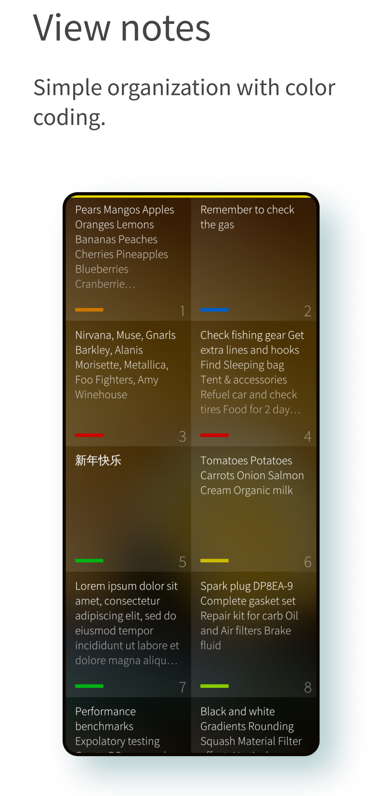
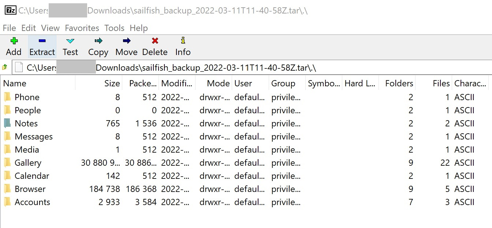
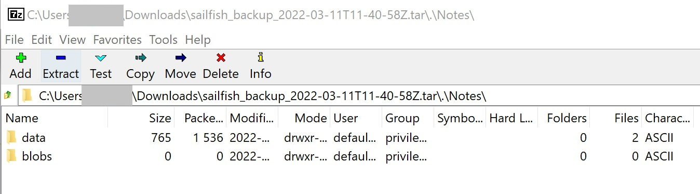
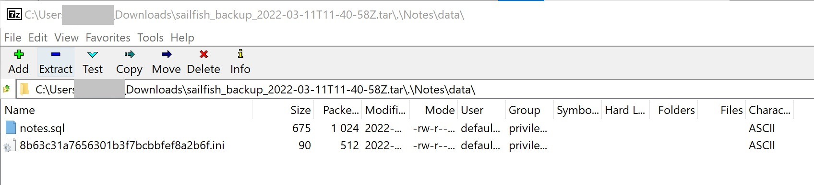
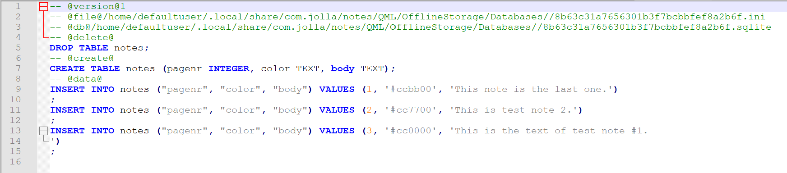

Notes is a handy application for writing down things you need to remember. With Notes app you can quickly write small notes and memos.

<div class="flex-images" markdown="1">

* <a href="Notes.png" class="narrow-image"></a>
  <span class="md_figcaption">
  </span>
</div>

Sailfish Notes are included in Sailfish Backup, therefore the guidance below should not be necessary. However in case the notes backup or restore fails these instructions can be useful.

# About the Notes database

The database of the Sailfish Notes application is in
```
$HOME/.local/share/com.jolla/notes/QML/OfflineStorage/Databases/
```

In some earlier Sailfish releases, this database used to be in
```
$HOME/.local/share/jolla-notes/QML/OfflineStorage/Databases
```

As the Notes database is in SQL format it is not perfectly readable just like that. The database could be read by installing an SQL tool (sqlite) but we won't do that here. Instead, we simply copy the Notes database back and forth.

# Saving the Notes data to an SD Card

In this chapter, we copy the content of the Notes database from the phone and save it to an SD card inserted in the phone. Ensure that you have unlocked and mounted your SD card if it happens to be an encrypted one (do it in Settings > Storage).

First of all, let's create a variable for the ID code of your SD card:
```
export MYSD=$(ls /run/media/$USER)
```
Create a directory for the Notes database on the SD card:
```
mkdir /run/media/$USER/$MYSD/MySavedNotes    # make a folder to SD card
```
Now, copy your notes to SD card:
```
cp -ivR $HOME/.local/share/com.jolla/notes/QML/OfflineStorage/Databases/*  
/run/media/$USER/$MYSD/MySavedNotes
```
Check that the copy operation worked - it should print out something similar to the example below (which has the real ID of my SD card):

```
ls -l /run/media/defaultuser/5D9F-28A5/MySavedNotes/
total 64
drwxr-xr-x 2 defaultu defaultu 16384 Mar 8 10:26 .
drwxr-xr-x 23 defaultu defaultu 16384 Mar 8 10:22 ..
-rw-r--r-- 1 defaultu defaultu 90 Mar 8 10:26 8b63c31a7656301b3f7bcbbfef8a2b6f.ini
-rw-r--r-- 1 defaultu defaultu 8192 Mar 8 10:26 8b63c31a7656301b3f7bcbbfef8a2b6f.sqlite
```

# Copying the Notes data from an SD Card to your phone

Restart your phone. Do not open the Notes app now.

We assume here that the copy of notes on the SD card resides in folder MySavedNotes as in chapter above. Ensure that you have unlocked and mounted your SD card if it happens to be an encrypted one (do it in Settings > Storage).

Create a variable for the ID code of your SD card:
```
export MYSD=$(ls /run/media/$USER)
```
Copy the notes from the SD card to the correct directory on the phone:
```
cp -ivR /run/media/$USER/$MYSD/MySavedNotes/*      
$HOME/.local/share/com.jolla/notes/QML/OfflineStorage/Databases/
```
Open the Notes app and check that it has the notes.

# Copying the Notes data from a backup container to your phone

The backup containers are kept on the SD card. They have the following file names:
```
sailfish_backup_yyyy-mo-ddThh-mi-ssZ.tar
```
where the moment of creating the backup is as follows:

- yyyy = year
- mo = month
- dd = day
- hh = hours
- mi = minutes
- ss = seconds

An example of a backup file is sailfish_backup_2022-03-09T08-20-46Z.tar.

You can copy the backup container to a PC and extract it there with the PC (e.g. by using the app 7-zip on Windows).

Unfortunately, the notes in the backup container are as SQL dumps rather than in SQLite database format, making it impossible to directly copy them to the phone, so that the notes would be readable in the Notes app.

The following chapter explains how it should be possible to extract the notes text from the SQL dump file "notes.sql". It should then be possible to save them to the PC.

Extracting notes texts

1) Open the backup container with 7-zip on Windows or with the Archive manager on Linux

The extracted backup container appears as follows:

<div class="flex-images" markdown="1">

* <a href="Notes1.jpg" class="narrow-image"></a>
  <span class="md_figcaption">
  </span>
</div>

2) Click "Notes":

<div class="flex-images" markdown="1">

* <a href="Notes2.jpg" class="narrow-image"></a>
  <span class="md_figcaption">
  </span>
</div>

3) Click "data":

<div class="flex-images" markdown="1">

* <a href="Notes3.jpg" class="narrow-image"></a>
  <span class="md_figcaption">
  </span>
</div>

4) Click "notes.sql" and let the PC open it to a text editor:

<div class="flex-images" markdown="1">

* <a href="Notes4.png" class="narrow-image"></a>
  <span class="md_figcaption">
  </span>
</div>

The texts of the notes appear in the VALUES fields. You will need to copy/paste them from there to an appropriate PC application.
