The People app is the **phonebook** of your Sailfish device. It is possible to add contacts to it by typing or by importing them. If you sign in to accounts like Google, Nextcloud, or Exchange, the contacts from them can be synchronised to your People app automatically.

Each contact can be given the name, phone number, street address, job, picture and other details.

* <a href="People_contact_card_all_details.png" class="narrow-image">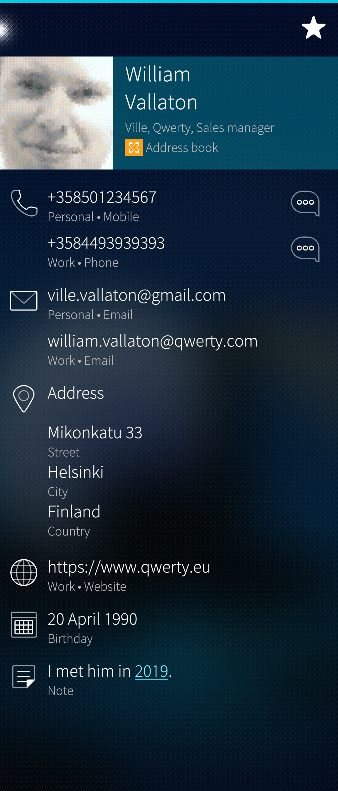</a>
  
    Contact card with details
  

# Viewing contacts

The People app shows images of your favourites first (with pictures or by their names) as large squares and then all of the contacts in alphabetical order, listed in groups of the same initial letter.

* <a href="People_home_view.png" class="narrow-image">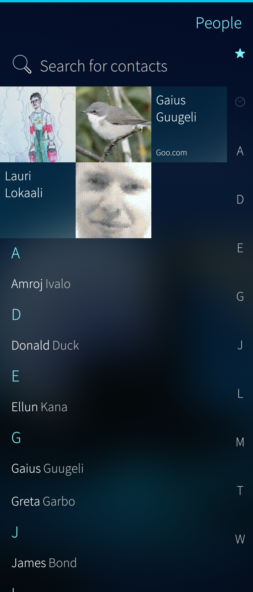</a>
  
    Home view of the People app
  

Tapping a favourite or any contact name opens up the contact card showing all the details of the contact.

The names can be sorted by the first name or by last name - this is selected in "Settings > Apps > People".

At the right edge of the People app, there is a quick index and a vertical search bar: tap the letter 'D', for instance, and the list jumps to the D group of names. Instead of tapping, one can slide a fingertip along the index.

* <a href="People_search_bar_D.png" class="narrow-image">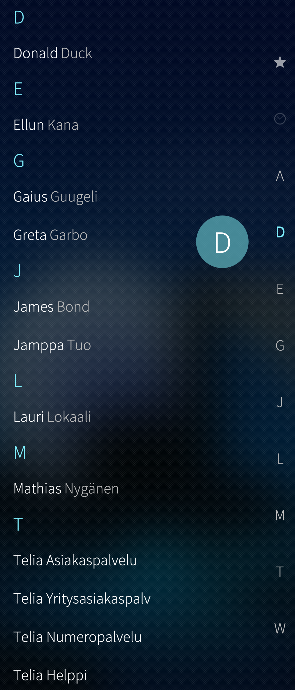</a>
  
    People app with vertical search bar
  

The pulldown menu of this app has, of course, the traditional "Search" command, too. Start typing a name (from the beginning or from the middle) and matching names are shown immediately.

* <a href="People_contact_search.png" class="narrow-image">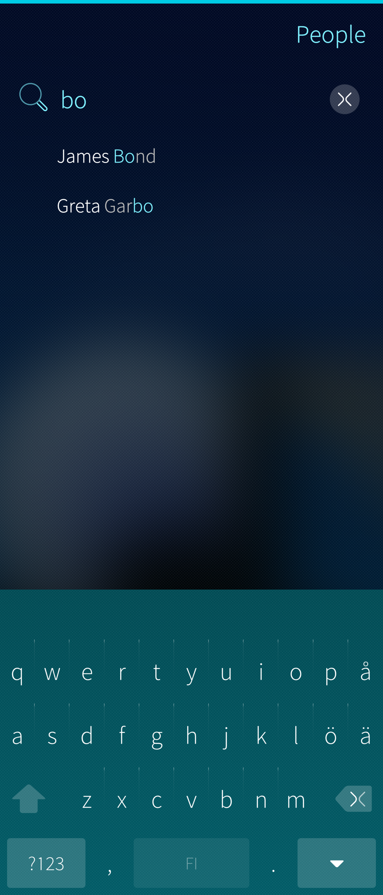</a>
  
    People app search box and matching contacts
  

# Local and synced contacts

There are _local contacts_ and _synced contacts_ in Sailfish OS. Both kinds of contacts appear in the People app but there are some differences in how they are treated.

* A contact created on the device (phone) (in "People app > Add contact") becomes a
    * Local contact if "Phone" is selected for the target in the "Save to" field
    * Synced contact if an account server (e.g. Google, Exchange, Nextcloud) is selected in the "Save to" field. For account servers see "Settings > Accounts"
* The previously used value (if any) is shown as the default - just tap any value in the list
* This selection cannot be changed later.
    

* <a href="People_save_to.png" class="narrow-image">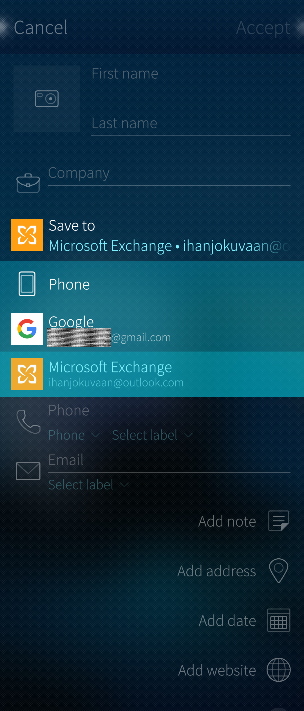</a>
  
    Selecting the service for a contact
  

          
* Contacts copied to the device with Bluetooth, Email or File Manager become local contacts. The same applies to contacts copied from a SIM card to the phone.
* Contacts initially synced down from an account server remain synced contacts. If a synced contact is edited on the phone and if the account settings have the option _"Two-way sync"_ enabled, then the edited contact is uploaded to the account server. However, if the option _"To device only"_ is in effect then the changes made to the contacts at the account server are synchronized to the phone (whereas any changes made on the phone would later be overwritten).
* Only local contacts are included in the Backup. Since synced contacts can be retrieved from the account server, they are left out of the backup.

# Importing contacts

Go to Settings > Apps > People. There you can choose to initiate an import from your SIM card or from a file containing the contacts.

**[This document](/Support/Help_Articles/Importing_Contacts/)** explains in detail how to import contacts from other devices.

# Adding contacts

Pull down the command "Add contact". An empty contact card appears. Fill in the details you know and want to save. Pay attention to the "Save to" field. It dictates the target of the contact card. Selecting "Phone" makes the contact local, i.e. it will be preserved in the phone memory and not synchronised with any service. Depending on which accounts you have signed in (see "Settings > Accounts"), there may be other options under the "Save to", for instance, Google, Microsoft Exchange or Nextcloud. Selecting one of them makes this new contact a synced one, i.e., its primary location will be at the account server while a copy is kept in the phone memory. Read more in chapter \[Local and synced contacts\](#local-and-synced-contacts).

Fill in all the necessary fields. Note that multiple phone numbers and email addresses are allowed. It is possible to indicate if those are private or work-related.

Tap "Accept" at the top right corner to save the new contact.

This contact was saved to "Google", so it will be synced with the Google contacts service. This contact is not included in backups as it resides on the Google server.

* <a href="People_edit_contact.png" class="narrow-image">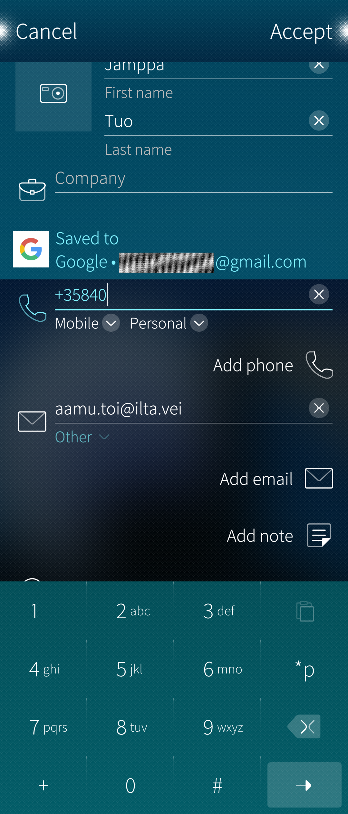</a>
  
    Contact added to Google sync service. Phone number being added
  

# Setting favourites

Open a contact card and tap the (empty) star icon. The star icon becomes filled up and a new favourite appears at the top of the People app as a large square. Another way is to tap and hold a contact so that the context menu appears and then select "Add to contacts".

Removing a favourite goes in the same way.

# Linking contacts

Linking contact card B (or even more) to contact card A results in a combined contact card appearing by the name A in the People app. Contact card A has all of the data belonging to initial contact cards A and B. Linking can be withdrawn so that the initial contact cards become visible. Linking means that two or more contact cards are temporarily combined.

The could be two contacts cards for the same person, one holding the private data and another containing the professional data. Linking makes it possible to combine these two cards easily.

In the example below, the contact card "Ericsson Ebba" (B) is to be linked to the contact card "Ericsson Emma" (A). After pulling down "Link", the People app presents some link candidates (here only one) that have some similarities with the B contact. If the listed candidates do not contain the intended one, it is possible to get more by pulling down "Add more links".

* 
  
    Imaginary contact: pulling down 'Link'
  
* <a href="People_link_candidates_listed.png">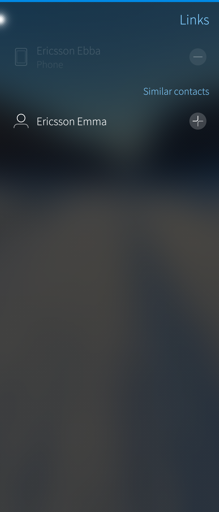</a>
  
    Candidates for linking shown
  

The first picture below shows the contacts Ebba and Emma ready to be linked which happens by going back to the previous page with a swipe to the right (one of the typical [**Sailfish gestures**](https://sailfishos.org/design/gestures/)). The second picture below shows the result of the linking: the data of Ebba and Emma are shown on Emma's contact card.

* <a href="People_two_contacts_linked.png">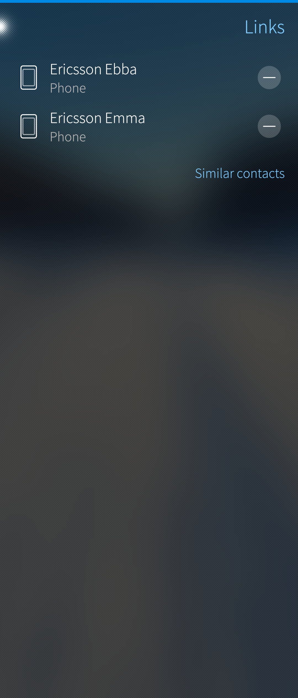</a>
  
    Contact link ready to be accepted
  
* <a href="People_result_of_linking.png">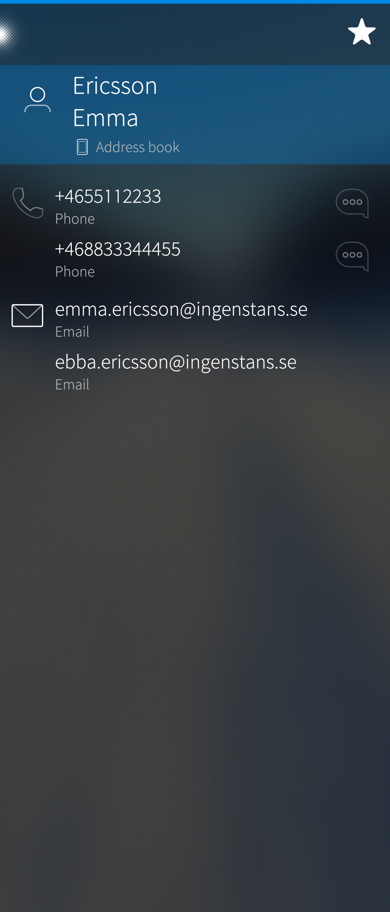</a>
  
    Contact card having the data of linked contact, too 
  

Unlinking of Emma and Ebba goes as follows: pull down "Link" in the combined contact card (1st picture below). Then (in the 2nd  picture), the initial linked contacts (two or more) are shown. Tap the minus button to remove a linked contact - if there are only two linked contacts (like in this example) then the combined contact will cease to exist. The original contacts will reappear in the main view of the People app (swipe to the right to get there).

* <a href="People_link_a_linked_contact.png">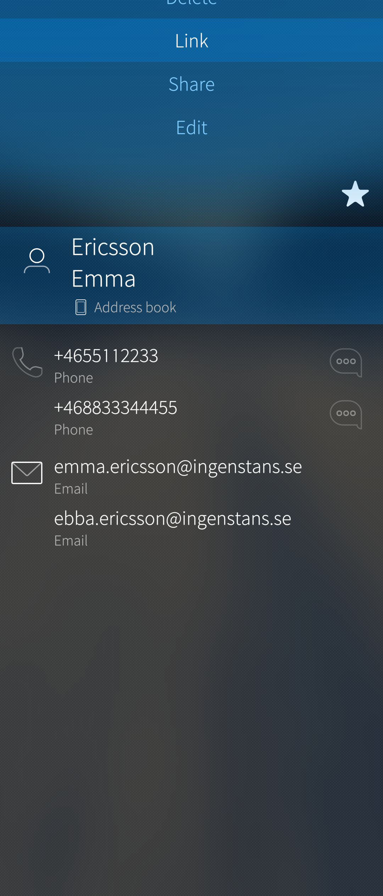</a>
  
    Linking (or unlinking) a linked contact
  
* <a href="People_unlink_contact.png">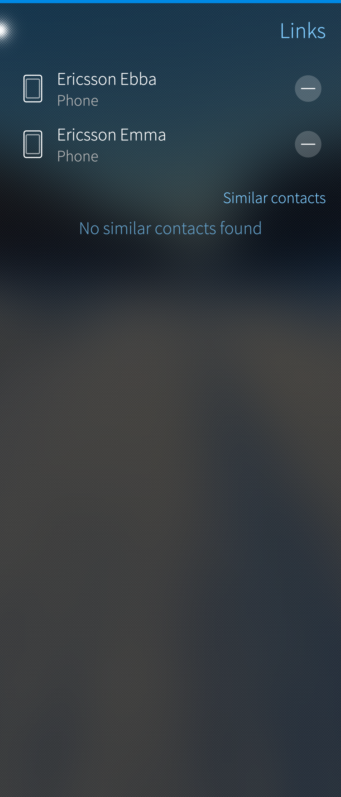</a>
  
    Removing a link is possible
  

# Saving a number from a received call or SMS

It is possible to extract phone numbers from entries in the History tab of the Phone app and save them to contact cards.

## Quick call is ON

The value of "Settings > Apps > Phone > Quick call" dictates how saving a number in the Phone app works. If it is ON, a short touch on a phone number in the History tab initiates a phone call right away. Therefore, saving the number to a contact must be done like this:

1. Tap and hold the number. A popup menu appears.
2. Choose "Save as contact".
3. You will see two options: "Link to contact" and "Create new contact". 
4. Choose "Create new contact" if you want to create a new contact. Proceed as described above in chapter \[Adding contacts\](#adding-contacts).
5. Choose "Link to contact" if you want to link that phone number to an existing contact. See chapter \[Linking contacts\](#linking-contacts).
    

## Quick call is OFF

The value of "Settings > Apps > Phone > Quick call" dictates how saving a number in the Phone app works. If it is OFF, a short touch on a phone number in the History tab  does not make a call but opens a contact card. Save the number to a contact card like this:

1. Tap a phone number in the History. The phone number with recent activity appears.
2. Pull down to Save the phone number (linking is also possible). A contact card appears. Fill in the name and other details. Proceed as described above in chapter \[Adding contacts\](#adding-contacts).

From an SMS message:

1. Open the message
2. Pull left to show the sender's details
3. Pull down to Save the phone number. A contact card appears. Fill in the name and other details. Tap "Accept".
    

# Sharing contact(s)

One or more contacts can be shared at a time as standardized **[vCard files](https://en.wikipedia.org/wiki/VCard)** (also known as “VCF files” or *.vcf). The file is exported to one of the apps or transports, including Bluetooth, Email, Messages, or WhatsApp - depending on which apps are installed and which services are enabled.

To share one contact, open the contact card and pull down "Share".

To share multiple contacts:

1. Pull down "Select contacts" while at the home view of the People app
2. Tap all of the contacts you want to share (one by one)  - the selected ones get a different background colour
3. Alternatively, pull down "Select all" so that all contacts are shown as selected
4. Unselect any of them in this view by tapping those contacts
5. Tap the "Share" icon near the bottom right corner of the display. Again, the list of available apps and transports appears (depending on what is installed on your device).

* 
  
    Several contacts selected
  
* <a href="People_share.png">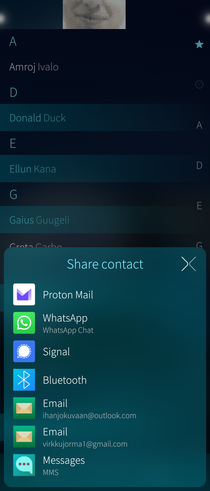</a>
  
    Selecting how to share
  

# Editing or deleting a contact

There are two ways to edit or delete a contact:

1.  Tap a contact so that the contact card opens up. Pull down "Edit" or "Delete".
2.  Tap and hold a contact so that the context menu appears. Select "Edit" or "Delete".

* <a href="People_contact_pulley.png" class="narrow-image">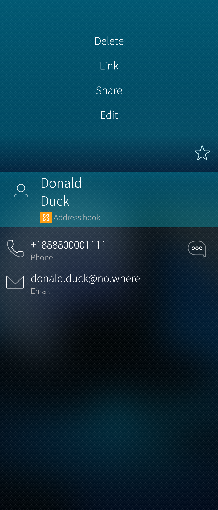</a>
  
    Showing the pulldown menu of a contact
  

## Editing

In the editor, you can change any values (but not "Save to") and add new data. Do not forget to tap the "Accept" button at the top right corner to save the changes.

Note that this contact has been saved to "Phone", i.e. it is a local contact that is not synchronised with any account service. This contact is included in backups.

* <a href="People_editor_used.png" class="narrow-image">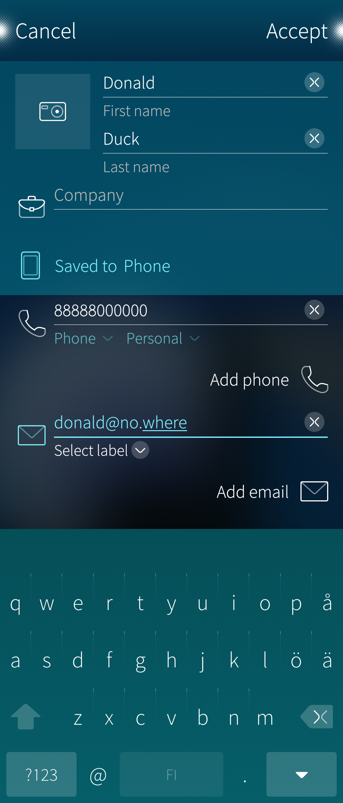</a>
  
    Editing a contact card
  

## Deleting

For the deletion, a remorse timer of 5 seconds is shown. You can cancel the deletion by tapping the colourful progress line (it says "Tap to undo") before it runs to the end.

Deleting all or multiple contacts can be done as follows:

1. Pull down "Select contacts" while at the home view of the People app
2. Tap all of the contacts you want to share (one by one)  - the selected ones get a different background colour
3. Alternatively, pull down "Select all" so that all contacts are shown as selected
4. Unselect any of them in this view by tapping those contacts (the different background colour goes off)
5. Tap the "Delete" icon near the bottom left corner of the display.

* 
  
    Several contacts selected. Option to delete them
  

# Application settings

The settings of the People app are in "Settings > Apps > People".

The settings allow for changing the sorting order and if the last or first name is to be shown first. One can decide if the contacts of the SIM card are shown in the People app. There are some options for **[importing contacts](/Support/Help_Articles/Importing_Contacts/)**, too.

# People tab in the Phone app

The Phone app has three subpages. One of them is "People". It basically replicates the content and view of the People app, making it easier to choose people to call.

