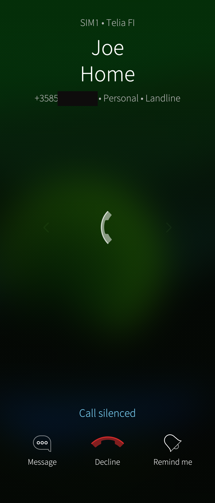
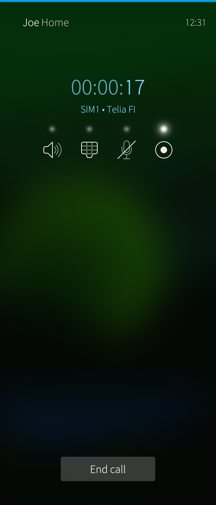
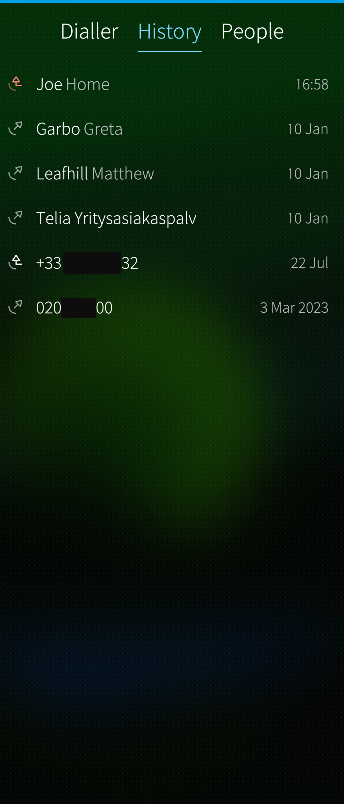
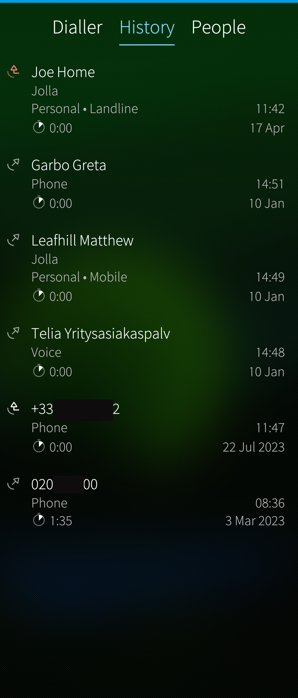

# Receiving and making calls
In Sailfish, the gesture indications to answer and reject **incoming calls** are right under your thumb. Answer by swiping horizontally in either direction without having to worry about whether you picked up the device in the right orientation. Note that there is no need to swipe by touching the green or red arrows exactly. Instead, the whole display is conveniently available: touch the display at any point you like (or can) and then swipe horizontally or vertically.

Silence the ringing by swiping up, by pressing the power key or by flipping the the phone the face down (if you have enabled "Flip to silence calls" in "Settings > System > Gestures"). 

* 
  
  

Only at the silenced state you will need to pay more attention to the display: Three buttons are shown at the lower part of the display: 
* Message: see chapter [Quick messages](/Support/Help_Articles/Phone/#quick-messages)
* Decline: reject the call right away
* Remind me:  see chapter [Call reminders](/Support/Help_Articles/Phone/#call-reminders)

* 
  
    Incoming call silenced
  

**Outgoing calls** can be made from the Phone app's [Dialler](#dialler), [History](#history) and [People](#people) pages, from the [Events view](https://sailfishos.org/design/ux-framework/) and from the [People app](/Support/Help_Articles/People_App_and_Contacts/). 

## Quick messages
Quick reply message (SMS) can be sent if you can't answer the call. The call is automatically rejected after sending a preset message. Prepare the messages at "Settings > Apps > Phone > Change quick replies". Pressing the "Message" button brings up the list of the messages. Select one by tapping. It is also possible to type a free text message. Sending that one does not terminate the call, though.

* 
  
  

## Call reminders
If you are too busy to answer, add a reminder for yourself to call the person back later. Press the "Remind me" button and select a time from the drop-down list. 

* 
  
  

## Recording conversations
Sailfish OS allows for recording phone call conversations. This can be enabled at "Settings > Apps > Phone > Call recording". When a phone call is on, the call UI has four buttons, the right-most of which is for call recording. Press this button to start and stop recording. The recorded conversations can be listened to at "Settings > Apps > Phone > Recorded calls".

* 
  
    Call recording turned on
  

## Call ending
When a call is ended by the remote party or due to a network factor, the call ending dialogue is shown. However, if the call was ended by you tapping the "End call" button, no dialogue is shown.

* 
  
  

# Subpages of the app

## Dialler
In the Dialler you can enter the phone number and make a call. Long-press the #0 key to dial the + character for the international number format. Long-press the asterisc key (*) to dial a pause character (shown as a comma) for DTMF strings. Long-press the #1 key to call your **voice mailbox**. The number of the mailbox can be set at "Settings > Apps > Phone" under the section of SIM cards.
From the top menu of the Dialler page you can send messages, link to contacts and save a contact.

* 
  
  

## History
From the History you can see the calls you have made, received or missed (see the icons on the left, in front of the names and numbers). From the top menu of this page you can select a detailed or essentials view.

* 
  
    Essential call history
  
* 
  
    Detailed call history
  

The History page works in two different ways, depending on the value of "Quick call" in "Settings > Apps > Phone"

* When ON, making a phone call takes only one tap on a name or number in the History. This is the default setting of Sailfish OS.
* When OFF, tapping on an item brings up the contact information, allowing one to choose whether to call (and to which number if multiple numbers) or to send an SMS or an email.

## People
From the People page you can see your contacts. The favourite contacts are shown on the top of the page, followed by the recent contacts and then all contacts in the alphabetical order. The alphabet on the right side of the page works as a shortcut to the names beginning with those letters. From the top menu you can use search or add new contacts.
The separate People app is another place to make phone calls. It works mostly in the same way as the People view.

* 
  
  

# Events view
Missed calls are shown in the Events view. Tap the caller's number/name to get to the History page. Tap the 2nd time there to make the call.

# SIM cards
If you have a dual SIM device you can set up which SIM card is used for making calls and sending messages. This setting is found from "Settings > System > SIM cards". Note that SIM settings can be also added to the Top menu ("Settings > System > Top menu": Enable SIM cards)

# 4G calling (VoLTE)
4G calling (a.k.a. Voice over LTE or VoLTE) can be enabled from "Settings > System > Mobile network". 4G calls have become the default as many mobile operators have closed their 3G networks. 4G provides better call quality and better experience during mobile data transfers.

