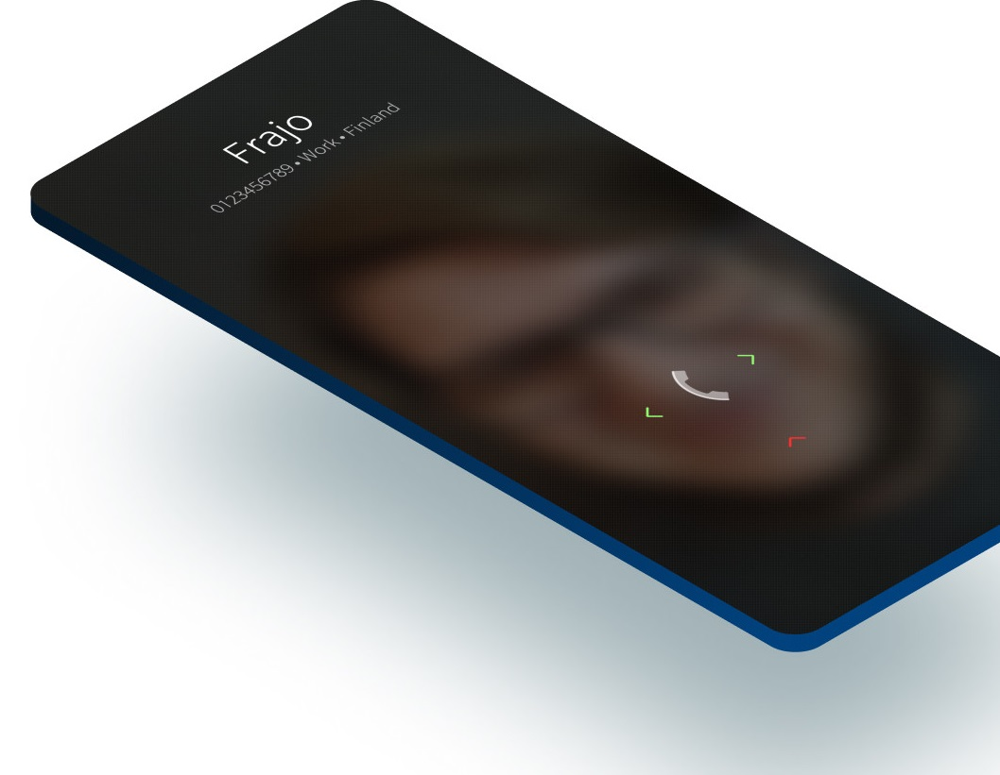
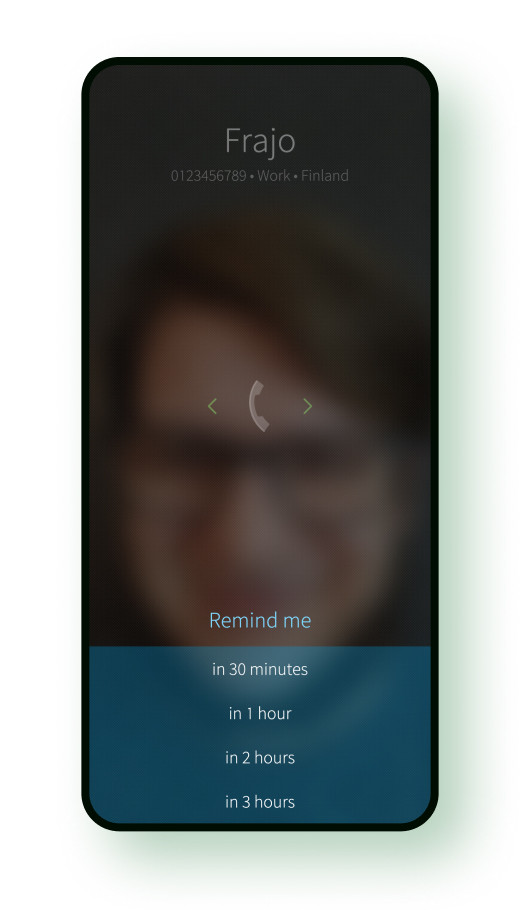
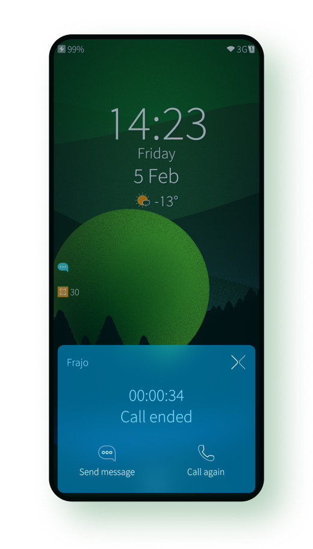
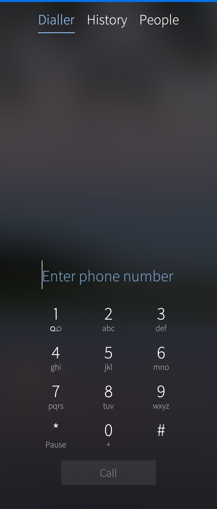
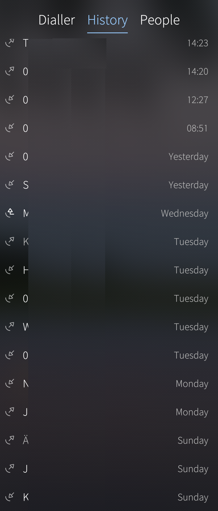
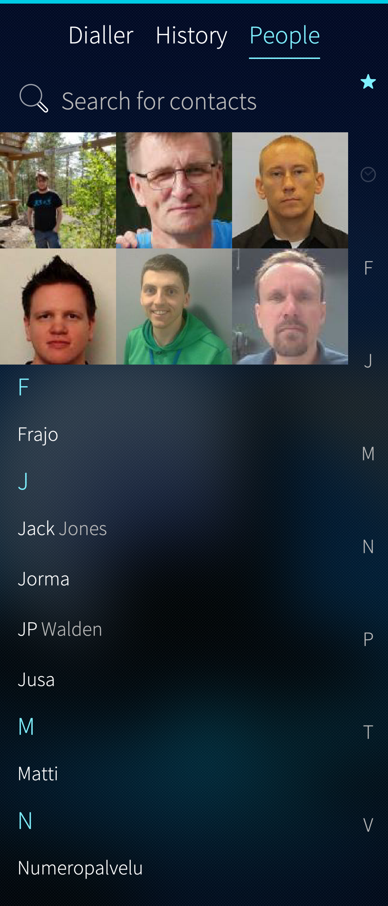

# Calling and receiving calls
In Sailfish the gesture indications to answer and reject calls are right under your thumb. Answer by swiping horizontally in either direction without having to worry about whether you picked up the device in the right orientation. Silence by swiping up or by pressing the power key. Calling can be done from the phone apps dialer, history or people pages or from the events view. Quick calling from the history can be enabled or disabled, more of this feature can be read from this [article](/Support/Help_Articles/Tips_and_Tricks/#quick-calls-from-the-call-history). From the same article you can also see how call recording can be enabled and once that is done you will have call record button on your call UI when the call is ongoing. With the call record button you can start and stop the call recording. Voice mail number can be also set on the same page.

* 
  
  

## Quick messages
Quick reply message can be send if you can't answer the call. You can easily add and manage quick replies in the settings of the Phone app which can be accessed from Settings > Apps > Phone > Change quick replies.

* 
  
  

## Call reminders
If you are too busy to answer, add a reminder for you to call the person back.

* 
  
  

## Call ending
When the call is ended a call ending dialog is shown. If the call was ended by you, no dialog is shown.

* 
  
  

# Dialler
In the dialler you can enter the phone number and make a call. From the top menu of this page you can send messages, link to contacts and save a contact.

* 
  
  

# History
From the history you can see the calls you have made, received or missed. From the top menu of this page you can select detailed or essentials view.

* 
  
  

# People
From the people view you can see your contacts. The favorite contact are on the top of the page, next are the recent contacts and then all the contacts in the alphabetical order. From the right side of the page you can see the alphabets and tapping the letter will move the view to that particular letter. From the top menu you can use search or add new contacts.

* 
  
  

# Events view
Missed calls are shown in the events view and you can call back to the caller by tapping the caller number/name from the events view which takes you to the history from you can directly make the call.

# SIM cards
If you have dual SIM card device you can setup which SIM card is used for making calls and sending messages. This setting is found from Settings > SIM cards. Note that SIM settings can be also added to Top menu (Open Top menu > Settings > Go to Top menu settings > Enable SIM cards)

# 4G calling (beta)
4G calling can be enabled from Settings > Mobile network. 4G calls may be required by your operator. It also provides better call quality and better experience during mobile data transfers.

