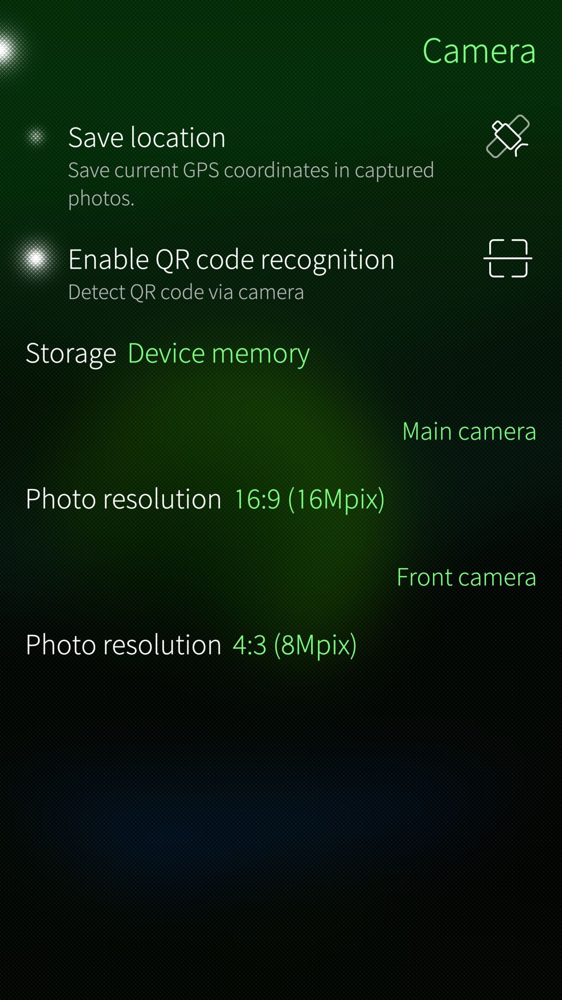
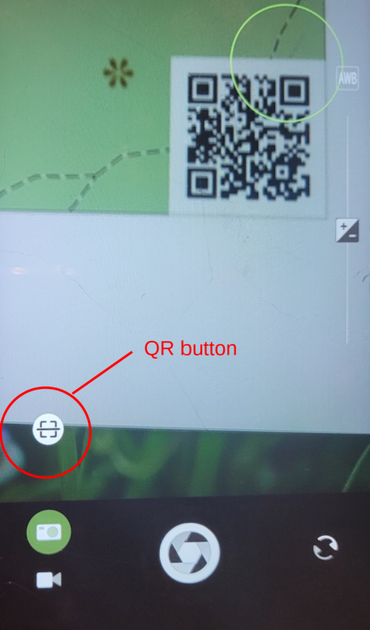
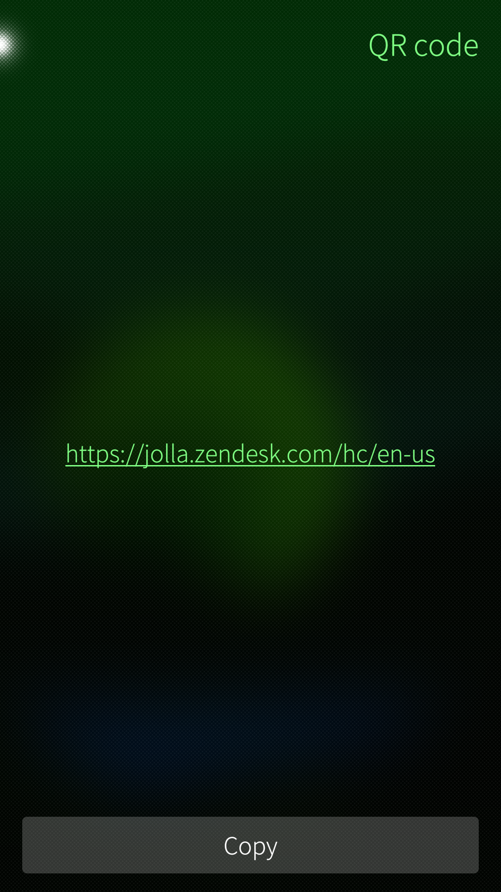
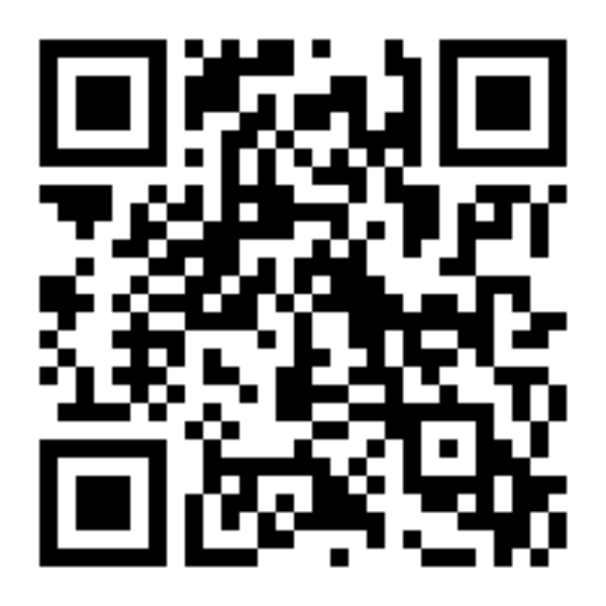

The QR code reader can be enabled from Settings > Apps > Camera. After the feature is enabled the camera viewfinder will automatically recognise QR codes in the view and show a button for converting the code to a web address (URL).

The QR code reader can recognise 2-dimensional codes with small squares in 3 corners of the code (an example [**here in Wikipedia**](https://en.wikipedia.org/wiki/File:QR_Code_Structure_Example_3.svg)).

# Turning the feature on
Open the page Settings > Apps > Camera and tap the item "Enable QR code recognition".

* 
  
    Enabling of the QR code reader
  

# Using the QR code reader
Open the Camera app. Point the camera to a QR code. The **QR button** should appear (see the red circle in the picture below) as an indication on recognizing the QR code.

Try to find an appropriate distance so that the focus is set at the QR code. Tapping at the QR code in the camera view may help. A circle with the ambience colour denotes the correct focus - in the picture below it is the green circle. The QR button appears on the screen as soon as the QR code is recognised.

If the QR button doesn't appear then the QR code may not be a valid, or the camera wasn't focused to the code, in this case please try again.

* 
  
    QR button on the camera view
  

# Web address
Tap the QR button to reveal the web address in the QR code. A new view, similar to the example below, will appear.

* 
  
    URL shown once the QR button is tapped
  

You can either tap the web address in the middle to open it to the Sailfish Browser
or use the Copy button to save the address to the copy/paste buffer for your next actions.

# An example of a QR code
The following code is to help you practise with the QR code reader.
It contains the URL https://jolla.zendesk.com/hc/en-us.

* 
  
    Example QR code
  

