If your Xperia 10 II is not starting up normally or not starting up at all, you can attempt to fix your device with the help of the Recovery Mode. This article will provide you with step-by-step instructions on recovering a malfunctioning device.

**NOTE:** This article is for Xperia phones only. There are separate articles for the Jolla Phone, Jolla C (also Aqua Fish) and for Jolla Tablet:

* [**Jolla Phone**](https://jolla.zendesk.com/hc/en-us/articles/204709607)
* [**Jolla C & Aqua Fish**](https://jolla.zendesk.com/hc/en-us/articles/115000663928)
* [**Jolla Tablet**](https://jolla.zendesk.com/hc/en-us/articles/208406917) 

# What is the Recovery Mode?
**Recovery Mode** is a tool designed to help your device recover from critical errors. It is somewhat "hidden" because you are not meant to have to use it except in case of a rare device malfunction. To use it successfully you need a MicroSD card on your device.

Recovery Mode is considered a last resort and should be used only if there is no other way. It is a powerful tool and using it always means that your data on the device is at risk. Please read the instructions in this article carefully.

**NOTE:** You can install Sailfish X again ("re-flash") to your Xperia 10 II and Xperia 10 III devices. This is an effective way to resolve many kinds of problems, compared to Recovery Mode. Your Sailfish X license even entitles you to download a more recent Sailfish version from [**Jolla Shop**](https://shop.jolla.com/downloads/). On the other hand, flashing implies that all data and apps in the device will be wiped away and lost. Please consider which way suits better to you.

If you have questions about Recovery Mode, you can raise those at the [**Sailfish Forum**](https://forum.sailfishos.org/) or you can [**contact us**](https://jolla.zendesk.com/hc/en-us/requests/new).

## When should I use Recovery Mode?
* You are experiencing problems starting up your device.
* Your device doesn't start past the Sony logo.
* Your device seems to never complete the startup process, before restarting again (AKA "boot loop", starts up to "Sony logo" but no further).
* Your device starts up to a state where it is unusable because of a corrupted or not visible user interface.
* Some parts of the Sailfish OS system seem to be missing. For example, opening Settings crashes the phone or Settings opens as a blank screen.
* You were instructed by Jolla's Service & Support personnel to use it.

# Setting up the Recovery Mode on the phone

## Preparing Xperia 10 II or Xperia 10 III to the Recovery Mode
1. Disconnect the USB cable from Xperia 10 II
2. Turn the phone OFF
3. If you have the _fastboot drivers_ (Windows) or _fastboot tools_ (Linux, Mac) already installed on your computer, skip to the next step (4). You have them if you installed Sailfish OS to your Xperia 10 II or Xperia 10 III with the present computer. If not, install fastboot now - the instructions are:
	* Windows computer: chapter 2 in [**Xperia 10 II Sailfish X instructions - Windows**](https://jolla.com/how-to-install-sailfish-x-on-xperia-10-ii-on-windows/)
	* Linux computer: chapter 2 in [**Xperia 10 II Sailfish X instructions - Linux**](https://jolla.com/how-to-install-sailfish-x-on-xperia-10-ii-on-linux/)
	* Mac computer: chapter 2 in [**Xperia 10 II Sailfish X instructions - Mac**](https://jolla.com/how-to-install-sailfish-x-on-xperia-10-ii-on-macos/)
	* Windows computer: chapter 2 in [**Xperia 10 III Sailfish X instructions - Windows**](https://jolla.com/how-to-install-sailfish-x-on-xperia-10-iii-on-windows/)
	* Linux computer: chapter 2 in [**Xperia 10 III Sailfish X instructions - Linux**](https://jolla.com/how-to-install-sailfish-x-on-xperia-10-iii-on-linux/)
	* Mac computer: chapter 2 in [**Xperia 10 III Sailfish X instructions - Mac**](https://jolla.com/how-to-install-sailfish-x-on-xperia-10-iii-on-macos/)
4. Force your Xperia 10 II or Xperia 10 III to the fastboot mode:
	* Hold the Volume Up key down and connect a data-connected USB cable (a charging cable would not work)
	* Ensure that the LED at the top of the display area is lit in BLUE colour (if not, disconnect the cable, release the key and try again)
5. You will need the same version of hybris-recovery.img as belongs to the Sailfish OS version of your phone currently. If you have updated your phone to the latest release then download the latest Sailfish OS image from [**Jolla Shop**](https://shop.jolla.com/downloads/). The downloaded package contains the matching hybris-recovery.img. If you happen to have an older OS release on the phone get the hybris-recovery.img from the installation directory of that release. If you do not have it on your computer, [**contact us**](https://jolla.zendesk.com/hc/en-us/requests/new).
6. The following commands will enable the Recovery Mode (the BLUE LED should be lit at this point)

On Windows:
```
fastboot flash boot_a hybris-recovery.img
fastboot flash boot_b hybris-recovery.img
fastboot reboot
```
On Linux or Mac:
```
sudo fastboot flash boot_a hybris-recovery.img 
sudo fastboot flash boot_b hybris-recovery.img
sudo fastboot reboot
```

<div class="flex-images" markdown="1">

* <a href="Flashing_and_booting_Xperia_10_II_to_RecoveryMode.png">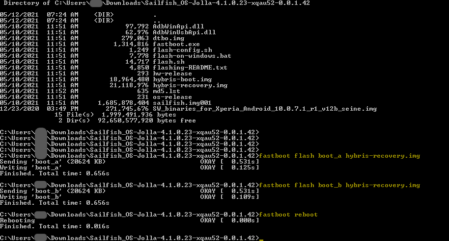</a>
  <span class="md_figcaption">
    Flashing and booting Xperia 10 II to_RecoveryMode
  </span>
</div>

Disconnect the USB cable.

## Preparing Xperia X, Xperia XA2 or Xperia 10 to the Recovery Mode

1. Disconnect the USB cable from the Xperia phone.
2. Turn Xperia OFF
3. If you have the _fastboot drivers_ (Windows) or _fastboot tools_ (Linux, Mac) already installed on your computer, skip to the next step (4). You probably have them if you installed Sailfish OS to your Xperia with the present computer.
    If not, install _fastboot_ now - the instructions are:
    * Windows computer: chapter 2 in **[Sailfish X instructions - Windows](https://jolla.com/sailfishx-windows-instructions/)**
    * Linux computer: chapter 2 in **[Sailfish X instructions - Linux](https://jolla.com/sailfishx-linux-instructions/)**
    * Mac computer: chapter 2 in **[Sailfish X instructions - Mac](https://jolla.com/sailfishx-macos-instructions/)**
4. Force your Xperia to the _fastboot mode_:
    * Hold the Volume Up key down and connect the data-connected USB cable
    * Ensure that the LED at the top of the display area is lit in BLUE colour
      _(if not, disconnect the cable, release the key and try again)_
5. You will need the same version of `hybris-recovery.img` as belongs to the Sailfish OS version of your phone currently. In other words, if you have updated OS version 4.3.0 (say) to your phone, then you should use the hybris-recovery.img of OS version 4.3.0. To ensure this, download the latest Sailfish OS image from [**Jolla Shop**](https://shop.jolla.com/downloads/) (provided that you have updated your phone to the latest).  Unzip the archive and observe the hybris-recovery.img file in it.
6. Open the Terminal app on your computer. Proceed to the directory where you have the hybris-recovery.img file.
7. The following command will enable the Recovery Mode (the BLUE LED should be lit at this point)
      
On Windows:
```
fastboot boot hybris-recovery.img
```

On Linux or Mac:
```    
sudo fastboot boot hybris-recovery.img
```

This is how it goes on Windows:

<div class="flex-images" markdown="1">

* <a href="XA2-entering-recovery-mode.png">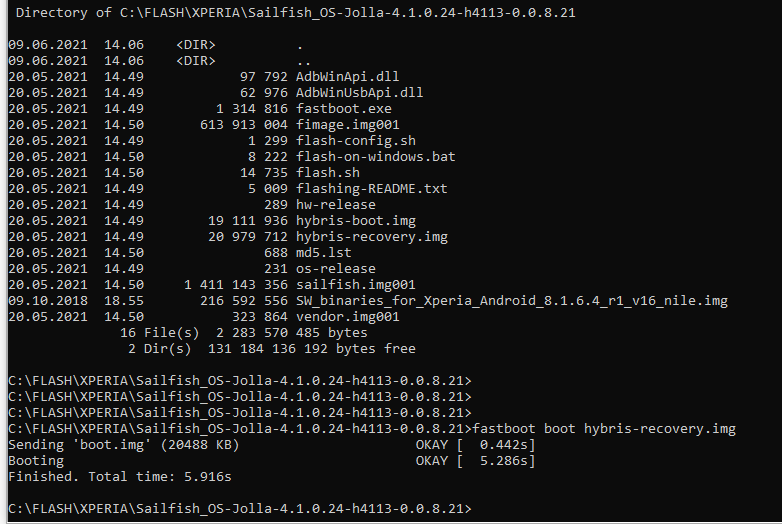</a>
  <span class="md_figcaption">
    XA2 booted to recovery mode on Windows
  </span>
</div>

Ubuntu Linux was used here:

<div class="flex-images" markdown="1">

* <a href="XA2-entering-recovery-mode-Ubuntu.png">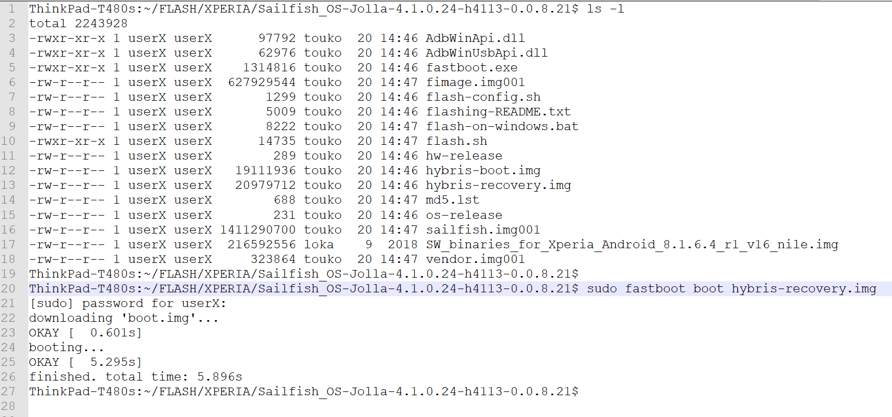</a>
  <span class="md_figcaption">
    XA2 booted to recovery mode on Ubuntu
  </span>
</div>

Disconnect the USB cable.


## Forcing the phone to the Recovery Mode

After reaching this point, there should not be any BLUE light on your Xperia. Instead, the following text should appear at the top of Xperia display (in a really tiny font):

**"RECOVERY: Connect USB cable and open telnet to address 10.42.66.66"**

<div class="flex-images" markdown="1">

* <a href="RecoveryMode.jpg">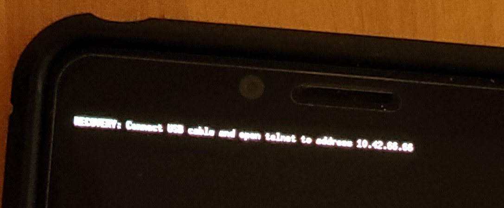</a>
  <span class="md_figcaption">
    Recovery Mode
  </span>
</div>

Next, if you have

* a Windows computer, go to this [chapter](#preparing-your-windows-computer-for-the-recovery-mode)
* a Mac computer, go to this [chapter](#preparing-your-mac-computer-for-the-recovery-mode)
* a Linux computer, go to this [chapter](#preparing-your-linux-computer-for-the-recovery-mode)


# Setting up the Recovery Mode on the computer

## Preparing your Windows computer for the Recovery Mode
Controlling the Recovery Mode from a Windows computer requires the _RNDIS drivers_ and a terminal application. If you have used the Recovery Mode before and installed RNDIS drivers then they might still be okay. In such a case, creating a Telnet connection from the PC to the phone could go as simple as this:

1. Connect your Xperia 10 II to your PC with a data-enabled USB cable.
2. Open the Windows CMD terminal.
You can keep using the same terminal window as in [this chapter](#setting-up-the-recovery-mode-on-the-phone)
3. Type into the Terminal:
```
telnet 10.42.66.66
```
If this worked correctly you would see the black Recovery Mode menu on your computer screen (below). You are now ready to move to chapter [Fixing your phone with Recovery Mode](#fixing-your-phone-with-the-recovery-mode).

<div class="flex-images" markdown="1">

* <a href="RecoveryModeXperia.png">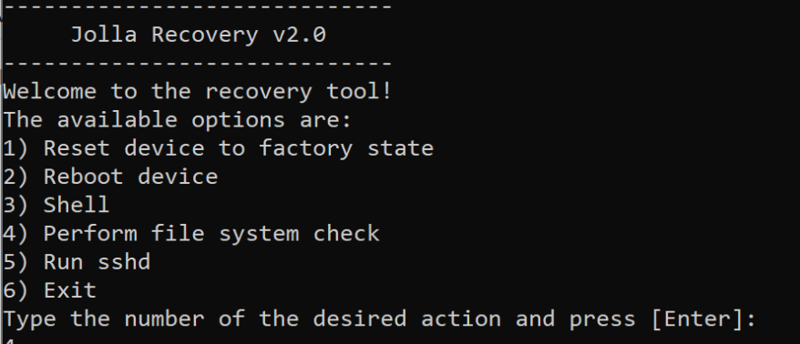</a>
  <span class="md_figcaption">
    Recovery Mode Xperia
  </span>
</div>

However, if the telnet command (above) failed then continue following the instructions below.

Do the following to install the "RNDIS drivers" and the terminal application.

1) Connect your Xperia (which is now in the Recovery Mode after running the steps of [this chapter](#setting-up-the-recovery-mode-on-the-phone)) with a USB cable to your computer. While doing this, do not press any buttons of the Xperia. Simply, connect the cable.

2) Launch the Windows Device Manager:
* Windows 7: Open Start Menu and right-click on "Computer". Select "Manage".
* Windows 10: Open Start Menu and type "device manager". You should see Device Manager in the search list now. Alternatively, right-click on the Windows Start menu and find Device Manager in the list (see picture below).

<div class="flex-images" markdown="1">

* <a href="WinDevMgr.PNG">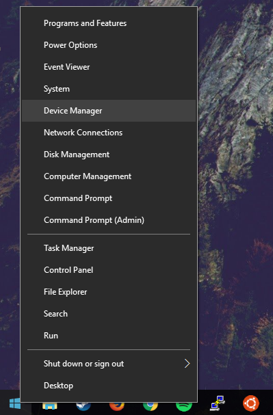</a>
  <span class="md_figcaption">
    Device manager
  </span>
</div>

3) Left-click on Device Manager and find the Device "RNDIS" under "Other Devices", equipped with a small triangle. If you do not see it listed, then ensure that you have the item "Remote NDIS compatible device" under "Network adapters" (this implies that the driver should be ok in your computer).
NOTE 1:  Windows keep developing. It may be that you won't find either "RNDIS" or "Remote NDIS compatible device" in the Device Manager of your Windows 10 computer (and who knows about Win 11) - this happened to the author when using Windows 10.0.19043, feature update 21H1 and cumulative update 21H1. In such a case, proceed to steps 10 or 11 below and try your luck with the telnet command. It worked like a charm for the author.

NOTE 2: The fastboot device "sa0114" of Sony must not appear in the listing of Windows Device Manager at this point anymore. If you do see it, detach the USB cable, turn the phone off and go back to the beginning of this [chapter](#preparing-your-windows-computer-for-the-recovery-mode).

<div class="flex-images" markdown="1">

* <a href="RNDIS-warning-triangle.PNG">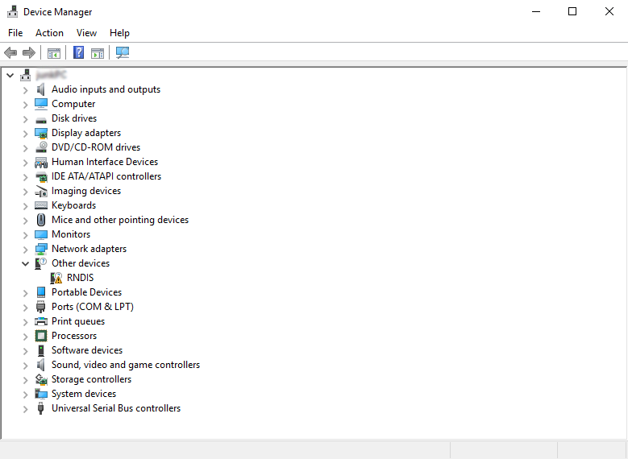</a>
  <span class="md_figcaption">
    Device manager
  </span>
</div>

4) Right-click on the RNDIS item (see above) and select Update Driver Software.

<div class="flex-images" markdown="1">

* <a href="Update-RNDIS.PNG">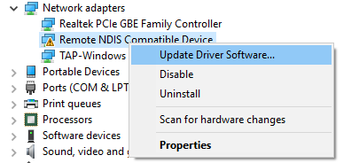</a>
  <span class="md_figcaption">
    Update driver software
  </span>
</div>

5) When the window pops up (Windows 7 and 10) select "Browse My Computer" for driver software, then on the next screen, click on the bottom that says "Let me pick from a list of drivers on my computer".

6) Next, you will be asked for the device type. Here you go down to **Network Adapters** – click on it. Select "Next", then.

7) Then when it asks you to select a manufacturer:

* Windows 7: select "Microsoft Corporation" (do not select "Microsoft")
* Windows 8 and 10: select "Microsoft"

8) Then select "Remote NDIS Compatible Device".

<div class="flex-images" markdown="1">

* <a href="RNDIS-select-driver.PNG">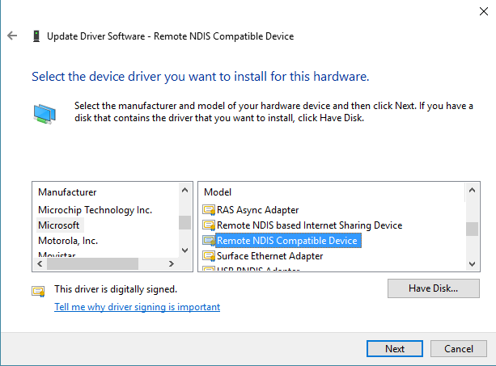</a>
  <span class="md_figcaption">
    Select driver
  </span>
</div>

9) Select "Next". Windows will present a warning dialogue telling that it is not safe, etc. Ignore this. Proceed to install it. Windows should show a message about a successful update. Close it. "RNDIS" should appear now below Network adapters.

10) Next, install a Terminal application and enable Telnet. There are two options (in the case of Windows 10 - if you still have Windows 7 then use Putty):

* In the case of Windows 10 it is possible to enable the actual **Telnet** (instead of installing Putty) and run it from the default CMD terminal of Windows (or from PowerShell). This can be done in "Control panel > Programs > Programs and Features" by clicking at "Turn Windows features on or off" (visible on the left) and then setting the checkmark for "Telnet client" in the list. Click OK to confirm. Done.

* Install **Putty**. Download it from [**here**](www.putty.org) "Download PuTTY" which currently points [**here**](http://www.chiark.greenend.org.uk/~sgtatham/putty/latest.html). Select "putty.exe" under "Alternative binary files" (make sure you take either the 32-bit or the 64-bit version, depending on your Windows architecture).

11) Launch either a) the CMD terminal on the PC or b) the Putty application. So, use either option a) or b) below.
* In the CMD terminal, type the command telnet 10.42.66.66.
* On the first screen of Putty, select **Telnet** as the Connection type (default is SSH) and then enter and set Host Name (IP address) to **10.42.66.66**. See the picture below. Click Open.

<div class="flex-images" markdown="1">

* <a href="Putty-menu.PNG">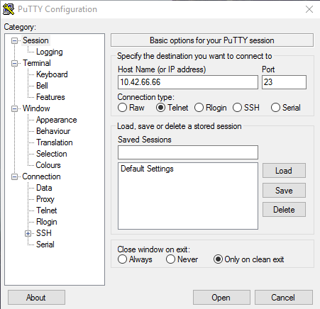</a>
  <span class="md_figcaption">
    Putty menu
  </span>
</div>

12) You should now see the black Recovery Mode menu on your computer screen (picture below):

<div class="flex-images" markdown="1">

* <a href="RecoveryModeXperia.png"></a>
  <span class="md_figcaption">
    Recovery mode
  </span>
</div>

This signifies that you are ready to perform a fix by using Recovery Mode.

You are now ready to move to chapter [Fixing your phone with Recovery Mode](#fixing-your-phone-with-the-recovery-mode).

After you have fixed what you need to fix, do not forget to return to chapter [Reverting phone back to the normal state](#reverting-the-phone-back-to-the-normal-state) of this document. You must revert the phone back to its normal state.

## Preparing your Mac computer for the Recovery Mode
To run the Recovery Mode on a **Mac computer**, you need to download the _HoRNDIS driver_ but all other software is already on your computer. You must use version 9 (or later) of HoRNDIS driver.

Citation of proof of [joshuawise.com](www.joshuawise.com/horndis): "Versions 10.11 and newer of Mac OS X have a rewritten USB stack that is substantially less compatible than that in 10.10 and below. HoRNDIS 9.0 has been rewritten to support MacOS 10.11 and above (El Capitan, Sierra, High Sierra and Mojave); for those versions of MacOS, please try the latest version of HoRNDIS!"

1) Browse to [joshuawise.com](www.joshuawise.com/horndis)

2) Download and install the latest version of the HoRNDIS driver.

3) After installing the driver you may be prompted to perform a system restart and receive a notification about a "Kernel extension not from an identified developer":

<div class="flex-images" markdown="1">

* <a href="Mac_Horndis_installed.png">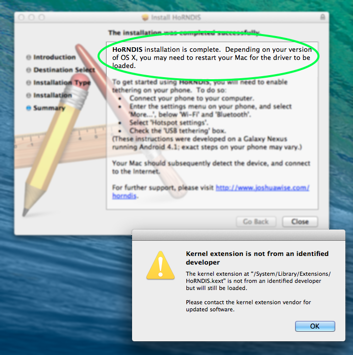</a>
  <span class="md_figcaption">
    Downloading and installing HoRNDIS
  </span>
</div>

Please click OK on the pop-up and restart your computer if you are unsure should you do so or not.

4) Once the driver is installed, attach your Xperia 10 II to your Mac with a data-enabled USB cable.
Note: The phone must be in the Recovery Mode before attaching the cable, see [this chapter](#setting-up-the-recovery-mode-on-the-phone).

5) Next, you need to locate the Terminal application. To do so:
* Open Finder
* Click the tab "Applications" and open "Utilities"

<div class="flex-images" markdown="1">

* <a href="Mac_Apps-Utilities.png">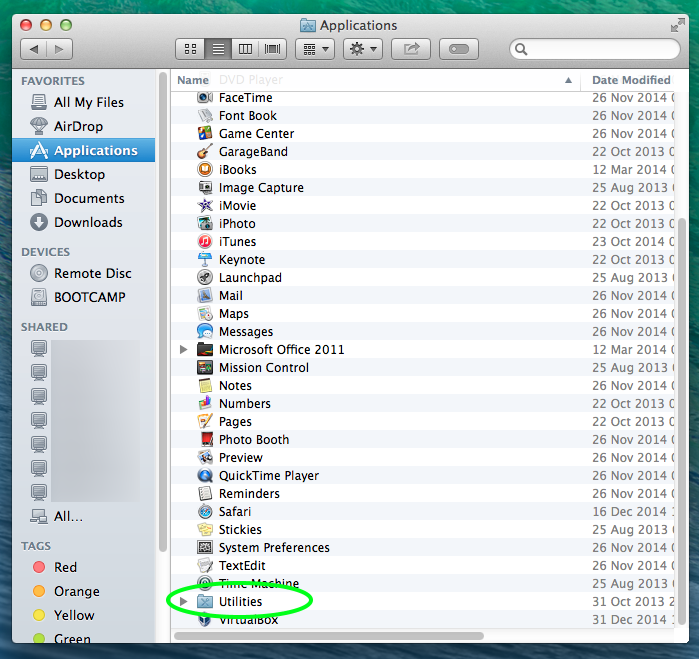</a>
  <span class="md_figcaption">
    Apps Utilities
  </span>
</div>

* Double-click the Terminal icon to launch it.

<div class="flex-images" markdown="1">

* <a href="Mac_Terminal.png">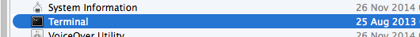</a>
  <span class="md_figcaption">
    Terminal
  </span>
</div>

6) Once Terminal is open, select Shell "New Remote Connection..."

<div class="flex-images" markdown="1">

* <a href="Mac_remote_conn.png">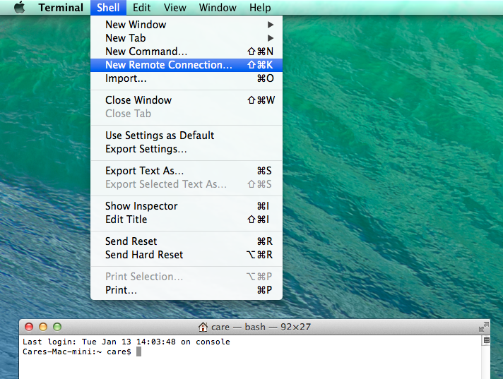</a>
  <span class="md_figcaption">
    Remote connection
  </span>
</div>

7) Click on "Remote Login (telnet)" and then the + -icon to add a server.

<div class="flex-images" markdown="1">

* <a href="Mac_telnet.png"></a>
  <span class="md_figcaption">
    Telnet
  </span>
</div>

8) Type in the address: 10.42.66.66 and press "OK".

<div class="flex-images" markdown="1">

* <a href="Mac_telnet_IP.png">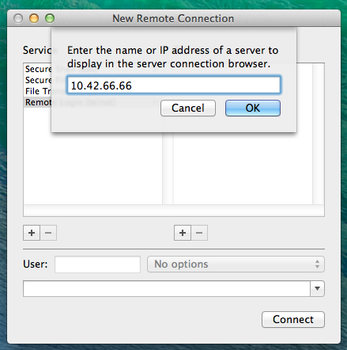</a>
  <span class="md_figcaption">
    Telnet
  </span>
</div>

9) You should now be in Recovery Mode, with the Recovery Mode menu visible on your computer screen:

<div class="flex-images" markdown="1">

* <a href="RecoveryModeXperia.png"></a>
  <span class="md_figcaption">
    Recovery
  </span>
</div>

You are now ready to move to chapter [Fixing your phone with Recovery Mode](#fixing-your-phone-with-the-recovery-mode).

## Preparing your Linux computer for the Recovery Mode
It is likely that you won't need to download any additional software to use the Recovery Mode. Below we've used Ubuntu.

1. Connect your Xperia 10 II to your PC with a data-enabled USB cable.
Note: The phone must be in the Recovery Mode before attaching the cable, see [this chapter](#setting-up-the-recovery-mode-on-the-phone).

2. Open the Terminal application.

3. Type into the Terminal:
```
telnet 10.42.66.66
```
4. You should now see the Recovery Mode menu:

<div class="flex-images" markdown="1">

* <a href="RecoveryModeXperia.png"></a>
  <span class="md_figcaption">
    Recovery
  </span>
</div>

You are now ready to move to chapter [Fixing your phone with Recovery Mode](#fixing-your-phone-with-the-recovery-mode).

After you have fixed what you need to fix, do not forget to return to the chapter [Reverting the phone back to the normal state](#reverting-the-phone-back-to-the-normal-state) of this document. You must revert the phone back to its normal state.

# Fixing your phone with the Recovery Mode

## Backing up data from your phone to a memory card
It may be possible to save some data from your device using option "3) Shell" in the Recovery menu. For this operation, you will need a MicroSD card inserted into your phone. The card must have been formatted for Sailfish OS (see the [help article on SD cards](/Support/Help_Articles/SD_Card_Format_and_Encryption/)).

To learn about saving some of your data through the Recovery Mode, please follow [Using the SD card in Recovery Mode](/Support/Help_Articles/SD_Card_in_Recovery_Mode/).

When the process is complete, you will need to revert the phone back to its normal state as instructed in the chapter [Reverting the phone back to the normal state](#reverting-the-phone-back-to-the-normal-state) of this document.

## Resetting phone to factory settings in the Recovery Mode
NOTE: this option deletes **ALL** data from your device. Resetting to factory settings does not affect data on the SD (memory card) and SIM cards, however.

1. Prepare your PC and device for Recovery Mode as described in [this chapter](#setting-up-the-recovery-mode-on-the-phone), until you see the Recovery Menu.
2. In the Recovery Mode menu take option #1 "Reset device to factory state"

**Note**: If your terminal application suddenly disappears when attempting to run this function, simply connect to Recovery Mode again, and go straight to performing the Device Reset. You may have to repeat this a number of times.

3. Give the process some time to run and follow on-screen instructions.

When the process is complete, you will need to revert the phone back to its normal state as instructed in the chapter [Reverting the phone back to the normal state](#reverting-the-phone-back-to-the-normal-state) of this document.

## Releasing Xperia 10 II or 10 III from "Permanent lock"
This requires that you know the correct security code!

In some circumstances it may happen that the allowed maximum number of unlocking attempts of the device lock gets exceeded, resulting in "Maximum attempts used. Device is permanently locked". The following procedure may help in unlocking the device:

Take option "3) Shell" in the Recovery menu
Type the following two commands. In the latter command replace **"12345"** with your correct security code!
```
chroot /rootfs
/usr/lib*/qt5/plugins/devicelock/encsfa-fpd --check-code 12345
exit
```
NOTE: There is no feedback from the 2nd command, so be sure to type your security code correctly. You will see the result (i.e. phone no more permanently locked) only after leaving the Recovery Mode.

* Type exit to escape the Shell and return to the main menu of Recovery Mode.
* In this document, go to the chapter [Reverting the phone back to the normal state](#reverting-the-phone-back-to-the-normal-state) of this document.

## Running file system check
It is possible to have the file system of your Xperia 10 II checked by selecting option #4 in the Recovery menu. This utility will try to fix problems if possible, too.

Please type the security code of your Xperia 10 II when requested.

The following excerpt shows sample output from an Xperia XA2 (that of Xperia 10 II is similar):
```
Type the number of the desired action and press [Enter]: 4 /dev/mmcblk0rpmb:
  read failed after 0 of 4096 at 0: Input/output error /dev/mmcblk0rpmb: read failed
  after 0 of 4096 at 4128768: Input/output error /dev/mmcblk0rpmb: read failed
  after 0 of 4096 at 4186112: Input/output error /dev/mmcblk0rpmb: read failed
  after 0 of 4096 at 4096: Input/output error 2 logical volume(s) in volume group
  "sailfish" now active e2fsck 1.45.4 (23-Sep-2019) Pass 1: Checking inodes, blocks,
  and sizes Pass 2: Checking directory structure Pass 3: Checking directory connectivity
  Pass 4: Checking reference counts Pass 5: Checking group summary information
  root: 24319/153600 files (0.5% non-contiguous), 334332/640000 blocks Opening
  encrypted filesystem, you will be prompted for your security code. Enter passphrase
  for /dev/sailfish/home:

  e2fsck 1.45.4 (23-Sep-2019) Pass 1: Checking inodes, blocks, and sizes Pass 2:
  Checking directory structure Pass 3: Checking directory connectivity Pass 4:
  Checking reference counts Pass 5: Checking group summary information /dev/mapper/luks-home:
  3627/1150560 files (2.1% non-contiguous), 428882/4601344 blocks /dev/mmcblk0rpmb:
  read failed after 0 of 4096 at 0: Input/output error 0 logical volume(s) in volume
  group "sailfish" now active Done
```
Press [Enter] to return to recovery menu. AFter that, proceed to reading the next chapter of this document.


# Reverting the phone back to the normal state
It is crucial to follow the below steps to successfully revert your phone from Recovery Mode back to its normal state:
* Select option 6 'Exit' in the Recovery Mode menu.
* Disconnect the USB cable from the phone.
* Press the Vol Up key down, keep it pressed and press the Power key, too. When you feel the vibrator play once and soon after three (3) times (this should happen in about 20 seconds), release both keys. In this way, we ensure that the phone is completely turned off before we proceed to the next phase.

Your phone has exited the Recovery mode now. It is off. You will still need to return it to its normal state. 
How this is done depends on the Xperia model. Read carefully.

## Reverting Xperia 10 II or Xperia 10 III to the normal mode

On these phone models, the boot image _hybris-boot.img_ must be re-installed in the fastboot mode.

Force your Xperia again to the fastboot mode:

* Hold the Volume Up key down and connect your USB cable again
* Ensure that the LED at the top of the display area is lit in BLUE colour

You will need the same version of hybris-boot.img as belongs to the Sailfish OS version of your phone currently. If you have updated your phone to the latest release then download the latest Sailfish OS image from [**Jolla Shop**](https://shop.jolla.com/downloads/). The downloaded package contains the matching hybris-boot.img. 

If you happen to have an older OS release on the phone, get the hybris-boot.img from the installation directory of that release.
Another way would be to extract the file from your device by selecting the option "5) Run sshd" and using "scp" to retrieve it from ``` /rootfs/boot/hybris-boot.img```.

We are ready to install the boot image:
* Open the Terminal app on your computer. Proceed to the directory where you have the _hybris-boot.img_ file.
* The following commands will restore the boot partition (the BLUE LED must be lit at this point)

On Windows:
```
  fastboot flash boot_a hybris-boot.img 
  fastboot flash boot_b hybris-boot.img 
  fastboot reboot
```
On Linux or Mac:
```
  sudo fastboot flash boot_a hybris-boot.img
  sudo fastboot flash boot_b hybris-boot.img
  sudo fastboot reboot
```

<div class="flex-images" markdown="1">

* <a href="Restoring_Xperia_10_II_boot_partition.png">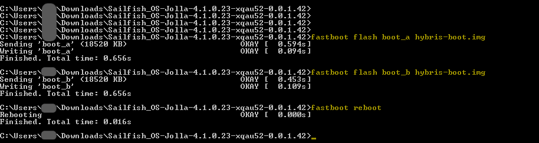</a>
  <span class="md_figcaption">
  </span>
</div>

After the reboot, your phone will be back to the normal state. Sailfish UI will appear. Disconnect the USB cable.


## Reverting Xperia X, Xperia XA2 or Xperia 10 to the normal mode


1. Select option 6 'Exit' in the Recovery Mode menu.
2. Disconnect the USB cable from the phone.
3. Press the Vol Up key down, keep it pressed and then also press the Power key. Release both keys when you feel the vibrator play three times - this will happen in about 20-30 seconds. The phone is turned off now.
4. Turn the phone on by applying the Power key in the normal way.

The phone is back in its normal state.


