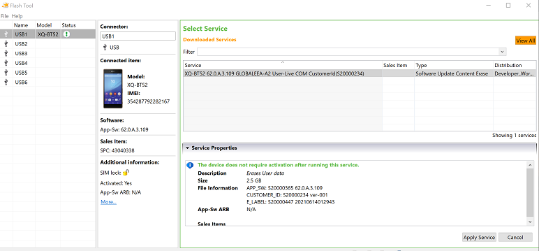
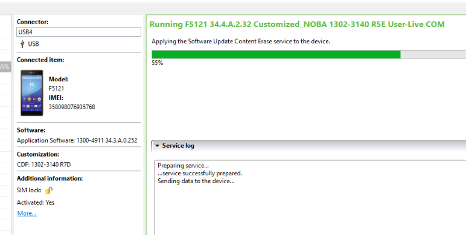
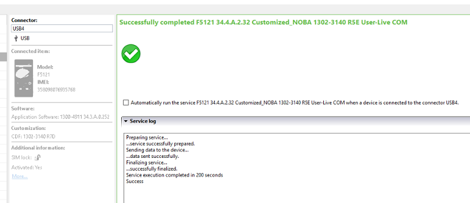
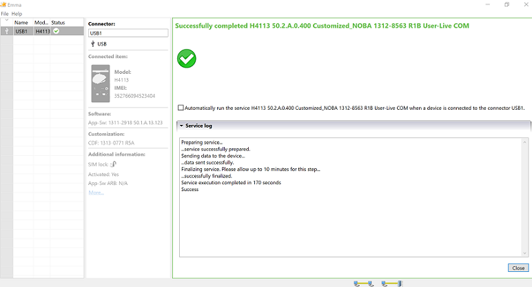
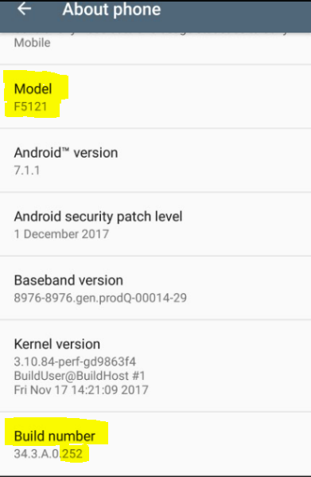
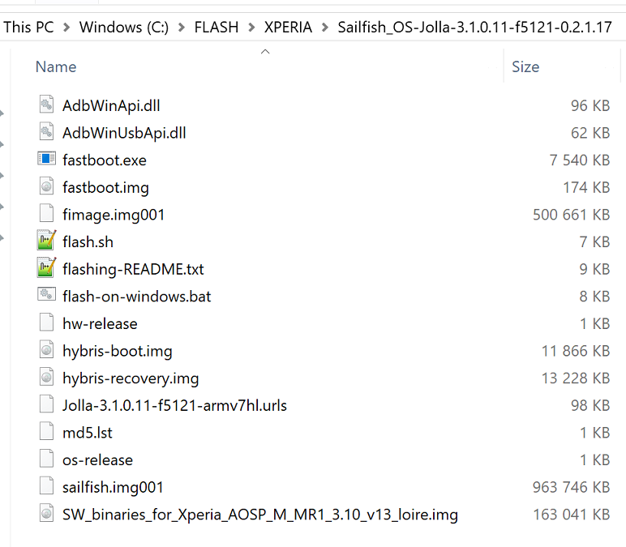
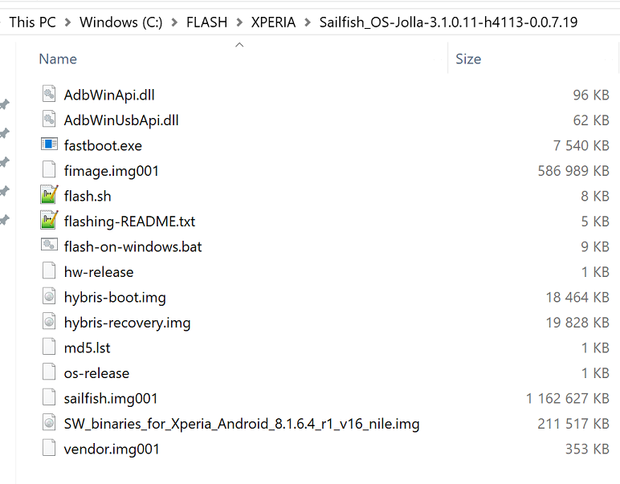

Reverting Xperia device to Android OS and reinstalling Sailfish OS

It has turned out that the following procedure may help if something has gone wrong while preparing the device for Sailfish OS and/or while installing Sailfish OS.

These instructions were originally written for Xperia X. However, the same works for Xperia XA2, Xperia 10, Xperia 10 II, and Xperia 10 III models, too.

Depending on the problems observed on your Xperia, it may be enough to reinstall ("reflash") Sailfish OS to it -- see this **[help article](https://jolla.zendesk.com/hc/en-us/articles/360002304714)**. However, if your Xperia cannot use the services of cellular network properly (or at all), then it may be necessary to revert the device back to Android first, and finally, reinstall Sailfish X.

**NOTE:** Reverting the device back to Android means that **all data** in the device memory **will be deleted**. Only the SD and SIM cards remain untouched.

# This is our plan

1.  Revert the device back to Android OS first
2.  Use your device and your SIM card with Android OS, checking the main functionality (see chapter 3)
3.  Re-flash Sailfish OS to the device.

# Reverting Xperia back to Android OS

## Getting Emma and connecting Xperia to it

Reverting Xperia device back to Android requires the **[Emma](https://developer.sony.com/develop/open-devices/get-started/flash-tool/download-flash-tool/)** tool from Sony. Emma runs on **Windows PC** only. It does not work on Linux or Mac computers.

Follow **chapter 1**, **option 2** in our **[official Sailfish X instructions](https://jolla.com/sailfishx-windows-instructions/)** (the Windows version for **Xperia X**). Please note that even if you have an Xperia XA2, Xperia 10, Xperia 10 II or Xperia 10 III, you must follow the instructions of Xperia X for using Emma (but only this part, using Emma).

Install Emma on your Windows PC.

Now, open Emma. Turn your Xperia off (wait for 15 sec after the red light has turned off).

Keep the **Volume DOWN** button pressed when connecting the USB **data** cable between the phone and the PC, and you must see a **GREEN light** on the Xperia. Once connected, you will use Emma to download and install the Android OS (Android baseband). The download may take time, so wait patiently.

## Downloading and installing the Android baseband

### Selecting the version of Android baseband

See the pictures below. They show the Emma home view on your PC once you have connected your Xperia phone and requested the list of available Android services (i.e., after you have clicked on "All services" button or "View all" button).  Picture 2.2.1.a present the Emma view of Xperia 10 III.

Select the Android baseband version (or "service" as they are called in Emma) according to the table below. The corresponding Android OS versions shown in the phone settings are in parentheses.

  
As of March 2022, the latest services were as below but note that the exact version ID's can vary by model (regular/Plus/Ultra) and by sales area. The first part of the ID (in bold letters) is significant and should be followed (anything after the letter A may vary and does not matter in this context):

| Device        | Android version                                                              |
| ------------- | ---------------------------------------------------------------------------- |
| Xperia X      | **34.4**.A.2.118 (Android 8)                                                 |
| Xperia XA2    | **50.2**.A.0.400 (Android 9) [1]   **50.1**.A.13.123 (Android 8) [2]    |
| Xperia 10     | **53.0**.A.8.69 (Android 9) [3]                                              |
| Xperia 10 II  | **59.1.**A.0.485 (Android 11)   **59.0**.A.6.24 (Android 10) [4]        |
| Xperia 10 III | **62.0.**A.3.109 (Android 11)   **62.1.**A (Android 12) [5]             |

[1] This Android 9 version appears to sometimes get an invalid WiFi MAC which prevents the phone from using WiFi networks (in the Android mode). In such a case, first flash an Android 8 version, boot up, and then flash Android 9.  Note that even if there was no WiFi on Android 9, after installing Sailfish, WiFi works again.
[2] We recommend Android 9 for Sailfish 3.3.0 and later. Baseband version 50.3.A.z.y might become available. Do not take it as it corresponds to Android 10, the compatibility with Sailfish has not been tested.
[3] Use 53.0.A.x.y (Android 9). Do not install Android 10 as Sailfish is not compatible with it. Baseband versions 53.1.A.x.y imply Android 10, so do not install them with Emma as the WiFi service of the phone would get broken.
[4] Both Android 10 and Android 11 are compatible with Sailfish. However, we recommend using Android 11, so select Android baseband 59.1.A.x.y if available.
[5] Both Android 11 and Android 12 are compatible with Sailfish. However, we still recommend using Android 11, so select Android baseband 62.0.A.x.y if available.

If there are two code packages with the same version ID, choose the one with the type "Software Update Content Erase" (instead of "Firmware update"), please. This is to force all possible changes into place.

||
|-|
|Picture 2.2.1.a: Initial Emma view from Xperia 10 III|

### Downloading and installing Android baseband

Then click "Apply service". Emma starts to download the update which lasts quite a while as the size is about 2.6 GB. Once downloaded, click the button at the bottom right corner to install the code to your Xperia.

||
|-|
|Picture 2.2.2.a: Flashing to device|

Picture 2.2.2.a above shows how the Android baseband is downloaded and then flashed to an Xperia X. Picture 2.2.2.b below indicates that the job was completed successfully.

Picture 2.2.2.c shows that Android 9 (build version 50.2.A.0.400) was successfully installed to an Xperia XA2.

Using Emma works in the same way with other products.

||
|-|
|Picture 2.2.2.b Flashing success|

||
|-|
|Picture 2.2.2.c Android installed |

# Checking that the phone works with Android

Detach the USB **data** cable from the device now. Start the device with the Power button and **run the Android start-up routine** where you can skip as many steps as possible (as you will soon install Sailfish OS).

Please note that it takes quite a while (minutes) before the Android start-up routine appears (other than a spinner).
  
**THIS IS VERY IMPORTANT**:
**Use your Xperia device some time with Android OS. Check the following, at least:

* phone calls can be made and received -- you can hear the remote party and (s)he can hear you
    
* browsing the internet with a mobile data connection (WLAN turned off) works
    
* browsing the internet with WLAN (mobile data turned off) works
    
* take pictures with the camera
    
* turn the location service (satellite-based position) on and check that the phone can show your location on a map
* play some music
* ensure that the touch display is responsive at all parts of the display
      
See picture 3 below. Do not forget to check that your phone has now the intended Android version. So, open the menu page Settings > System > About phone. Check the Android version and build number.  
    

Picture 3: Check the Android version

# Installing Sailfish X again to Xperia X, XA2, 10, 10 II, and 10 III

Installing Sailfish can be made with Windows, Linux or Mac computers. In the next chapters, we have pointers to our official Sailfish X instructions.

Make sure you have the **[latest available Sailfish OS](https://forum.sailfishos.org/tag/release-notes)** version downloaded to your computer and that the Sailfish variant is the correct one for your **phone model**. You can check the exact model by pulling out a white label from the SIM card slot, listing the info (e.g. H3113 or I4213). Other ways to check the model are the sales box label and the phone menus. Trying to install (flash) an incorrect one will fail.

The latest Sailfish OS version (and only the latest) is always available in **[this repository](https://shop.jolla.com/downloads/)** and can be downloaded from there. Please, sign in to this service by using the same Jolla account that you used for buying the Sailfish X license.

NOTE:  The links at the Download buttons are valid for a fairly short period of time only after entering the page.  Should you get a "403 permission denied error" when trying to download, you will need to reload the page to refresh the download links.

After downloading and unzipping the Sailfish package, it is good to check that the contents of your Sailfish OS directory are similar to those in pictures 4a, 4b or 4c below (there are small variations across phone generations).

||
|-|
|Picture 4a:Sony Xperia X single SIM (f5121)|

||
|-|
|Picture 4b:Sony Xperia XA2 dual SIM (H4113)|

||
|-|
|Picture 4c:Sony Xperia 10 II dual SIM (XQ-AU52)|

In particular, check that you have file "SW\_binaries\_for\_Xperia\_Android*.img" there. If missing, select the instructions applicable to you:

* for Xperia X:      SW\_binaries\_for\_Xperia\_AOSP\_M\_MR1\_3.10\_**v13_loire**.img
    (if missing, visit chapter 5: **[Windows](https://jolla.com/sailfishx-windows-instructions/), [Linux](https://jolla.com/sailfishx-linux-instructions/), [Mac](https://jolla.com/sailfishx-macos-instructions/)** )  
    
* for Xperia XA2:  SW\_binaries\_for\_Xperia\_Android\_8.1.6.4\_r1_**v16_nile**.img
    (if missing, visit chapter 5: **[Windows](https://jolla.com/sailfishx-windows-instructions-xa2/)2, [Linux](https://jolla.com/sailfishx-linux-instructions-xa2/)2, [Mac](https://jolla.com/sailfishx-macos-instructions-xa2/)2** )  
    
* for Xperia 10:  SW\_binaries\_for\_Xperia\_Android\_9.0\_2.3.2_**v9_ganges**.img
    (if missing, visit chapter 5: **[Windows2](https://jolla.com/install-sailfish-x-xperia-10-windows/), [Linux2](https://jolla.com/install-sailfish-x-xperia-10-linux/), [Mac2](https://jolla.com/sailfishx-xperia10-macos/)** )
* for Xperia 10 II:  SW\_binaries\_for\_Xperia\_Android\_10.0.7.1\_r1_**v12b_seine**.img
    (if missing, visit chapter 5: **[Windows](https://jolla.com/how-to-install-sailfish-x-on-xperia-10-ii-on-windows/)**, **[Linux](https://jolla.com/how-to-install-sailfish-x-on-xperia-10-ii-on-linux/)**, **[Mac](https://jolla.com/how-to-install-sailfish-x-on-xperia-10-ii-on-macos/)** )
* for Xperia 10 III:  SW\_binaries\_for\_Xperia\_Android\_11\_4.19_**v9a_lena**.img
    (if missing, visit chapter 5: [**Windows**](https://jolla.com/how-to-install-sailfish-x-on-xperia-10-iii-on-windows/), **[Linux](https://jolla.com/how-to-install-sailfish-x-on-xperia-10-iii-on-linux/)**, **[Mac](https://jolla.com/how-to-install-sailfish-x-on-xperia-10-iii-on-macos/)** )

Install (flash) Sailfish OS  to your Xperia. Select the instructions applicable to you:

* Xperia X, as instructed in chapters 6: [Windows](https://jolla.com/sailfishx-windows-instructions/), [Linux](https://jolla.com/sailfishx-linux-instructions/), [Mac](https://jolla.com/sailfishx-macos-instructions/).
* Xperia XA2, as instructed in chapters 6: [Windows](https://jolla.com/sailfishx-windows-instructions-xa2/)[,](https://jolla.com/sailfishx-macos-instructions/) [Linux](https://jolla.com/sailfishx-linux-instructions-xa2/)[,](https://jolla.com/sailfishx-macos-instructions/) [Mac](https://jolla.com/sailfishx-macos-instructions-xa2/)
* Xperia 10, as instructed in chapters **8**: [Windows](https://jolla.com/install-sailfish-x-xperia-10-windows/), [Linux](https://jolla.com/install-sailfish-x-xperia-10-linux/), [Mac](https://jolla.com/sailfishx-xperia10-macos/)
* Xperia 10 II, as instructed in chapters **8**: [Windows](https://jolla.com/how-to-install-sailfish-x-on-xperia-10-ii-on-windows/), [Linux](https://jolla.com/how-to-install-sailfish-x-on-xperia-10-ii-on-linux/), [Mac](https://jolla.com/how-to-install-sailfish-x-on-xperia-10-ii-on-macos/)
* Xperia 10 III, as instructed in chapters **8**: [Windows](https://jolla.com/how-to-install-sailfish-x-on-xperia-10-iii-on-windows/), [Linux](https://jolla.com/how-to-install-sailfish-x-on-xperia-10-iii-on-linux/), [Mac](https://jolla.com/how-to-install-sailfish-x-on-xperia-10-iii-on-macos/)
    

  
While connecting the USB data cable (*) press the **Volume UP** button of the phone. Then, you must see a **BLUE light** lit on the phone (if green, disconnect, reconnect and try again - press the button gently).

After you have completed flashing, the printout similar to that shown in the **[PDF file Windows](/hc/en-us/article_attachments/360025713940/Flashing_Sailfish_X_to_Xperia_10_II_with_Windows_10_computer.pdf)** or **[PDF file Linux](/hc/en-us/article_attachments/360025717899/Flashing_Sailfish_X_to_Xperia_10_II_with_Linux_Ubuntu_computer.pdf)** should appear on your computer screen (Sailfish OS version ID will be different as time goes on).

# Booting up to Sailfish OS

You can now turn your Xperia on by pressing the Power key. Let it then run the initial start-up of Sailfish OS.

First, you will see a reminder of an unlocked boot loader, which you can ignore. This is not a defect.

Sign in to your **Jolla account** in order to get the Android App Support and other licensed content. The Jolla account must be the same as you used when purchasing the Sailfish X licence.

Next, you can install more **Sailfish apps** from the Jolla store and **[Android apps](/hc/en-us/articles/201440787)** from stores like **[APKPure](m.apkpure.com)** or **Aptoide** (appearing with an orange icon in Jolla Store).
