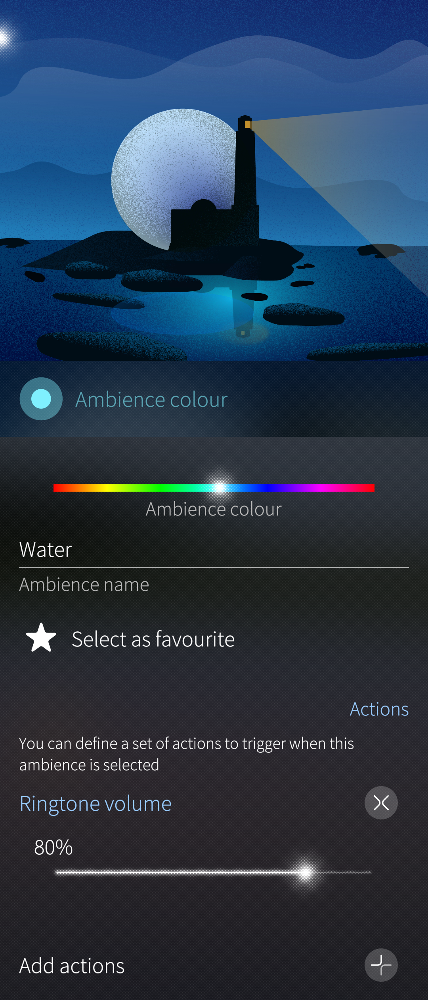
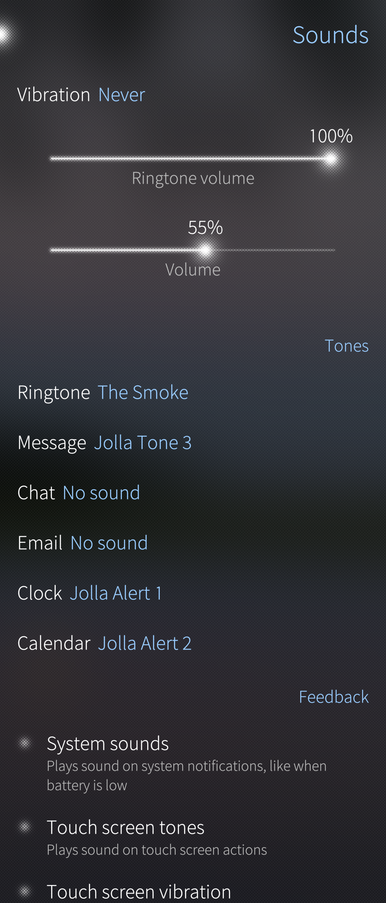
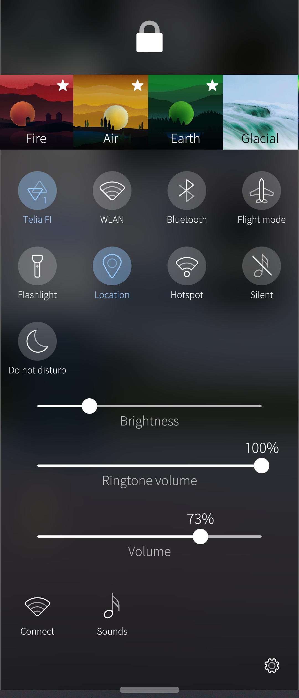
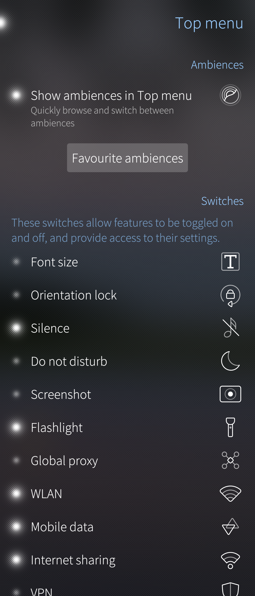

# Pre-requisites
To use your own audio file as a tone in your Sailfish device, your file must be playable with Media app. In other words, it must be compatible with the [audio codecs](https://docs.sailfishos.org/Reference/Core_Areas_and_APIs/Multimedia/#audio) supported by SailfishOS. We also recommend your files to contain information of the album and artist names.

You can also modify your audio files on your PC before transferring those to your Sailfish device. The tones can be placed in the phone memory or in the SD card.

You can read more about transferring files between your Sailfish device and your PC, please see [here](/Support/Help_Articles/Moving_Files_Between_PC_and_Sailfish_Device/).

# Selecting a ringtone for an ambience

1. Open Settings > Ambiences.
2. Tap on the ambience you want to edit.
3. Tap on "Add actions" in the bottom of the page.
4. Tap on the action you want to add the tones, for example "Ringtone".
5. Tap on "Select from music files".
6. Tap on a song you want to add (song starts to play).
7. If you want to use that song then tap on Accept.
8. Go back to the ambiance main page by tapping the top left corner
9. Pull down "Set ambience" if you want to use this ambience and its tones.
10. You can read more about Ambiences from [here](/Support/Help_Articles/Ambiences/).

Other actions and tones can be added and changed same way.

* 
  
  

# Sounds and feedback
Sounds and feedback can be adjusted also from Settings > Sounds and feedback.
From that view you can adjust also:
* Vibration
* Ringtone volume
* System volume (Volume level of the Media sounds etc.)
* Tones
  * Ringtone
  * Message
  * Chat
  * Email
  * Clock
  * Calendar
* System sounds
* Touch screen tones
* Touch screen vibration
* Enable or disable 'Do not disturb mode' (Notifications are silenced and also chosen calls, which can be chosen from Ringtone for incoming calls)
  * Ringtone for incoming calls (You can choose which calls will alert while 'Do not disturb mode' is enabled.

* 
  
  

# Top menu

## Controlling the phone with the Top Menu

Note also that with a top swipe you can open [Top menu](https://sailfishos.org/design/ux-framework/) where you can adjust several actions and settings related also to the ringtones and sounds. You can do this by opening the top menu with the top swipe and selecting the action you want to adjust.

* 
  
  

## Setting up the Top Menu

You can setup the Top menu actions and settigs by opening the top menu with the top swipe and tapping the settings icon on the right bottom corner and then open 'Go to Top menu settings'. From the Top menu you can enable or disable various sounds and feedback related settings to the top menu.

* 
  
  

