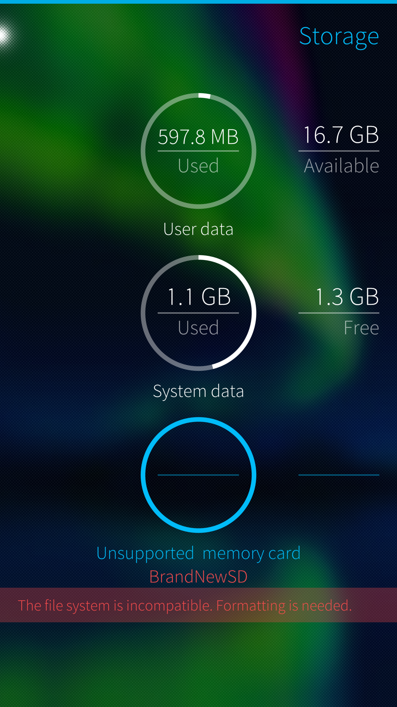
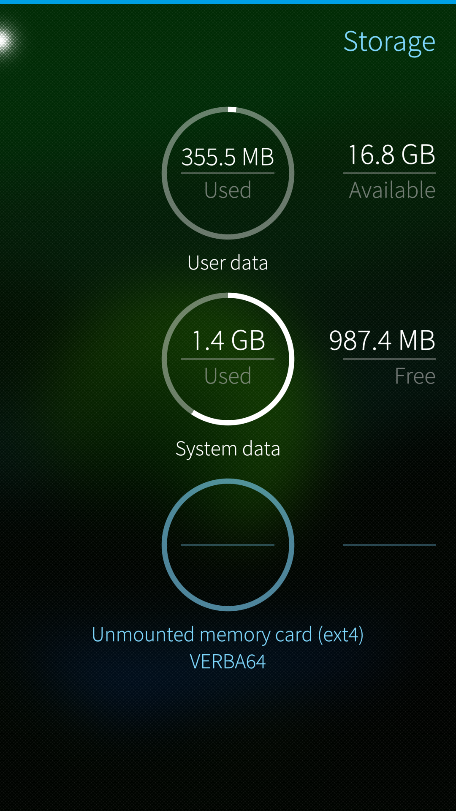
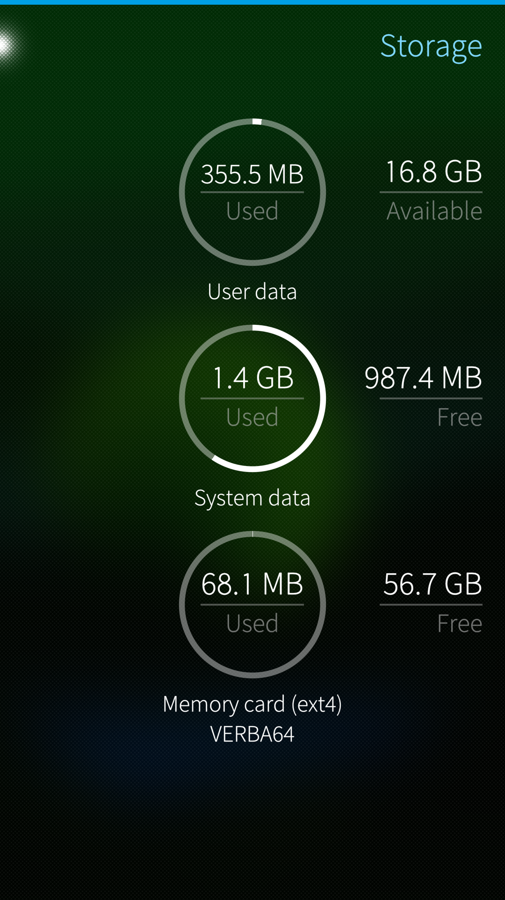
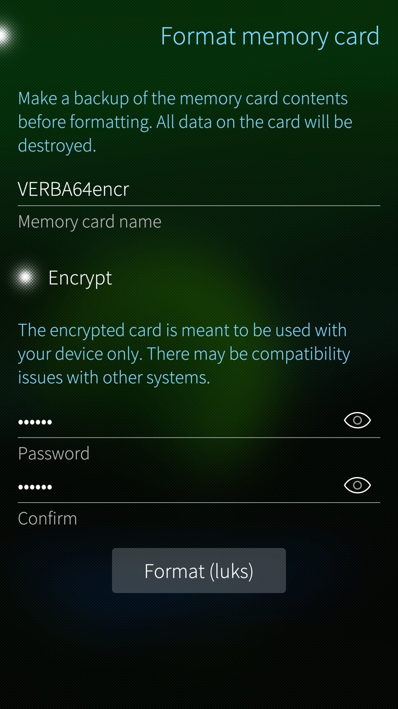
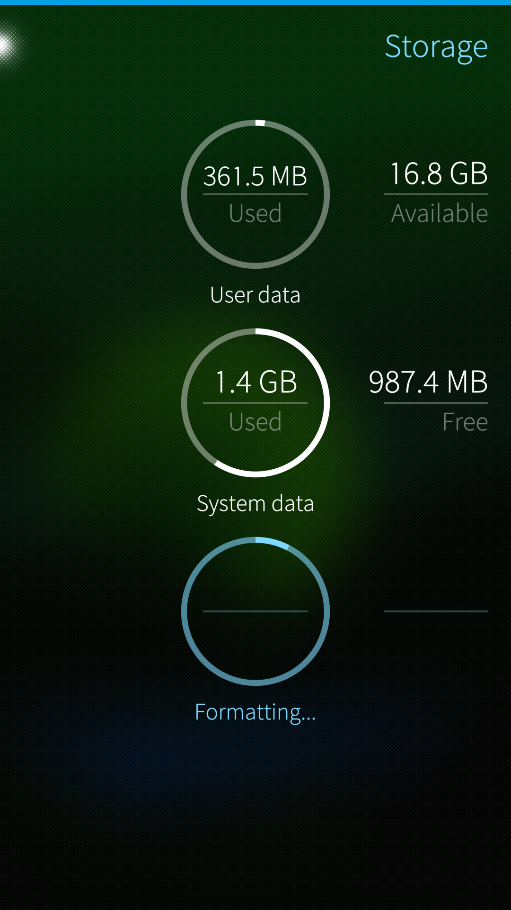
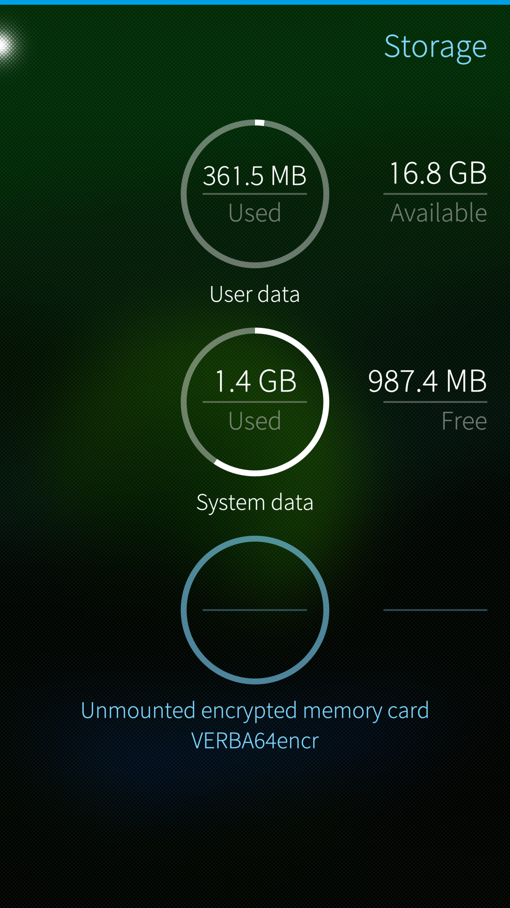
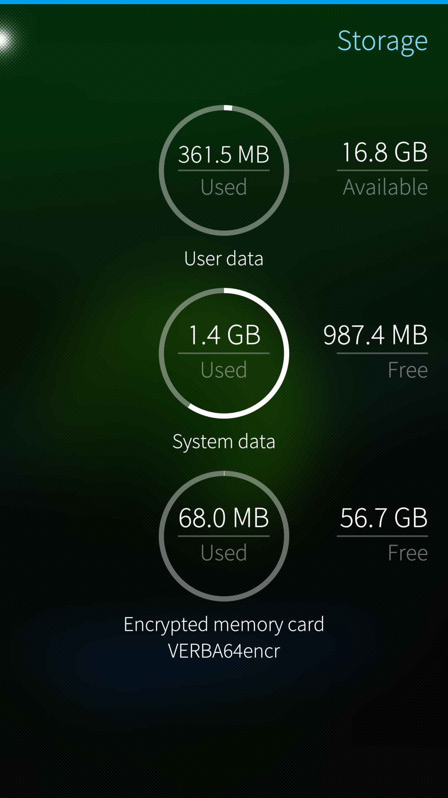
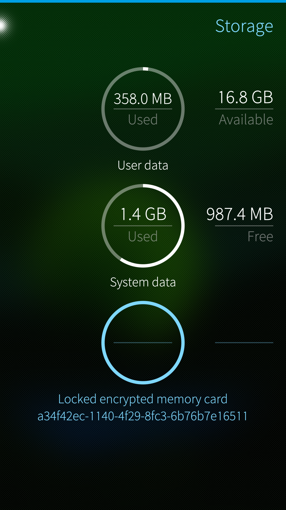
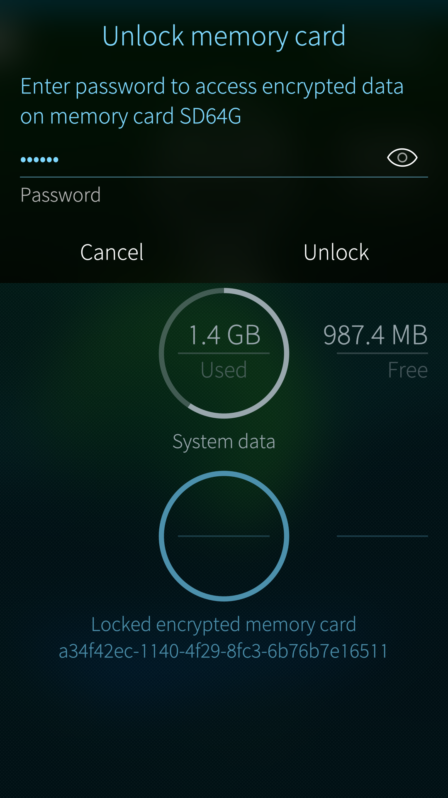
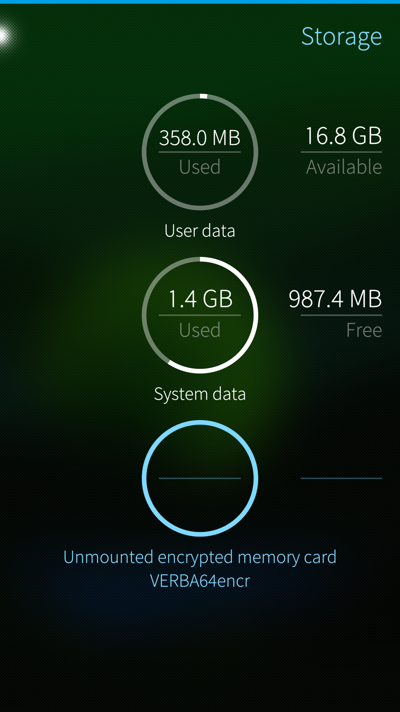

# Introduction

This document discusses memory cards on Sailfish OS devices.


## Compatible cards and formats  


Sailfish OS supports **microSD** cards (**SDHC** cards) up to 32 GB of storage capacity in FAT32 [^1] and ext4 [^2] formats.

Sailfish OS can also handle SD cards with more storage capacity (64 GB, 128 GB, and even more). These **SDXC** memory cards are typically sold in exFAT [^3] format which is not compatible with Sailfish OS. Therefore, they must be formatted to ext4 before they can be used in Sailfish devices. Either the card is formatted on a computer before inserting it into a Sailfish device or else the user lets Sailfish format the card using the menu page "Settings > Storage". Please bear in mind that formatting the card will wipe out all existing data from it.

Note that Windows and Mac computers are not able to show the contents of ext4 cards directly. However, if an ext4 card is inserted in a Sailfish device that is connected to a computer with USB using the media transfer mode (MTP), then the card and its contents are available for the file manager on the computer.

Inserting a card that is incompatible (e.g. in exFAT format) will lead to the warning "_The file system is incompatible. Formatting is needed_" in "Settings > System > Storage".

<div class="flex-images" markdown="1">

* <a href="SD-unsupported.png" class="narrow-image"></a>
  <span class="md_figcaption">
    SD card with an unsupported format
  </span>
</div>

Some card brands or models may not be recognised by all Sailfish-driven devices.

This article is also valid for **external storage device** which can be connected with a special **USB On-The-Go** cable to your Sailfish device.


## Terminology  

The contents of an SD card can be protected by **encrypting** [^4] it with Sailfish OS. The encryption standard used by Sailfish OS is _Linux Unified Key Setup (LUKS)_ [^5].

An unencrypted card is automatically **mounted** [^6] (opened for use) on the system when the device is restarted. After this, apps like Gallery can show the pictures and videos residing on the card. Camera app can be set to save pictures and video clips directly to the card.

An encrypted card must be **unlocked** by the user in "Settings > Storage" and then **mounted**, before it becomes available for the apps.

## Limitations

* Memory cards encrypted with Sailfish OS cannot be used on your computer.
* Memory cards encrypted with a computer cannot be used on Sailfish OS. Cards formatted without encryption should work ok. 


# Formatting a card with Sailfish OS

Card operations are done in "Settings > System > Storage" menu. Tap and hold the memory card item - this makes the pop-up menu appear with appropriate commands in it.

There is currently no option for the user to choose which format to apply. Sailfish OS will format cards with 32 GB or less storage space to FAT32, and bigger cards to ext4 or to LUKS when encryption is chosen.

Before proceeding to format a memory card, it must first be unmounted. This is done with command "Unmount" in the pop-up menu.

<div class="flex-images" markdown="1">

* <a href="SD_format_1.png" class="narrow-image"></a>
  <span class="md_figcaption">
    SD card operations start here
  </span>
</div>

## Formatting a memory card without encrypting it  


The following sequence of 4 pictures shows how the formatting takes place. In this case, we do not want to encrypt the card. Note that you will need to **unmount** the card first (use the context menu of "Settings > System > Storage") after which the card appears as in the picture above. Next, use the context menu again and select command "Format". The view of the 1st picture below will appear. Give a nickname for your card and tap the Format button. Formatting starts (Pic 2).

<div class="flex-images" markdown="1">

* <a href="SD_format_2.png"></a>
  <span class="md_figcaption">
    Pic 1: Give a name for the card
  </span>
* <a href="SD_format_3.png"></a>
  <span class="md_figcaption">
    Pic 2: Formatting in progress
  </span>
</div>

The actual formatting is complete in Pic 3 (below). Tap and hold the memory card item and take "Mount" in the context menu - this makes the formatted card available for the apps and the view of Pic 4 appears. The card is now ready to be used. Whenever you restart the phone, this (unencrypted) card is automatically mounted.

<div class="flex-images" markdown="1">

* <a href="SD_format_4.png"></a>
  <span class="md_figcaption">
    Pic 3: Formatting complete. Card unmounted.
  </span>
* <a href="SD_format_5.png"></a>
  <span class="md_figcaption">
    Pic 4: Card mounted. Ready to be used.
  </span>
</div>


## Formatting and encrypting a memory card  

The following sequence of 4 pictures (5 to 8) shows how the formatting and encryption take place. The process of producing an encrypted and formatted card differs from mere formatting only in that one must define a **password** (see Pic 5) that will be needed when unlocking the encrypted card for use. Note that this is a password dedicated for card encryption - the Sailfish security code is not used here. Pic 6 has the formatting in progress.

<div class="flex-images" markdown="1">

* <a href="SD_format_encrypt_2.png"></a>
  <span class="md_figcaption">
    Pic 5: Give a name for the card. Tap encrypt. Type password.
  </span>
* <a href="SD_format_encrypt_3.png"></a>
  <span class="md_figcaption">
    Pic 6: Formatting in progress
  </span>
</div>

In Pic 7, the card is formatted and encrypted, just not yet mounted. Use the "Mount" command of the context menu. Pic 8 shows the card mounted and ready to be used.

<div class="flex-images" markdown="1">

* <a href="SD_format_encrypt_4.png"></a>
  <span class="md_figcaption">
    Pic 7: Formatting and encryption complete. Card unmounted
  </span>
* <a href="SD_format_encrypt_5.png"></a>
  <span class="md_figcaption">
    Pic 8: Card mounted. Ready to be used.
  </span>
</div>

Encrypted cards can be formatted again only when they are in the locked state. Formatting removes encryption as the option to encrypt is intentionally not available in this case. After this step, the card is formatted but unencrypted. You can then format it again with encryption, if needed.

It is not possible to encrypt a card without formatting it (i.e. without deleting the data).


## Using an encrypted card

The 4 pictures (9 to 12) below show the steps of unlocking an encrypted card.

Every time you turn your Sailfish device on, you must unlock the encrypted memory card in "Settings > System > Storage" with command "Unlock" of the pop-up menu (Pics 9 & 10), followed by the command "Mount" (Pics 11 & 12), to make the card available for the applications.  Without this, the apps cannot "see" and use the card. 

As soon as the card is unlocked and mounted, it appears to the apps and to the user in the same way as an unencrypted card. There is no difference in using an encrypted card compared to an unencrypted card from applications' perspective.

<div class="flex-images" markdown="1">

* <a href="SD_encr_usage_1.png"></a>
  <span class="md_figcaption">
    Pic 9: Card encrypted and locked up.
  </span>
* <a href="SD_encr_usage_2.png"></a>
  <span class="md_figcaption">
    Pic 10: Unlocking the card.
  </span>
</div>

<div class="flex-images" markdown="1">

* <a href="SD_encr_usage_3.png"></a>
  <span class="md_figcaption">
    Pic 11: Card unlocked but still unmonted.
  </span>
* <a href="SD_encr_usage_4.png"></a>
  <span class="md_figcaption">
    Pic 12: Card ready to be used.
  </span>
</div>


Use the "Unmount" or "Lock" commands in the context menu of the card when you want to make the card and its content hidden from apps.

When a Sailfish device with an encrypted memory card in it is turned off (shut down), the card becomes locked up automatically.

# Formatting an SD card to ext4 with Linux PC

It may not be possible to format all kinds of SD cards (especially those with high capacity) using Sailfish OS.  In such a case, formatting with a computer may help you out.

We recommend formatting the card to **ext4** format using a Linux computer (or with _PartitionGuru_ app, or similar, on Windows PC). Before doing this, please make sure that you know the device address of the card, so that you would not accidentally format a wrong card or disk.


# Path to the SD card (Sailfish 4)

The path to the SD card (or its location) in the Sailfish OS file system is shown below.

Normally, you should not need this path as Sailfish apps know it and present it by a logical name, e.g., the Camera settings and Backup app have "Storage Memory card 114.3 GB". Media and Gallery apps are able to find the media files residing in the card and show them among the rest of the files.

```
/run/media/<username>/<uuid>
```

where \<uuid\> stands for a unique identifier of a card and \<username\> is the Sailfish username of the admin user (e.g. nemo, defaultuser, nemo or something else).

An example:

```
/run/media/defaultuser/dee363b4-69f3-4e05-9ce0-52d80db6d757/
```

# Moving data to/from the SD card

If you have a Windows or Linux PC, read [this article](https://jolla.zendesk.com/hc/en-us/articles/201440587).
If you have a Mac, read [this article](https://jolla.zendesk.com/hc/en-us/articles/201440867).


- - - - -
[^1]: File system [FAT32](https://en.wikipedia.org/wiki/File_Allocation_Table#FAT32)
[^2]: File system [ext4](https://en.wikipedia.org/wiki/Ext4)
[^3]: File system [exFAT](https://en.wikipedia.org/wiki/ExFAT)
[^4]: Encryption is the process of encoding a message or information in such a way that only authorized parties can access it, and those who are not authorized, cannot. Source: [https://en.wikipedia.org/wiki/Encryption](https://en.wikipedia.org/wiki/Encryption)
[^5]: Linux Unified Key Setup (LUKS). Source: [https://en.wikipedia.org/wiki/Linux\_Unified\_Key_Setup](https://en.wikipedia.org/wiki/Linux_Unified_Key_Setup)
[^6]: Mounting is a process by which the operating system makes files and directories on a storage device available for users and applications to access via the device file system. Source: [https://en.wikipedia.org/wiki/Mount_(computing)](https://en.wikipedia.org/wiki/Mount_(computing))
