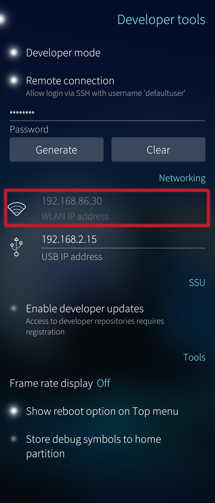

_Using the Sailfish command line on the Terminal app is ok for small tasks. However, if there is a need to type plenty of long commands, copy-pasting them perhaps, and to easily view the results, then we recommend that you connect to your Sailfish device from a computer with SSH._

# Prerequisite

You must unlock the device lock and the encryption of your Sailfish phone before you can make an SSH connection to the phone. In other words, the phone must be on and unlocked. See these articles: **[device lock](/Support/Help_Articles/Device_Lock_and_Security_Code/)** and **[encryption](/Support/Help_Articles/Encryption_of_User_Data/)**.

We refer to _Ubuntu_ Linux in this document. However, the same instructions should work with other Linux distributions.

# Preparing the connection

Make sure you have the Developer mode enabled on your Sailfish device. If not, see **[this article](/Support/Help_Articles/Enabling_Developer_Mode/)**. Check that you have the SSH password set in "Settings > Developer tools > Remote connection".

## USB

Connect a USB cable between your PC and your Sailfish device. Choose "Developer mode" on the device display at the moment of connection.

On Sailfish, the address of the USB connection is the fixed **192.168.2.15**. It appears in the examples of this document.

## WLAN

Ensure that your PC and Sailfish device are connected to the same WLAN network (SSID).
Check the **WLAN IP address** of your device in "Settings > System > Developer mode".

<div class="flex-images" markdown="1">

* <a href="Settings_wlan_ip_address.png" class="narrow-image"></a>
  <span class="md_figcaption">
    WLAN IP address of Sailfish phone
  </span>
</div>

# SSH session

Open the Terminal on Ubuntu. Note that there are two different usernames depending on the Sailfish OS version on your phone:  'defaultuser' and 'nemo'. Only the correct one works. You can check it from the prompt of the Terminal app of the phone or with the command below (before getting root rights).

```
echo $USER
```

The reply should be either `nemo` or `defaultuser`. If you should get `root` then do `exit` first and try again.

Create the SSH connection with the correct command (matching your username). In the examples of this document, we will use the more common name 'defaultuser'.

## USB example

```
ThinkPad-T480s / $ ssh defaultuser@192.168.2.15
defaultuser@192.168.2.15's password:
Last login: Thu Nov 24 16:26:35 2022 from 192.168.86.42
,---
| Sailfish OS 4.4.0.72 (Vanha Rauma)
'---
[defaultuser@Xperia10II-DualSIM ~\]$ ls -l
total 240
drwxrwxr-x 2 defaultu defaultu 4096 Sep 29 09:05 Desktop
drwxrwxr-x 2 defaultu defaultu 4096 Nov 24 15:44 Documents
drwxrwxr-x 3 defaultu defaultu 4096 Nov 24 15:59 Downloads
```

## WLAN example

```
ThinkPad-T480s / $ ssh defaultuser@192.168.86.30
defaultuser@192.168.86.30's password:
Last login: Thu Nov 24 16:26:07 2022 from 192.168.86.42
,---
| Sailfish OS 4.4.0.72 (Vanha Rauma)
'---
[defaultuser@Xperia10II-DualSIM ~\]$ ls -l
total 240
drwxrwxr-x 2 defaultu defaultu 4096 Sep 29 09:05 Desktop
drwxrwxr-x 2 defaultu defaultu 4096 Nov 24 15:44 Documents
drwxrwxr-x 3 defaultu defaultu 4096 Nov 24 15:59 Downloads
```

# SCP session

The SCP connection allows you to transfer files between your phone and your Ubuntu computer.

Prepare in the same way as in the chapter "[Preparing the connection](/Support/Help_Articles/SSH_and_SCP/SSH_and_SCP_Linux#preparing-the-connection)" above. Then use various commands to copy files between the two devices. There are some examples below.

## Over USB

**Examples:**

1) Copy the file "User-manual.txt" from Ubuntu (from the current directory) to the home directory on your phone:
```
scp User-manual.txt  defaultuser@192.168.2.15:/home/defaultuser/
```

2) Copy the directory "Scripts" from Ubuntu to the directory "test" on your phone. Note the attribute "-r" which makes it copy the entire directory tree:
```
scp -r Scripts/  defaultuser@192.168.2.15:/home/defaultuser/test/
```

3) Copy the file "journal.log" from your phone to Ubuntu (to the current directory):
```
scp defaultuser@192.168.2.15:/home/defaultuser/journal.log ./
```

4) Copy all ".log" files from the phone directory /var/log to the Ubuntu directory /testdir/logs:
```
scp defaultuser@192.168.2.15:/var/log/*.log /testdir/logs/
```

## Over WLAN

Replace the USB address 192.168.2.15 with the current WLAN IP address of your Sailfish device in the examples above.

# Troubleshooting

If the connection attempt fails, disconnect the phone from the PC. Restart the phone (consider restarting the PC, too).  Try again.

