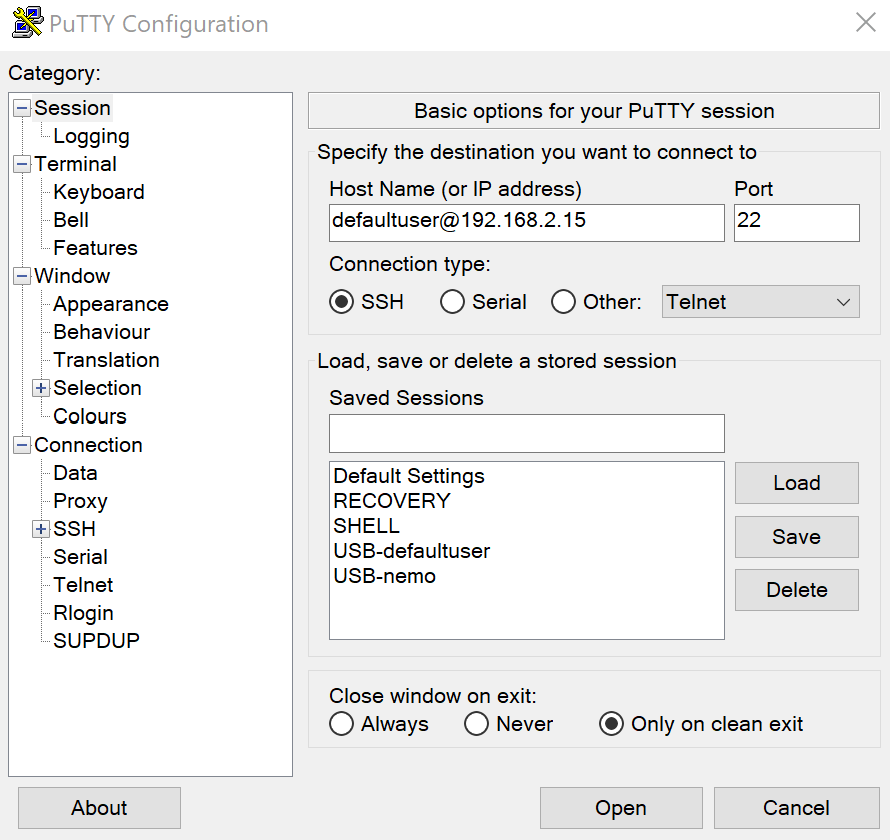
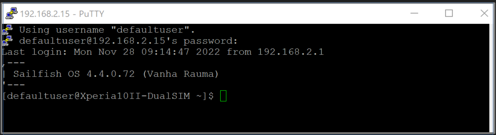
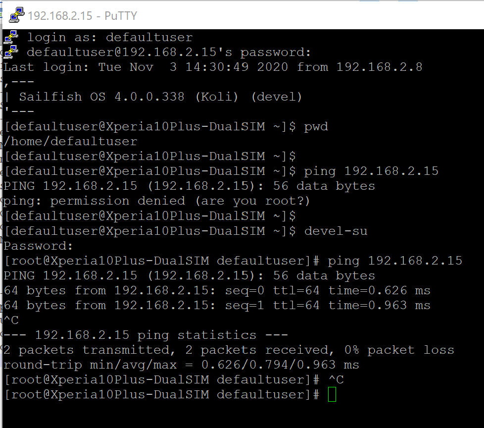

_Using the Sailfish command line on the Terminal app is ok for small tasks. However, if there is a need to type plenty of long commands, copy-pasting them perhaps, and to easily view the results, then we recommend that you connect to your Sailfish device from a computer with SSH._

# Prerequisite

You must unlock the device lock and the encryption of your phone before you can make an SSH connection to the phone. In other words, the phone must be on and unlocked. See these articles: **[device lock](/Support/Help_Articles/Device_Lock_and_Security_Code/)** and **[encryption](/Support/Help_Articles/Encryption_of_User_Data/)**.

# Preparing the connection

Make sure you have the Developer mode enabled on your Sailfish device. If not, see **[this article](/Support/Help_Articles/Enabling_Developer_Mode/)**.
Check that you have the SSH password set in "Settings > Developer tools > Remote connection".

## USB

Connect a USB cable between your PC and your Sailfish device. Choose "Developer mode" on the device display at the moment of connection.

On Sailfish, the address of the USB connection is the fixed **192.168.2.15**. It appears in the commands of this document.

## WLAN

Ensure that both your PC and your Sailfish device are connected to the same WLAN network (SSID).
Check the **WLAN IP address** of your device in "Settings > System > Developer mode". This address varies between different devices.

When you no longer need the SSH connection we recommend that you disable remote connections in "Settings > System > Developer tools"). Having the option open makes your device vulnerable to unwanted connection attempts.


# SSH session

Open the Terminal of your Sailfish device. Note that there are two different usernames depending on the Sailfish OS version on your phone:  'defaultuser' and 'nemo'. Only the correct one works. You can check it from the prompt of the Terminal app of the phone or with the command below (before getting root rights).

```
echo $USER
```

It replies either `nemo` or `defaultuser`. If you should get `root` then do `exit` first and try again.

Create the SSH connection with the correct command (matching your username). In the examples of this document, we will use the more common name 'defaultuser'.

## Get the Putty app for the SSH session

Install the **[Putty application](http://www.putty.org/)** on the PC. Once done, open Putty.

## Connecting

1) Set the host name

If you connect with USB, type **defaultuser@192.168.2.15** into the "Host Name (or IP address)" box (see the picture).

If you connect with WLAN, type **defaultuser@xxx.yyy.zzz.qqq** into the "Host Name (or IP address)" box. Replace **xxx.yyy.zzz.qqq** with the current WLAN IP address from "Settings > System > Developer tools". The picture below shows where to find the address.

<div class="flex-images" markdown="1">

* <a href="Settings_wlan_ip_address.png" class="narrow-image"></a>
  <span class="md_figcaption">
    WLAN IP address of Sailfish phone
  </span>
</div>

2) Check that **SSH** is selected for the connection type.

<div class="flex-images" markdown="1">

* <a href="Putty_SSH_type_hostname.png"></a>
  <span class="md_figcaption">
    Typing the hostname
  </span>
</div>

3) Click Open. The terminal window of Putty appears (black background - see the picture below)

4) Type your SSH password

You are now in the directory /home/defaultuser of your Sailfish device.

<div class="flex-images" markdown="1">

* <a href="Putty_and_SSH_connection.png"></a>
  <span class="md_figcaption">
    SSH connection created with Putty
  </span>
</div>

**Examples:**

Check what is in the home directory:
```
**ls -l**
```
Check the repositories required for over-the-air updates of Sailfish OS
```
**ssu lr**
```

# Troubleshooting


If the connection attempt fails, disconnect the phone from the PC. Restart the phone (consider restarting the PC, too).  Try again.

Use the ping command to verify the connection. When the connection is on successfully, it is possible to issue the ping to address 192.168.2.15 with root rights (see the picture below).

<div class="flex-images" markdown="1">

* <a href="Putty_ping.png"></a>
  <span class="md_figcaption">
    Using ping at Putty terminal to verify the SSH connection
  </span>
</div>


# SCP session

The SCP connection allows you to transfer files between your phone and your Ubuntu computer.

Prepare in the same way as in the chapter "Preparing the connection" above. Then use various commands to copy files between the two devices. There are some examples below.

The following should work on Windows 10 if you have installed the support for SSH and SCP protocols on your Windows computer. The commands below can be given in **the PowerShell** application or in the **CMD** terminal but it may be best to install **Putty** to Windows and then the add-on **PSCP** (see this **[web page](https://www.ssh.com/ssh/putty/putty-manuals/0.68/Chapter5.html)**).

## Over USB

**Examples:**

1) Copy the file "User-manual.txt" from Ubuntu (from the current directory) to the home directory on your phone:
```
scp User-manual.txt  defaultuser@192.168.2.15:/home/defaultuser/
```

2) Copy the directory "Scripts" from Ubuntu to the directory "test" on your phone. Note the attribute "-r" which makes it copy the entire directory tree:
```
scp -r Scripts/  defaultuser@192.168.2.15:/home/defaultuser/test/
```

3) Copy the file "journal.log" from your phone to Ubuntu (to the current directory):
```
scp defaultuser@192.168.2.15:/home/defaultuser/journal.log ./
```

4) Copy all ".log" files from the phone directory /var/log to the Ubuntu directory /testdir/logs:
```
scp defaultuser@192.168.2.15:/var/log/*.log /testdir/logs/
```

## Over WLAN


Replace the USB address 192.168.2.15 with the current WLAN IP address of your Sailfish device in the examples above.
