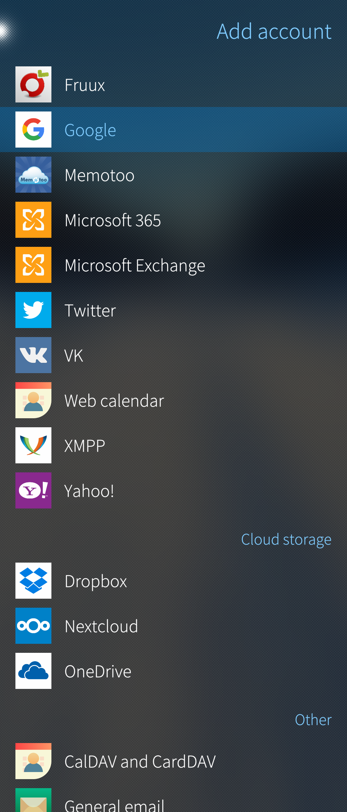
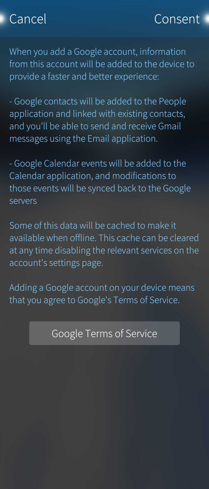
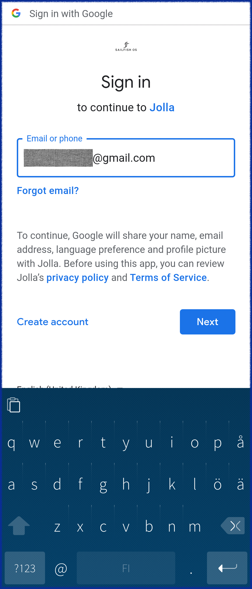
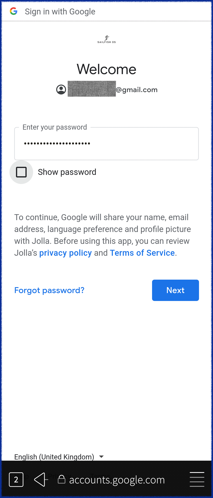
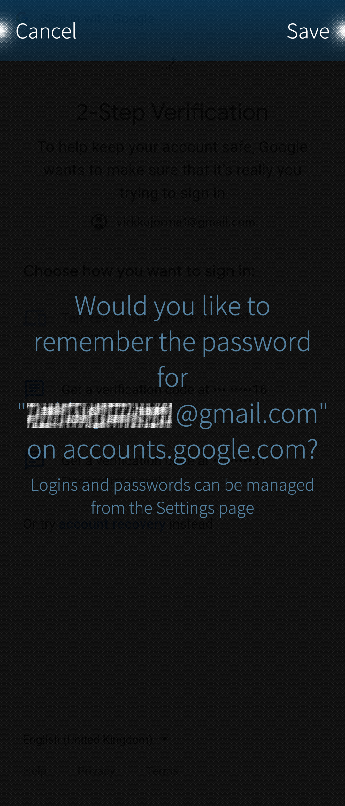
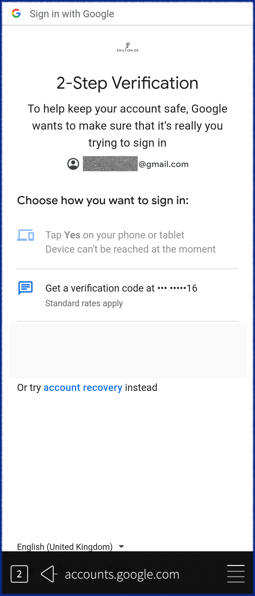
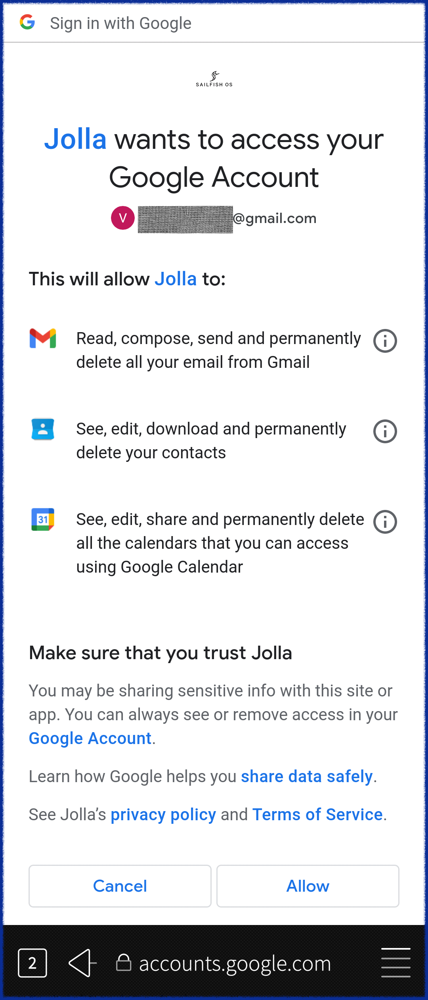

Adding the Google account to your Sailfish OS device will allow you to:

* Transfer contacts from Gmail to your People app (and vice versa if you want)
* Send and receive emails from your Gmail account
* Sync calendars from Google Calendar

Below are detailed step-by-step instructions for configuring your Google account with your Sailfish OS device. Make sure there is a working Internet connection before you start.

# Open "Settings > Accounts"

* Tap "Add account".
* Tap "Google".

* 
  
    Pic 1: Start signing in to Google account
  

# Accept Google's terms of service

The text below will appear.  View the Google Terms of Service" by tapping the large button.

* 
  
    Pic 2: Consent to Google terms needed
  

Tap "Consent" at the top right corner if you want to proceed.

The message "Sign in via Browser app" will shortly appear on a black background. This indicates that the Sailfish browser will be used for the next steps of the account setup.

# Start signing in to your existing Google account

Type your Google email address into the text box on the Sign in page (see Pic 3 below). Tap "Next".

NOTE: _The text "to continue to Jolla" might appear confusing to you. It should actually be stated as "to continue to Sailfish OS" because Jolla Ltd,  the company, has nothing to do with your Google account and has no access to your phone. The name "Jolla" in this view is derived from the Google service interface (used by this Sailfish app) as Jolla Ltd is the 'owner' of the app_.

The page for entering your password appears (see Pic 4). Type your password. Check what you wrote by using the "Show password" checkbox. Tap "Next" to proceed.

* 
  
    Pic 3: Enter your gmail address
  
* 
  
    Pic 4: Enter your gmail password
  

Next, the Browser presents the following dialogue (Pic 5). Tap "Save" if you want the Browser to keep your credentials which would make signing in easier the next time if the account is lost for some reason. Tap "Cancel" if you want to proceed with this sign-in without saving the credentials.

* 
  
    Pic 5: Do you want the Browser to keep your credentials?
  

# Complete the sign-in by applying the 2-step verification

If you have enabled the 2-step verification on your Google account then the page somewhat similar to the example below will appear.  If you do not use the 2-step verification, jump to chapter 5, please.

Depending on the verification method you have previously chosen you should now select (by tapping) one of the items below the line "Choose how you want to sign in" (Pic 6). If you have decided to verify your sign-in with a code sent over in a text message (SMS) then you would tap on "Get a verification code at *** *****nn". You would soon receive a text message with the code.

Read the text message and type the code you received (Pic 7). Tap "Next".

* 
  
    Pic 6: Request the 2-step verification code
  
* 
  
    Pic 7: Enter the 2-step verification code
  

# Accept the permissions

As soon as the account verification is complete, the following page will appear. It lists the actions that Sailfish OS is allowed to do on the data of your Google account (Pic 8).

NOTE: _The sentences "Jolla wants to access..." and "This will allow Jolla to..." might appear confusing to you. They should actually be stated as "Sailfish OS needs the access to..." and "This will allow Sailfish OS to..." because Jolla Ltd, the company, has nothing to do with your Google account and no access to your phone. The name "Jolla" in this view is derived from the Google service interface (used by this Sailfish app) as Jolla Ltd is the 'owner' of the app_.

* 
  
    Pic 8: Give Sailfish OS the permission to modify the data of your Google account
  

Tap "Allow" to proceed with the account creation.

# Configure the sync settings

On this page, you can choose what data (emails, contacts, calendar items) is to be synchronised with your Google service on your Sailfish phone. It also allows to set up of some synchronisation details (Pic 9).

NOTE: _All the data of this menu page may not fit in one view. You may need to scroll the page up to see the bottom part of it._

## Synchronisation

The Google service starts automatically syncing your data as soon as the sign-in is completed, according to the sync settings of your account. After a couple of minutes, you have your emails, calendar appointments and contacts on your device, depending on the choices you made.

The "Sync schedule" is for email messages whereas calendar items and contacts ("content") are synced "automatically" (unless "manually" is in effect), i.e., whenever there are changes. 

It is also possible to have all the data synchronised by using the command "Sync" in the pulldown menu of "Settings > Accounts > Google".

* 
  
    Pic 9: Sync settings of your account
  

As soon as you are ready with the sync settings, tap "Accept" at the top right corner to complete the set-up.

Your Google account will appear in Settings > Accounts now. It has the text “Setting up account…” under it for a while. Wait until the spinner runs to the end. The account is now installed. It appears in the Email, Calendar, and People apps.

