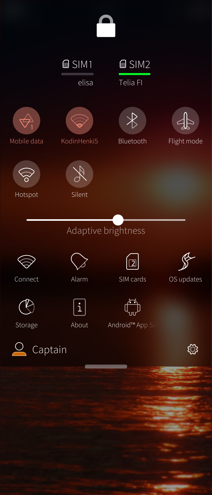
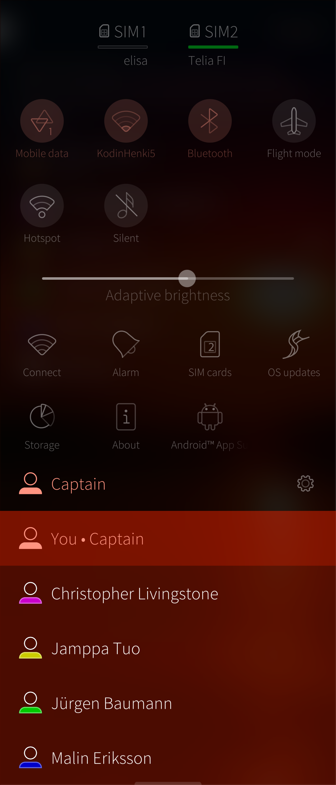

# Introduction
Sailfish OS release 3.4.0 brings a new feature, **Shared device** (sometimes called "multi-user"). This means that there can be, in addition to the admin (the device-owner or primary user), one or more additional users with reduced rights, and yet another user, the Guest, with even more reduced rights.
This feature is intended primarily for corporate use. There would be a pool of company-owned phones which can be used by the employees. These additional users can tailor the device to some extent whereas many functions can be altered by the admin only.
The Guest could be used when demonstrating products, for instance. As a guest, no harm can be done to the device or data, and all user data belonging to the guest will be deleted when closing the session.
Each user has a different username and a security code of their own. This code must be typed when

# Managing users

## Adding and changing users
The admin can add new users, rename or remove them and set some restrictions on them in "Settings > Users". The additional users can only switch users. There can be a maximum of seven users: the admin and 6 additional users. After the limit has been reached no more users can be created. The Guest is an extra user, pushing the upper limit to 8, in practice. The Guest is volatile as this user will disappear by restarting the device.
The admin can change the given names of the users (also, an additional user can change the name of his/her own). Note that this will change the name visible in the UI only - the username in the file system will remain unchanged (the same when created).

<div class="flex-images" markdown="1">

* <a href="Settings-Users.png" class="narrow-image"></a>
  <span class="md_figcaption">
    Adding and changing users
  </span>
</div>

## Switching users
The active user can be changed in Settings > Users or at the Top Menu (the lower part of it). The display gets black with the text "Switching to <username>".
The security code of the next user shall be typed correctly to complete the switch.
One more way of switchning users is to do it in the boot up phase. Any user's code may be entered at the home encryption unlock dialogue (on black background). This allows for switching users when restarting the device.

<div class="flex-images" markdown="1">

* <a href="TopMenu1.png"></a>
  <span class="md_figcaption">
    Topmenu
  </span>
* <a href="TopMenu-Users.png"></a>
  <span class="md_figcaption">
    Topmenu users
  </span>
</div>

# What can different users do
## The admin
The admin equals the default user of Sailfish, so "defaultuser" (it used to be called "nemo" on Sailfish 3).

* Admin can set a human-friendly name in "Settings > System > Users" to replace "defaultuser". His/her role "Admin" will be shown underneath the new name in the same menu. The given name can be tens of characters long.
* Admin's username in the file system is "defaultuser"
* His/her home area is hence /home/defaultuser.
* Exception: if a device previously had "nemo" as the username (as in OS release 3.3.0 and before) and the device was updated over-the-air, then it keeps "nemo" (and /home/nemo) as the username of the admin.

What can the admin do:

* is signed in to his/her Jolla account in Jolla Store
* can change device settings authorised by his/her security code
* can update the OS
* can install apps
* can reset the device
* can see the data of the additional users with super-user rights (devel-su) but not as "defaultuser"
* can manage the device lock
* can install and use Android App Support and Android apps (given there is a valid licence)
* can create an SSH connection from a computer to the device -- pay attention to the username: it is either nemo or defaultuser (the correct one works, the other does not).

## Additional users
* Additional users have their human-friendly names in "Settings > Users". These given names can be tens of characters long.
* In the file system, they appear by their usernames generated from their given names. Latin alphabet (a to z) and digits are allowed. Other characters are removed. The names are truncated to 20 characters.
* For instance, "Christopher Livingstone" becomes "christopherlivingsto" and "Jürgen Baumann" becomes "jrgenbaumann".
```
$ ls -al
drwxr-x--- 17 christop christop 4096 Jun 23 17:17 christopherlivingsto
drwxr-x--- 17 jrgenbau jrgenbau 4096 Jun 24 09:33 jrgenbaumann
```
* The home area of this example would be /home/christopherlivingsto and /home/jrgenbaumann.

What can and cannot Additional users do:

* can switch to another user
* can receive phone calls and messages
* can make phone calls and send SMS/MMS if the admin has allowed this
* can use cellular data for internet connections if the admin has allowed this
* can use the apps installed by the admin
* can create fingerprints for themselves
* have security codes to protect the data of their own from other additional users
* cannot change the settings of other users
* do not have any Jolla accounts
* do not have Jolla Store                         
* do not have the Developer mode and Terminal available, cannot get super-user (root) rights
* do not see Android App Support and Android app
* cannot install Android App Support and Android apps
* cannot install OS updates; don't even get advertisements on OS updates
* cannot install or uninstall apps
* cannot see or change the data of other users
* cannot use the memory card
* cannot change the active SIM cards on dual SIM devices (in Settings)
* cannot change the SIM card for outgoing calls (if both SIMs enabled by the admin)
* cannot set up a remote connection (SSH) to the device
* cannot use the recovery mode.

# Help

## Additional user has locked up the phone - how can the admin unlock it?

Supposing that the phone is turned off and it has been used with the account of the additional user previously, it can be unlocked by the admin user in the following way:

1. Turn the phone on.
2. At the 1st security code dialogue, on the black background, type the security code of the primary user.
3. When the 2nd security code dialogue appears, put your fingertip above the upper edge of the device and pull down the Top Menu.
4. Tap the name of the additional user at the bottom part of the Top Menu. This makes also the device owner appear.
5. Tap the name of the device owner. => “Switching to the device owner”
6. Type the security code of the device owner.

## How to remove an additional user's account if he/she has not completed the startup wizard?

If an account for an additional user was created but the startup wizard of the new account was never completed (for whatever reason) then the phone keeps booting up to this incomplete account. Currently (OS version 4.4.0), the only way to delete this additional account is to use the Recovery Mode.

The following should help you out and make the phone reboot to the primary user's account:

1. In the Recovery Mode, select "Shell"
2. Type the commands
```
/ # cat /rootfs/etc/environment
LAST_LOGIN_UID=100001          <== a line like this should appear - ignore the number
/ #
/ # sed -i '/LAST_LOGIN_UID=/d' /rootfs/etc/environment   <== delete the ^ line
/ # cat /rootfs/etc/environment    <== check...
/ #                                <== yes, it is gone
```
3. Exit Recovery Mode
4. Reboot the phone.


