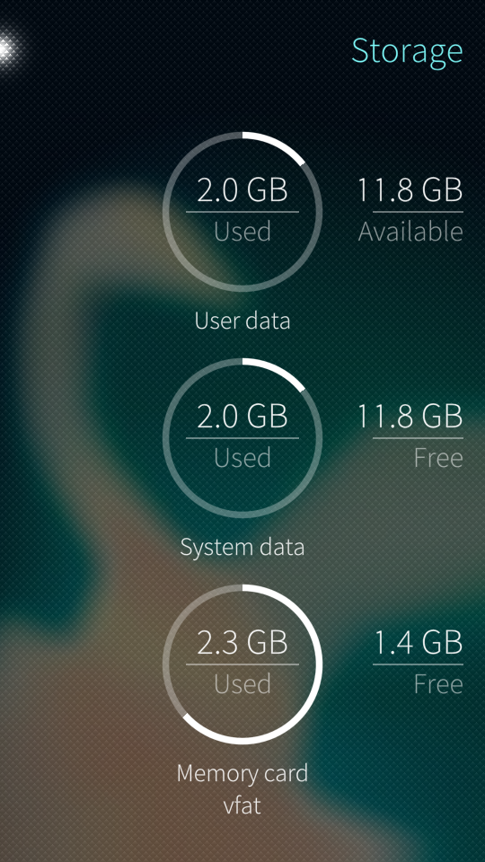
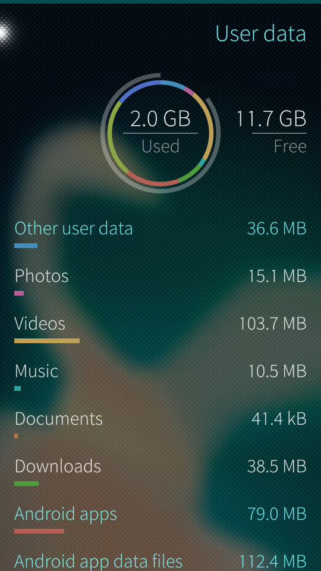
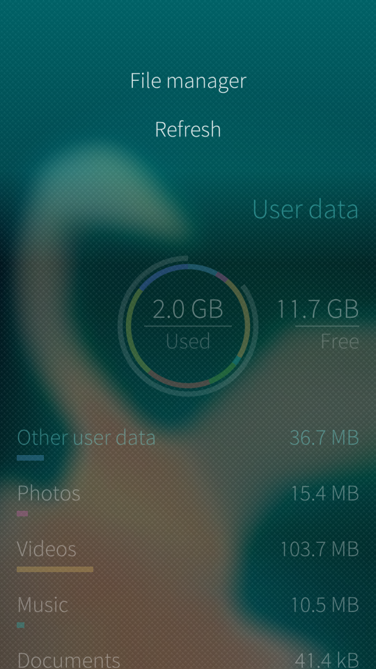
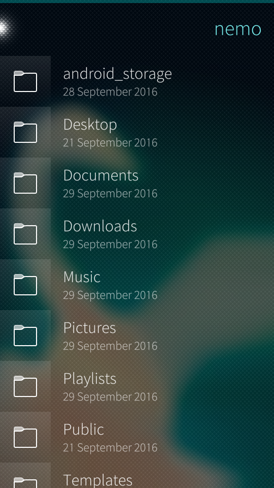
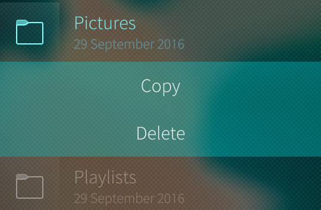
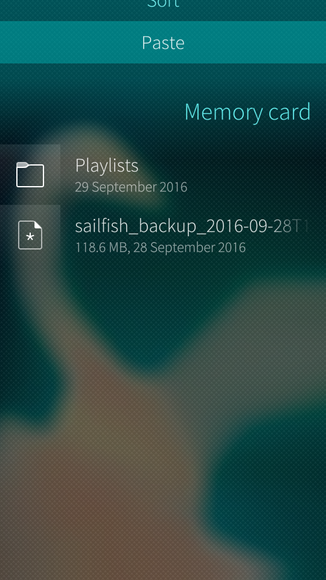
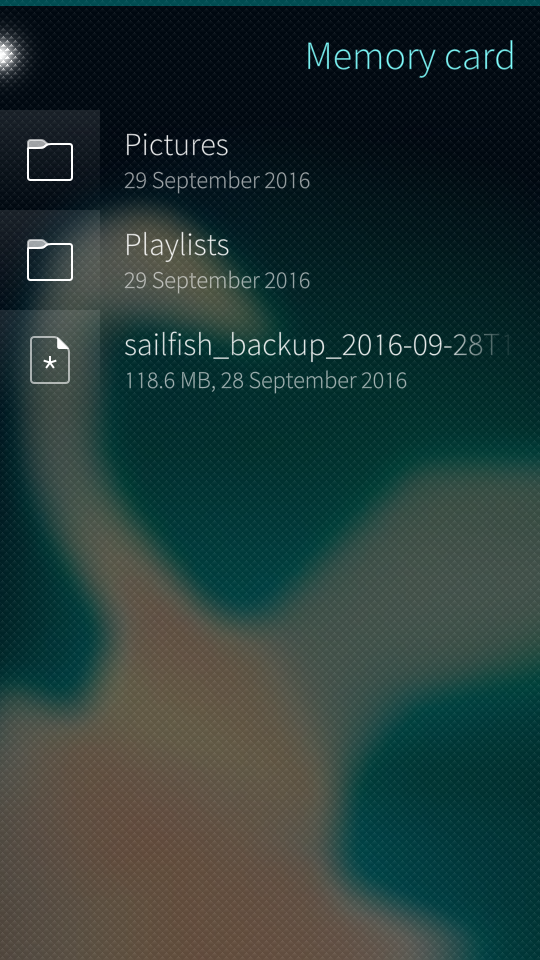
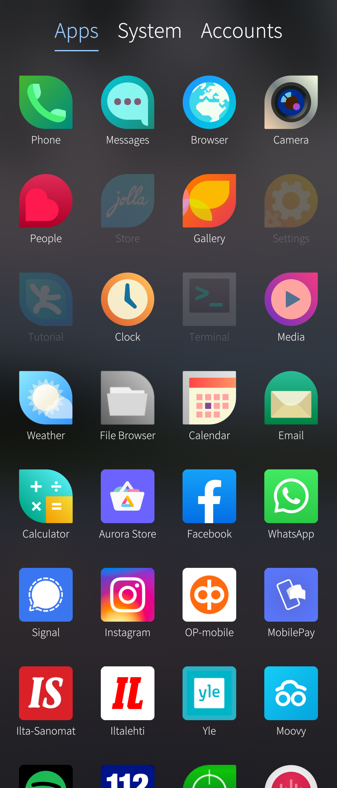
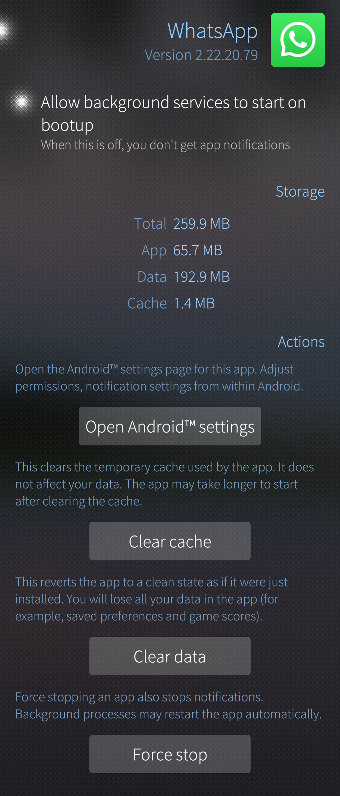

This article explains how to free up disc space on your device's internal memory (permanent storage). You don't need a computer to apply these instructions. You might, however, need a Memory Card on your device.

Some symptoms of devices with the storage full:

* The Camera takes photos but they do not appear in the Gallery
* Items in the Gallery/Media player disappear and reappear from time to time
* Notifications of low memory and disk space are shown
* Inability to download system updates due to low memory, or you can't get past the "Preparing the update" phase
* The device works slowly.

To read about transferring files between your device and a PC, please see the following articles for [**Windows and Linux users**](/Support/Help_Articles/Moving_Files_Between_PC_and_Sailfish_Device/), and for [**Mac users**](/Support/Help_Articles/Moving_Files_between_Mac_and_Sailfish_Device/).

# Determining the amount of free space on your device
To find out the current status of your mass memory (disk space) on your device, open the menu "Settings > Storage":

<div class="flex-images" markdown="1">

* <a href="storage.png" class="narrow-image"></a>
  <span class="md_figcaption">
  </span>
</div>

The “User data” circle represents the disk space used (in gigabytes) on your device, and the available free space is shown next to it.

Tap the circle to see more specified information about what is taking up your memory:

<div class="flex-images" markdown="1">

* <a href="userdata.png" class="narrow-image"></a>
  <span class="md_figcaption">
  </span>
</div>

If you suspect that the figures in “User data” are not accurate, please try the “Update” function in the pulley menu.
By tapping an item shown in white text, the respective app will open up. This makes it easy to take a closer view to the big files.

It is possible to get an even more accurate report on the biggest directories in the /home partition. This requires the super-user rights (root rights) - see [**this article**](/Support/Help_Articles/Enabling_Developer_Mode/).

```
devel-su
du -xm /home | sort | tail -20 |  sort -nr
```

## How to check the big disc space consumers

The following commands may be helpful in checking what might be wrong with the file system. This information may help in resolving a problem in getting Sailfish OS updates.

In many cases, the problem is found in some files that the user has installed to the system data partition, which then prevents installation of the update. This is usually because of some hacking/development which has brought stale files to the system data partition or the installation of packages that consume the disc space from the system data partition.
Each case looks a bit different but was caused by the user doing things in the developer mode (without understanding the consequences).
The [Developer mode](/Support/Help_Articles/Enabling_Developer_Mode/) is required for running the following commands.
They can be run in the device Terminal app or preferably over an SSH connection (SSH/Windows, SSH/Linux) from a PC. In this latter case, you can conveniently copy/paste the commands to the command line.
```
cd $HOME
export MYHOME=$(pwd)

devel-su
```

High level list, both from the root and from home:
```
du -xa / | awk '{if($1 > 102400) print int($1/1024) "MB" " " $2 }' | sort -nr
```
```
du -xa /home | awk '{if($1 > 102400) print int($1/1024) "MB" " " $2 }' | sort -nr
```

A full list (in reverse order). It gives you an idea of where the storage space consumers are, by folder size.
```
du -xa / | sort -n
```

This command presents the installed code (rpm) packages, listed by size:
```
rpm -qa --queryformat '%{SIZE}\t %{NAME}-%{version}\n' | sort -nr | more
```
Please note that removing packages can break your system, so if you are not 100% sure which packages to remove please do not remove any.

# Using File Manager to transfer files onto a memory card
We recommend using a memory card on your Xperia phone to save internal storage. As soon as you have the card inserted and formatted, consider moving some data from the phone to the card.

An [**SD card**](/Support/Help_Articles/SD_Card_Format_and_Encryption/) with a capacity of 32 GB (or more) would be ok.

1) Go to Settings > Storage

2) Tap “User data”

3) Pull down the pulley menu and select “File manager”:

<div class="flex-images" markdown="1">

* <a href="pullmenu.png" class="narrow-image"></a>
  <span class="md_figcaption">
  </span>
</div>

4) You will now see the list of folders located under "defaultuser" or under “nemo”:

<div class="flex-images" markdown="1">

* <a href="defaultuser.png" class="narrow-image"></a>
  <span class="md_figcaption">
  </span>
</div>

Note: As for example, we will move the Pictures folder in its entirety to the memory card.

5) Now, long-press the Pictures folder and select “Copy”:

<div class="flex-images" markdown="1">

* <a href="cropped.png" class="narrow-image"></a>
  <span class="md_figcaption">
  </span>
</div>

6) Go back to the Storage main view and tap the “Memory card” circle

7) Once there, select "Paste" from the pulley menu above:

<div class="flex-images" markdown="1">

* <a href="paste.png"></a>
  <span class="md_figcaption">
  </span>
* <a href="memorycard.png"></a>
  <span class="md_figcaption">
  </span>
</div>

File Manager will now begin to transfer the Pictures folder onto your Memory Card. Another good source of more space for the phone is the "Videos" folder which may contain many video clips recorded with the Camera.

NOTE: To avoid the need to do the file transfer again we recommend that you insert an [**SD card**](/Support/Help_Articles/SD_Card_Format_and_Encryption/) (a 32 GB one would be good) into your device and then let the camera store the pictures and videos directly to the card. The setting for this is in "Settings > Apps > Camera". Select "Memory card" for Storage.

# Deleting the data held by some Android apps
Some of your Android apps tend to collect data onto the device over time. Examples of such apps are Spotify, WhatsApp, and various map apps (e.g., HERE WeGo, OsmAnd).

To clean up the data generated by an Android app try to do it first by using the application itself (e.g., delete the map of a country that you will not visit soon).

If this is not supported in the app or if you want to reset the app without uninstalling it, then visit Settings > Apps > [the-app-in-question].
Try "Clear cache" first, note that you might need to tap the "Clear cache" several times to clear it properly.
If this does not bring enough help then consider using "Clear data".

The screenshots below show the process of clearing WhatsApp's data:

<div class="flex-images" markdown="1">

* <a href="appgrid.png"></a>
  <span class="md_figcaption">
  </span>
* <a href="wa.png"></a>
  <span class="md_figcaption">
  </span>
</div>
