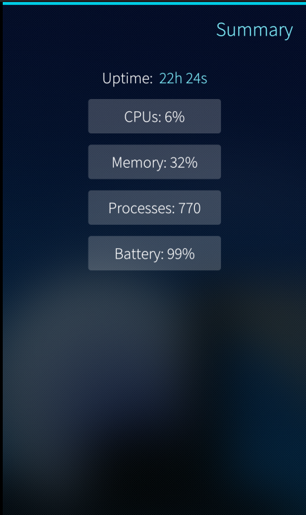
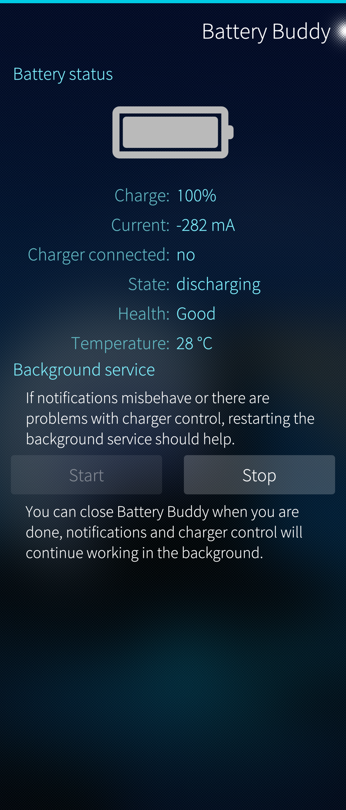

There may be a need to follow what is happening in a Sailfish OS device. At least, it is nice to have a deeper look into the system out of curiosity.

There are several apps for showing different aspects of a Sailfish device. However, the author's absolute favourite is the app by the name **System Monitor (Fork)** from Open Repos distribution.

Another lightweight system monitor is **Lighthouse**. With app **Battery Buddy** one can try to improve the lifetime of the battery (it does not have any other typical features of a system monitor).

The following chapters show how to install the discussed apps.

# System Monitor (Fork)
1. Open Sailfish OS browser.

2. Go to web page **[https://openrepos.net/content/ade/system-monitor-fork](https://openrepos.net/content/ade/system-monitor-fork/)**

3. Download the latest version of **harbour-systemmonitor** file. Make sure that you take the correct variant for your device:
	* **aarch64.rpm** for Xperia 10 II, Xperia 10 III, Xperia 10 IV, Xperia 10 V and, Jolla C2
	* **armv7hl.rpm** for other Xperias and Jolla phones

4. Go to Settings > Untrusted software and enable "Allow untrusted software".

5. Go to Settings > Transfers. Find the rpm file you downloaded with the browser. Tap it to install it.

6. Disable "Allow untrusted software".

7. Find the new app in the app grid of your device by the name SysMon. Open the app.

8. Pull down Settings and adjust them to your liking.

* 
  
  

# Lighthouse
1. Open Sailfish OS browser.

2. Go to web page **[https://openrepos.net/content/almindor/lighthouse](https://openrepos.net/content/almindor/lighthouse/)**

3. Download the latest version of **harbour-lighthouse** file. Make sure that you take the correct variant for your device:

	* **aarch64.rpm** for Xperia 10 II, Xperia 10 III, Xperia 10 IV, Xperia 10 V and, Jolla C2
	* **armv7hl.rpm** for other Xperias and Jolla phones
	
4. Go to Settings > Untrusted software and enable "Allow untrusted software".

5. Go to Settings > Transfers. Find the rpm file you downloaded with the browser. Tap it to install it.

6. Disable "Allow untrusted software".

7. Find the new app in the app grid of your device by the name SysMon. Open the app.

8. Pull down Settings and adjust them to your liking.

* 
  
  

# Battery Buddy
1. Open Sailfish OS browser.

2. Go to web page **[https://openrepos.net/content/direc85/battery-buddy/](https://openrepos.net/content/direc85/battery-buddy/)**

3. Download the latest version of **harbour-batterybuddy** file. Make sure that you take the correct variant for your device:

	* **aarch64.rpm** for Xperia 10 II, Xperia 10 III, Xperia 10 IV, Xperia 10 V and, Jolla C2
	* **armv7hl.rpm** for other Xperias and Jolla phones
	
4. Go to Settings > Untrusted software and enable "Allow untrusted software".

5. Go to Settings > Transfers. Find the rpm file you downloaded with the browser. Tap it to install it.

6. Disable "Allow untrusted software".

7. Find the new app in the app grid of your device by the name SysMon. Open the app.

8. Pull down Settings and adjust them to your liking.

* 
  
  

