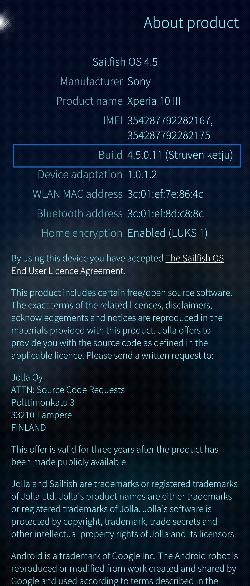
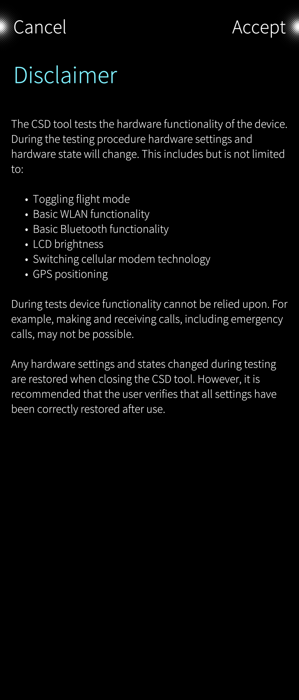
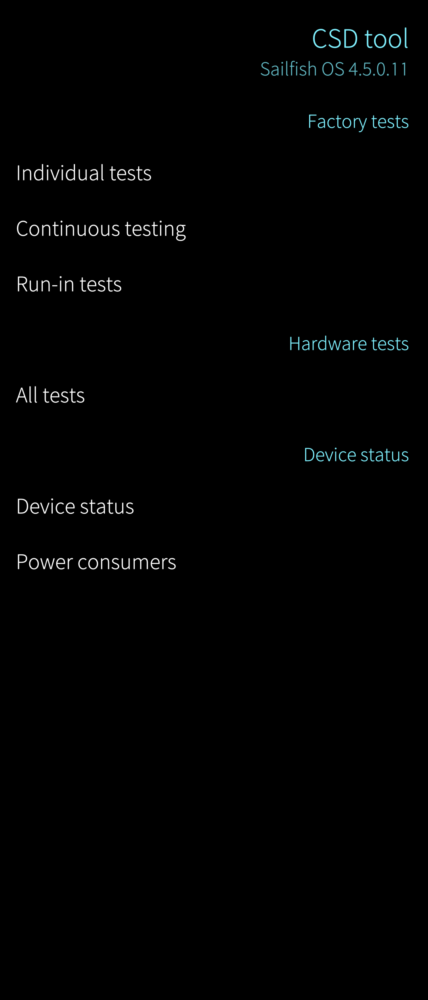
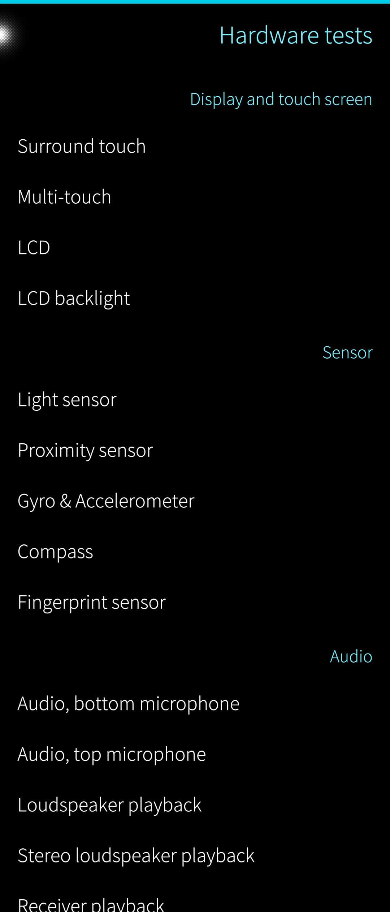
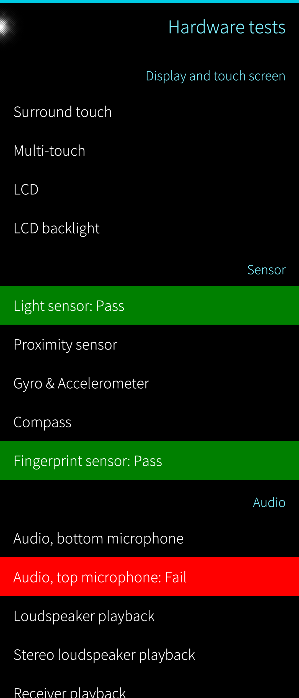
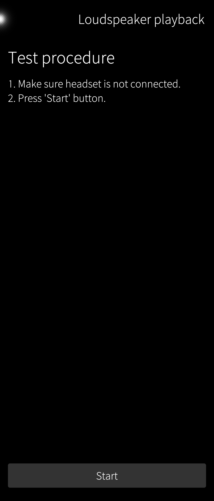
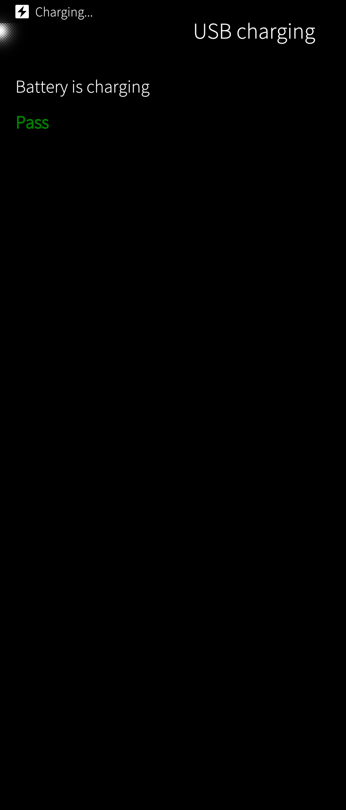
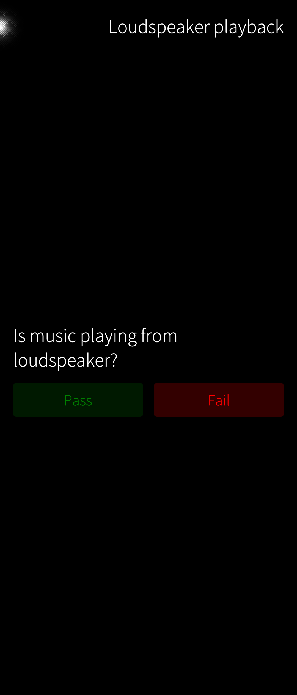

Sailfish devices have a built-in customer service diagnostic tool, abbreviated **CSD**. This test tool makes it possible for users to verify the key functions of their devices.

# Opening the CSD

Access the tool by tapping the item "Build" five times or more in "Settings > System > About product". The tool pops up in a few seconds showing the Disclaimer page first.

* 
  
    Pic 1: About product
  
* 
  
    Pic 2: CSD disclaimer
  

Please read the text carefully. Accept the disclaimers by tapping 'Accept' at the top right corner.

NOTE:  _Interpreting the test results correctly may not be easy without suitable technical training.  Please seek help from the **[Sailfish Forum](https://forum.sailfishos.org/)** or from **[Jolla Customer Support](https://jolla.zendesk.com/hc/en-us/requests/new)**._

# Main categories

There are three main categories of tests (Pic 3):

1.  Factory tests
2.  Hardware tests
3.  Device status

We recommend using categories #2 and 3#. The only reason for using category #1 would be to run some long-lasting tests. Everything else and more are covered by category #2. The device status category provides data mainly on power consumption.

* 
  
    Pic 3: Test categories
  

# All hardware tests

Tap "All tests" to enter the category of Hardware tests.

The tests are grouped by technology areas. The groups are shown at the right of the display (Pic 4). After executing a test, the verdict is shown with green or red colour in the list of tests (Pic 5).

The test results can be cleared by pulling down "Clear test results" for the next round.

* 
  
    Pic 4: Hardware tests
  
* 
  
    Pic 5: Test results in colours
  

## Test procedures

Each test has a short written procedure. Please follow it precisely.

Picture 6 below shows the test procedure of the loudspeaker test for example.

* 
  
    Pic 6: Procedure of the loudspeaker test
  

After executing a test, some of them give the verdict of "Pass" or "Fail" automatically (Pic 7 below) whereas in some other cases, you must decide on the verdict based on your interpretation of the test results (Pic 8). In such a test, tap the appropriate button (Pass or Fail).

* 
  
    Pic 7: Test verdict of the USB charging test
  
* 
  
    Pic 8: Test verdict of the loudspeaker test
  

## Reporting

The CSD tests do not have a reporting utility. Take **[screenshots](/Support/Help_Articles/Tips_and_Tricks/#taking-screenshots-screen-captures)** if there is a need to save test results.

