_This document explains how to set up the on-screen (virtual) keyboard and to select the layout of a physical keyboard (e.g. Bluetooth keyboard). There are a few tips and tricks related to typing, too._

  
  
# Managing keyboard settings

## Basic settings

Open the menu page "Settings > System > Text input". The following default view appears.

* <a href="Text_input_default_home_view.png" class="narrow-image">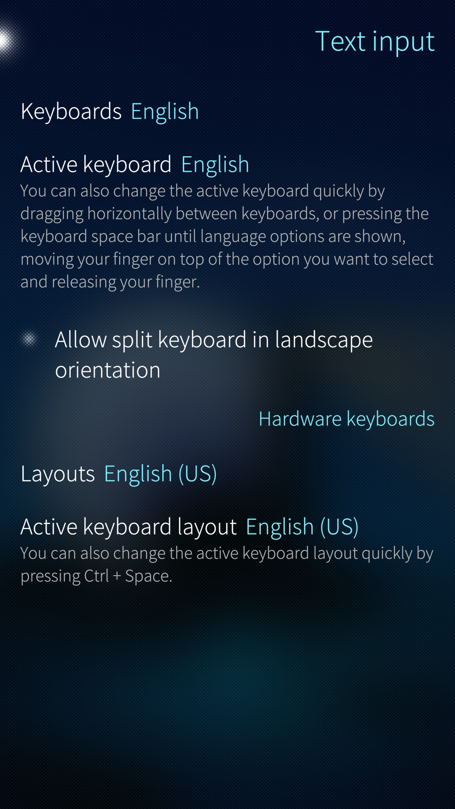</a>
  
    Keyboard and text input menu
  

In this view, you can select the keyboards you need by tapping on "**Keyboards"**. The list of supported keyboard layouts of various languages appears. All of these are presented in their native languages. Tap one or more of them to make them appear on your virtual keyboard.

"**Active keyboard**" is the keyboard that will appear if you open an app to write something.

_Note that the language of the user interface (menus etc.) is chosen in "Settings > System > Language" (see **[this document](https://docs.sailfishos.org/Support/Help_Articles/Language_Settings/)**)._

Enabling **Allow split keyboard in landscape orientation** makes the horizontal keyboard appear divided into two parts, one for the left and the other for the right hand. The word suggestions appear in the middle. This is obviously for large screen devices like the Tablet to allow for faster typing.

* <a href="Text_input_split_keypad.png">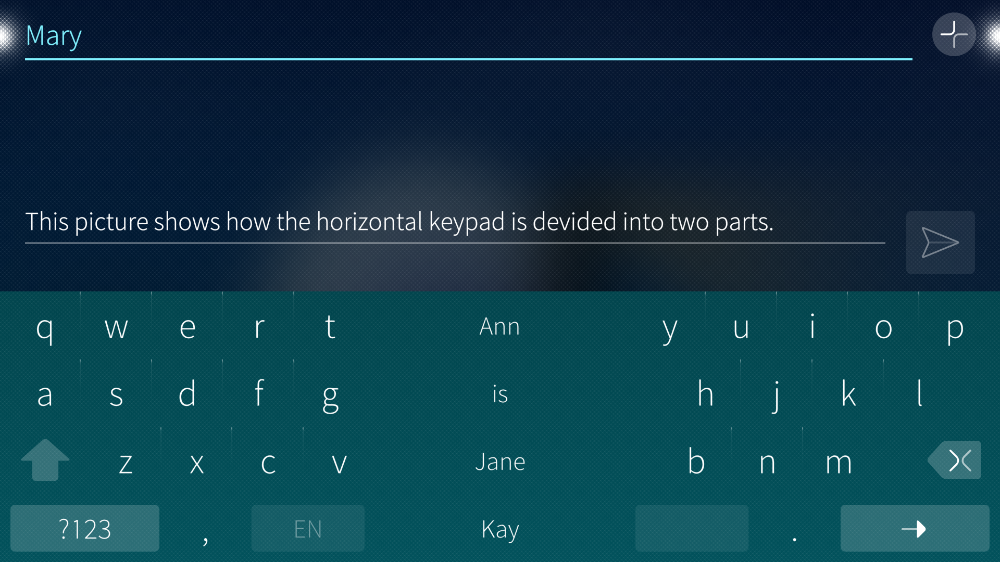</a>
  
    Split keyboard
  

In the lower part of the first picture, there is a section for "Hardware keyboards". This is for Bluetooth keyboards connected to Sailfish devices. This section has the items "Layouts" and "Active keyboard layout". These items correspond to those of the virtual keypad, i.e., "Keyboards" and "Active keyboard". It is possible to define one or more keyboard layouts and select which of them is active currently on the Bluetooth keyboard.

The following picture shows an example of the Text input menu after making some choices:

* <a href="Text_input_advanced_home_view.png" class="narrow-image">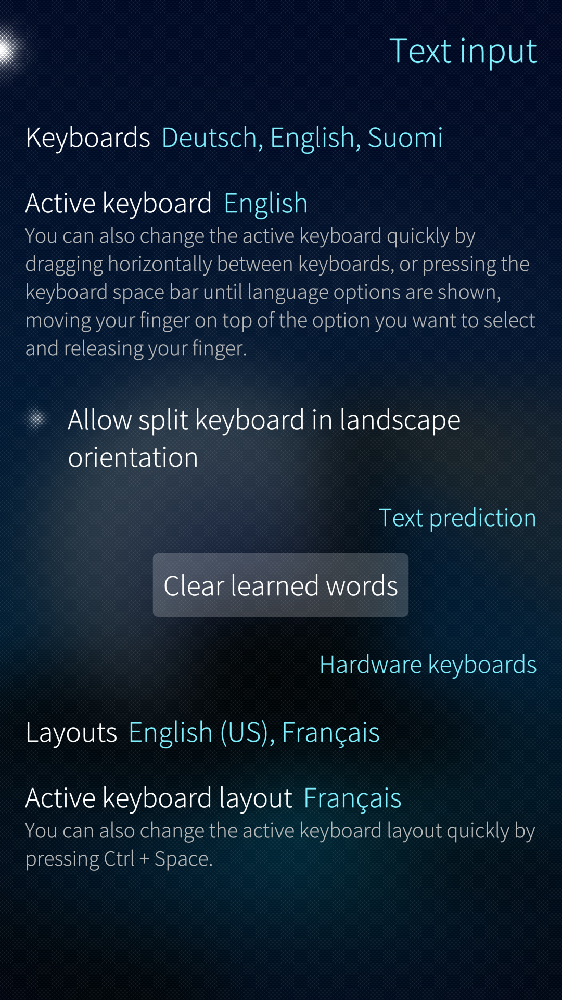</a>
  
    Keyboard and text input menu with some selections
  

## Text prediction

The picture above has the section "Text prediction". This is one of the add-on apps covered by the **[Sailfish OS licence](/hc/en-us/articles/115003837053)**. It can be installed from the Jolla Store app after buying and activating the licence.

Text prediction collects the words that you type into a dictionary of your own. Those words appear among the suggested words when you type. With the button "**Clear learned words" you can** erase the words that have been saved into the dictionary.

Text prediction cannot be turned off in any other way but by uninstalling it.

  
  
# Using the virtual keyboard

## Changing between keyboards when typing

When you have multiple keyboards selected (see above), changing between them is easy and fast.

* Open for eg. Messages and start writing a new message.
* Press and hold the spacebar to reveal enabled keyboards.
* Slide your finger on top of the language keyboard you want, and release your finger.
* Your keyboard and the suggestions are now changed to the selected language.

* <a href="Text_input_changing_language.png" class="narrow-image">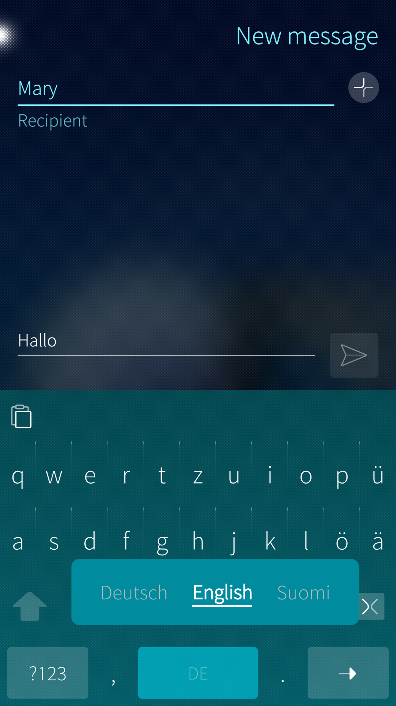</a>
  
    Keyboard language being changed with the space bar
  

   
  
## Typing numbers, symbols, and special characters

* When you have the keyboard visible, long-press a letter to see and type the hidden characters assigned to that letter.

* <a href="Text_input_hidden_characters.png" class="narrow-image">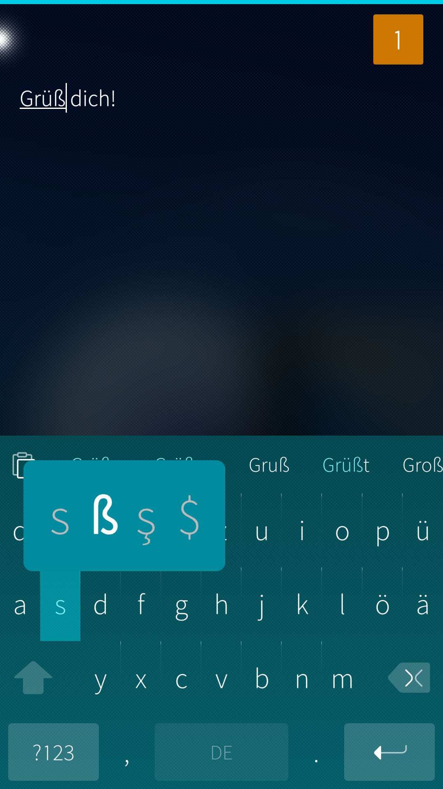</a>
  
    Typing hidden characters
  

* Pressing "?123" will take you to the numbers & symbols view. Note that pressing "1/2" will take you to the second page of characters. Go back to letters by pressing "Abc".

* <a href="Text_input_text_and_page_12.png">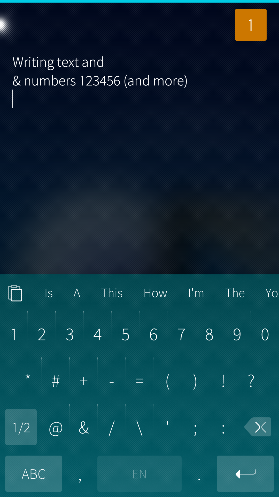</a>
  
    Numbers and special characters from page 1/2
  
* <a href="Text_input_text_and_page_22.png">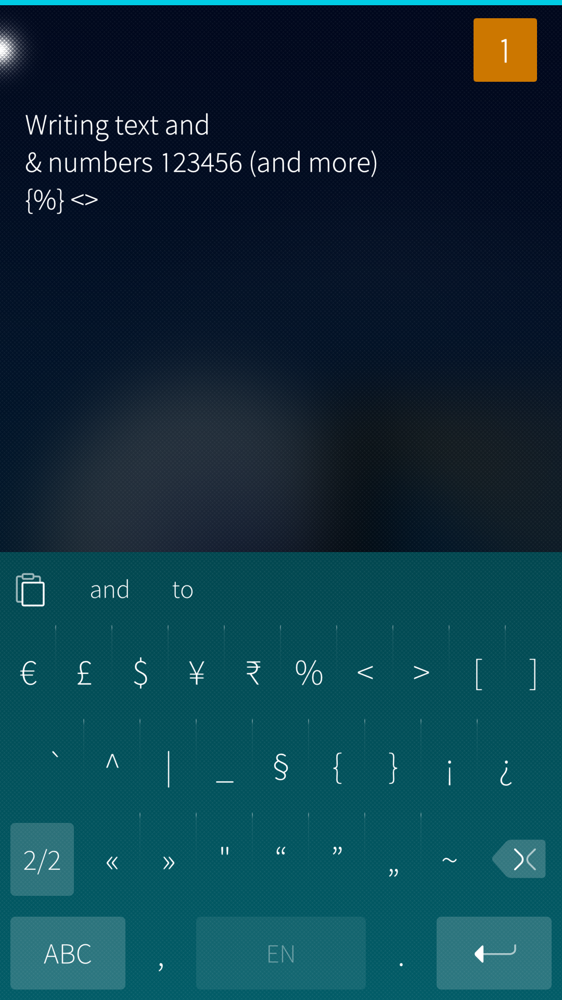</a>
  
    More special characters from page 2/2
  

  
## Setting the cursor precisely

The text font of SailfishOS is fairly small and the buttons of the keypad are densely located. When there is the need to fix a typing mistake in the text, moving the cursor to the correct place can be aided in the following manner:

* Tap on the text you have written. Put your fingertip to the same point again and swipe along the display, preferably diagonally. Start swiping immediately after putting the fingertip, or else the nearby word would become painted (see the next chapter)
* The text should now appear magnified
* Slide your fingertip to move and set the cursor to the point you want

* <a href="Text_input_with_typo.png">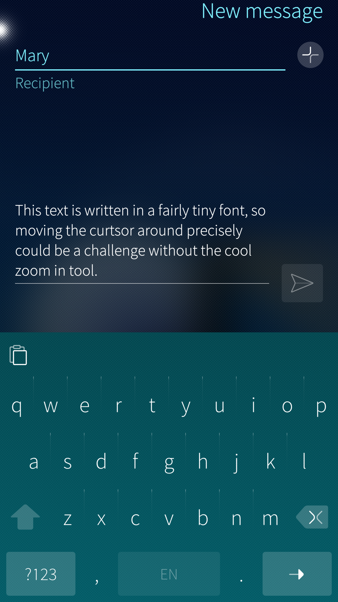</a>
  
    Tiny text with a typo in it
  
* <a href="Text_input_zoomed_in.png">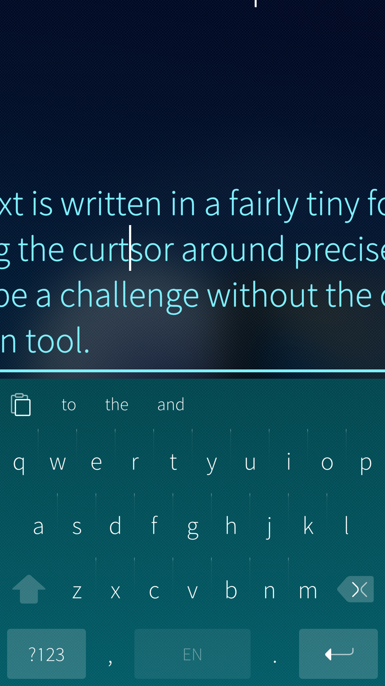</a>
  
    Text magnified. Cursor moved to typo.
  

  
## Selecting text

Selecting a piece of text for copying or deletion is easy. Simply, put your fingertip on a word to select. Keep it there for a second and the vibrator plays once as a confirmation of the selection becoming active.

The word becomes painted and gets the beginning and end bubbles that can be moved to change how much text is selected.

* <a href="Text_input_word_selected.png" class="narrow-image">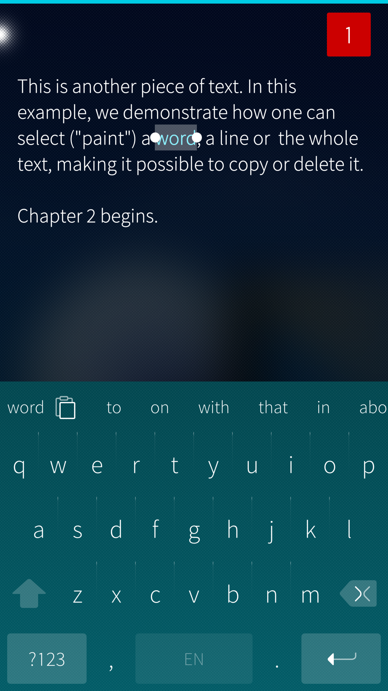</a>
  
    A word selected
  

If you keep the fingertip in its place then, after a fraction of a second, the vibrator will play the 2nd time. A line of text is selected now.

If you keep going in the same way, the whole text becomes selected after the vibrator plays the 3rd time.

* <a href="Text_input_line_selected.png">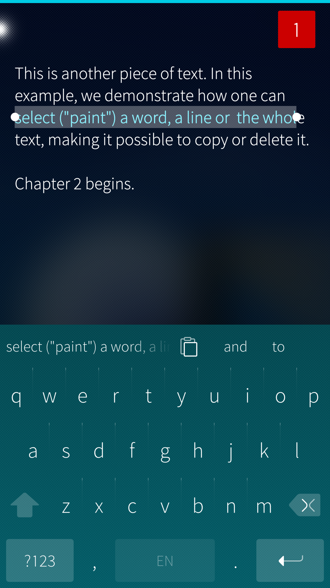</a>
  
    Line of text selected
  
* <a href="Text_input_whole_text_selected.png">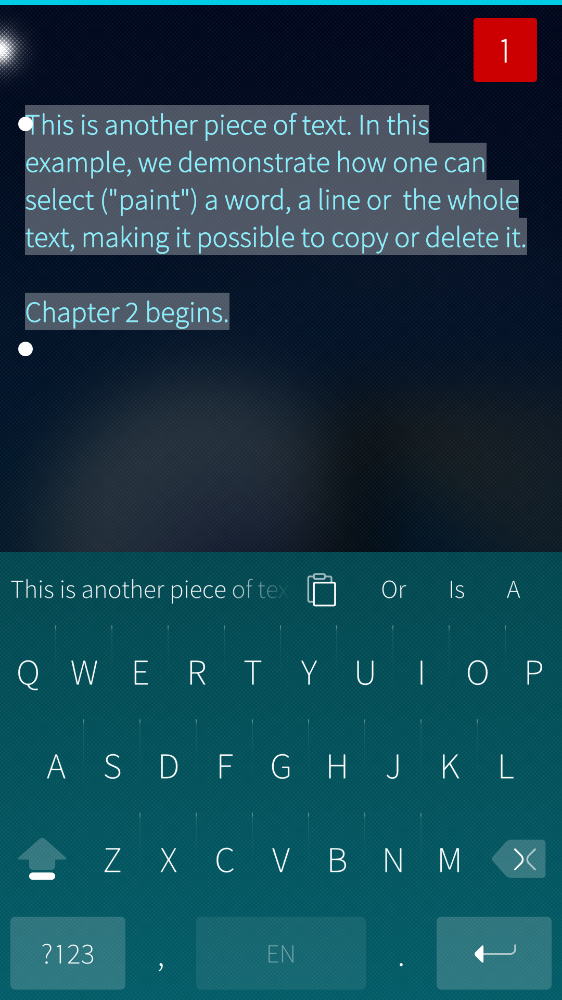</a>
  
    Whole text selected
  

Please find the Copy button at the top of the virtual keypad. Tap it to copy the selected text into the paste buffer.  If you want to delete the selected text, tap the Delete button on the keypad.

