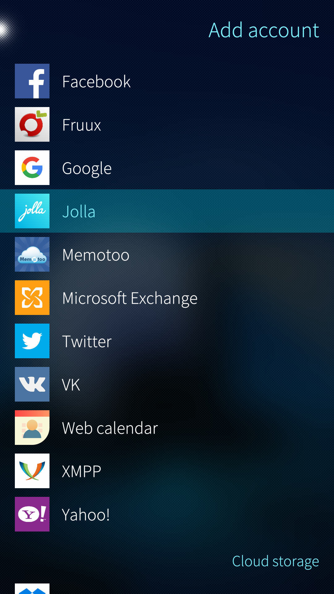
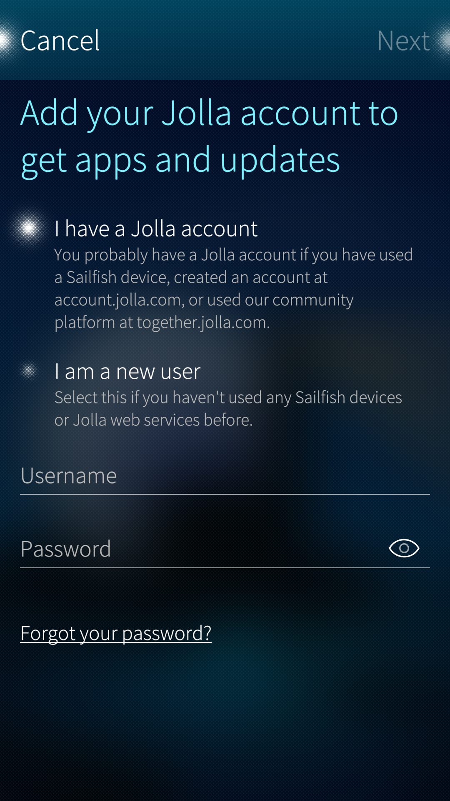
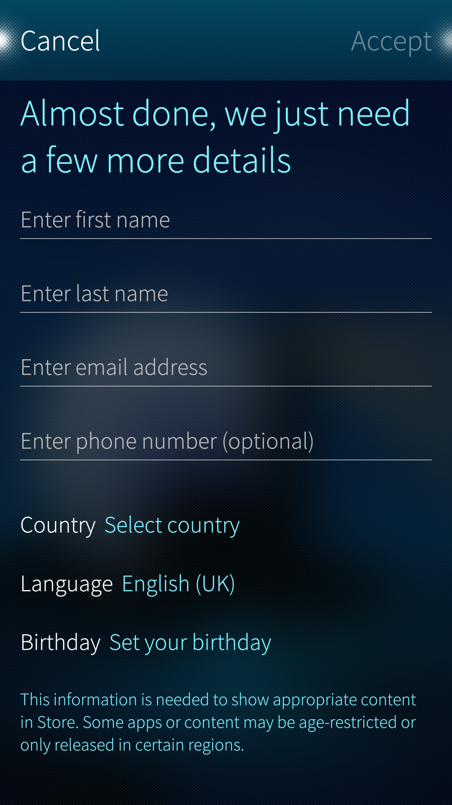
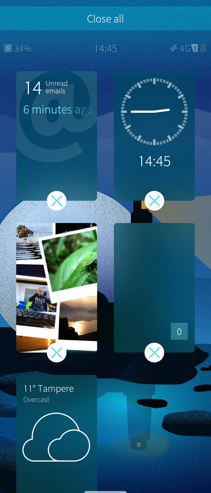
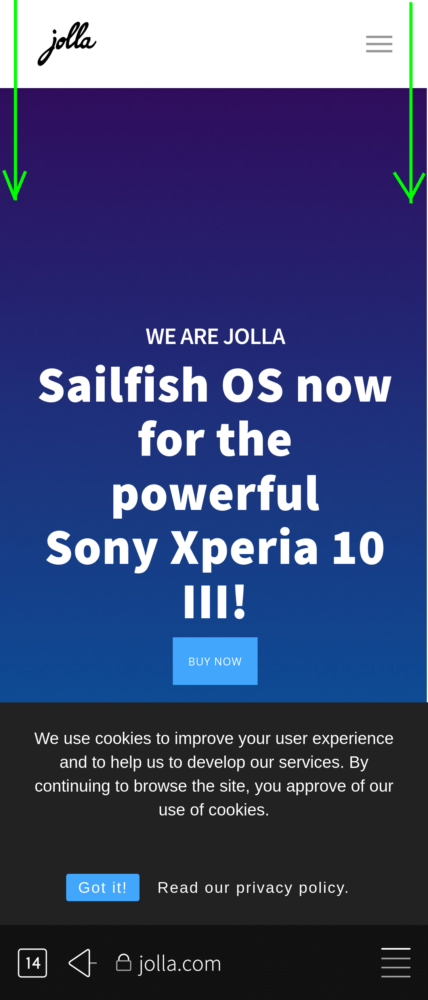
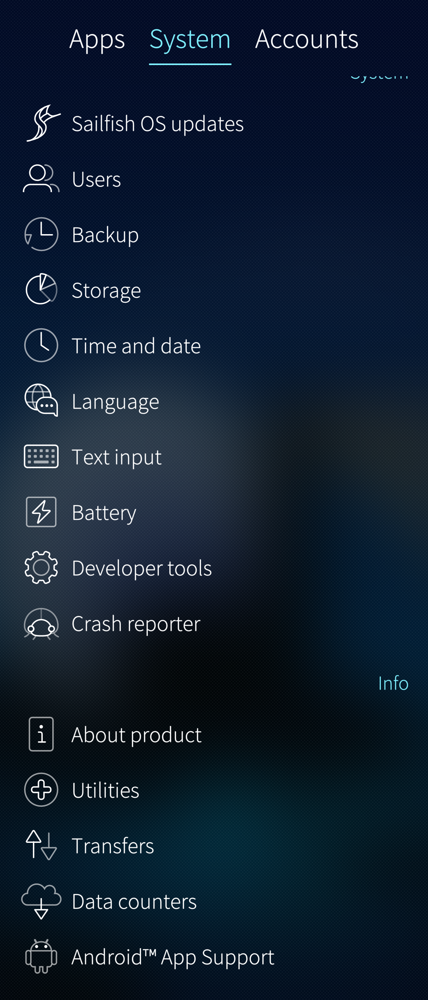
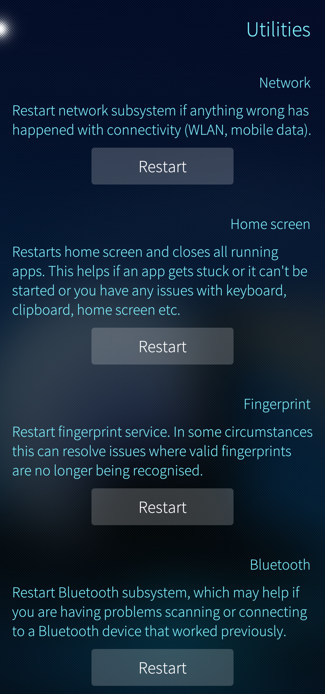
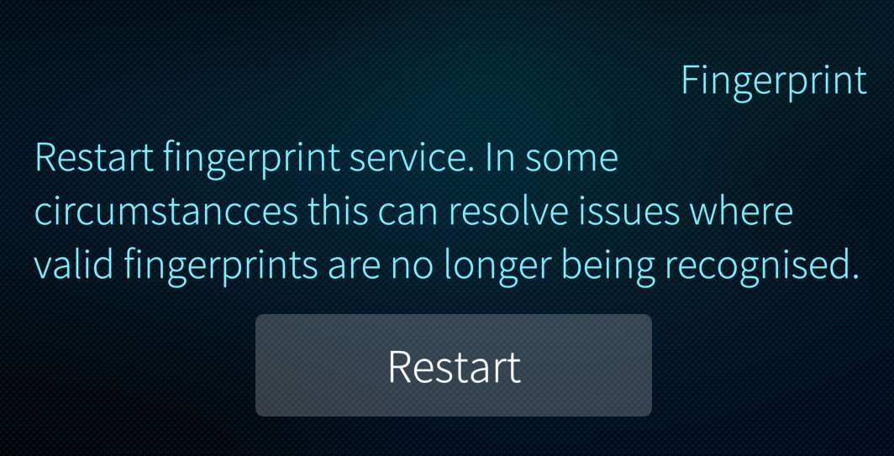

# Jolla Account: signing in and help to problem situations

This article provides information about what the Jolla account can be used for and shows how to sign in to an existing Jolla Account or create a totally new Jolla Account on your device. Instructions for retrieving lost Jolla Account credentials are given, too.


## General

The Jolla Account is required for the following things:

* Downloading applications and updates for them from the Jolla Store. There is a registry of devices and their OS versions and app versions
* Downloading Sailfish OS updates and licensed apps. Sailfish OS licence is required here, too
* It serves as your account for our community site **[https://forum.sailfishos.org/](https://forum.sailfishos.org/)**
* It serves as your account at the **[Jolla Online Webshop](https://shop.jolla.com)**

The following Jolla service is separate from the Jolla Account

* Jolla Zendesk support pages


## Adding the Jolla account to your device


* Go to the menu on Settings > Accounts
* Tap "Add account"

|<a href="New-account.png" style="width:30em;display:block"></a>|
|-|
|<span class="md_figcaption">Adding an account</span>|

|<a href="Jolla-account.png" style="width:30em;display:block"></a>|
|-|
|<span class="md_figcaption">Selecting Jolla account</span>|


* Tap "Jolla" and the following view appears:

|<a href="Existing-account.png" style="width:30em;display:block"></a>|
|-|
|<span class="md_figcaption">Jolla account exists</span>|


### Signing into an existing Jolla account


If you already have a Jolla account check that the option "I have a Jolla account" is selected.
Next, type your username and password (see the picture above)

If you are unsure about your credentials, you can check them by trying to log in **(using a computer) at [https://account.jolla.com/](https://account.jolla.com/)**

If you receive an error about an incorrect password or username, then you can **[reset your password](https://account.jolla.com/registration/password/reset/)**


### Registering a new Jolla account


If you are a new Jolla user with no previous Jolla Account, let's create it now

* Tap "I am a new user".
* Type a username you want (not an email address, please). You will soon see if it is free to be used.

* Enter your password. Type it again for verification.  Please use the eye icon at the end of the line to show the typed letters.

|<a href="New-user.png" style="width:30em;display:block"></a>|
|-|
|<span class="md_figcaption">New user registering</span>|


* Proceed by tapping "Next" at the top right corner.

|<a href="New-user-details.png" style="width:30em;display:block"></a>|
|-|
|<span class="md_figcaption">Details of a new user</span>|


* Type your personal information
    \- note: not all fields are mandatory (e.g., phone number)
    \- red text implies incorrect information
    \- note that there must be a **unique email address** for each Jolla account (if you want to create more accounts) - the email address is used for confirming a password reset request

* Accept your information
* Confirm the account by tapping "Accept" at the top right corner, again.


## Forgot your username and/or password?

In case you have forgotten the username and/or the password to your account, please **[click here to reset](https://account.jolla.com/registration/password/reset/)** your password, and receive an email reminder of what your username is.
When asked, please enter the email address that you used when creating your Jolla Account.


# Basic concepts of the Sailfish user interface

Here one can get familiar with the basic concepts of Sailfish OS. They were upgraded for Sailfish 3 the previous time.
Learn how to use a Sailfish OS device promptly and conveniently.

* [UX Framework](https://sailfishos.org/design/ux-framework/)
    The main vies of Sailfish OS explained: Lock screen, Home, Events, Top Menu, and App Grid
* [Gestures](https://sailfishos.org/design/gestures/)
    This presentation shows the different swipes and taps that make it convenient to use Sailfish OS
* [Navigation Architecture](https://sailfishos.org/design/navigation/)
    How to move in apps and how to use dialogues and the pulley menu
* [App Icons](https://sailfishos.org/design/icons/)
    Brief presentation of icons. Instructions for creating icons of your own


# How to close apps

This article briefly describes how to close apps on the Sailfish OS. The same gestures work both for Sailfish and Android apps.

## Closing an app or several apps in the Home view

All of your open apps appear as rectangles (minimized to thumbnails) in the Home view. It is easy to switch from one app to another there, or close apps.

If you have one app fully open, i.e., covering the entire display, you can enter the Home view by swiping leftwards from beyond the right edge of the device. This gesture will minimize the current app to a thumbnail, too. The Home view has all of the currently open apps as thumbnails.

It is easy to close apps in the Home view. Long-tap any point of the display for a coupöle of seconds. The thumbnails will get small white circles with a cross on them (see below). Close one or more apps by tapping those circles. If you want to close all of your apps, pull down the command "Close all" and lift up the fingertip from the display (if nothing happens, tap "Close all").

|<a href="Home-view-ready-to-close-apps.png" style="width:30em;display:block"></a>|
|-|
|<span class="md_figcaption">Home view with close buttons</span>|


## Closing the current app by swiping

How to close apps
An app can be closed with the gestures \[1\] shown in the picture below. Always start the swipe from one of the top corners of the display.  The same gestures also work when the device is in the landscape position. Note that swiping down from the middle of the top edge would make the Top Menu appear.

There is no dedicated setting for this gesture in the Settings menu, i.e., it is always enabled.

|<a href="Swipe-to-close-an-app.png" style="width:30em;display:block"></a>|
|-|
|<span class="md_figcaption">Closing an app by swiping</span>|


\[1\] Sailfish gestures are explained here: **[https://sailfishos.org/design/gestures/](https://sailfishos.org/design/gestures/)**


# How to keep your Sailfish device in good shape

_Sailfish OS devices just like any other electrical devices require maintenance to keep them in shape. We have written some guidelines for this._

1.  Update the **Sailfish OS** operating system to its latest version. New versions bring new features to your Sailfish device and fix problems observed on earlier versions. The latest available version is the best. **[This article](https://jolla.zendesk.com/hc/en-us/articles/201836347)** tells how to update the OS. The device attempts to optimize the storage space before downloading an update; however, this may not work if there is no more space left for the optimization! Please follow the guidelines in step 5 below.


2.  Update the **applications** you have installed. Jolla Store will send reminders to your device - they appear on the **[Events Screen](https://jolla.zendesk.com/hc/en-us/articles/201440537)**. Update your Android apps in the respective application stores (e.g. Aptoide).


3.  Uninstall apps that you do not really use.

4.  **Restart the device** every now and then (for instance, once a week). Some unnecessary data may pile up in the main memory (RAM) over time. A reboot removes it.


5.  Install the **Sailfish Utilities** toolbox (read **[this article](https://jolla.zendesk.com/hc/en-us/articles/203837576)**). The tools may help the phone out from certain problem situations.


6.  Check the **status of the non-volatile storage** (disk space)

    * Open page Settings > Storage. By touching the graphical diagrams, you will get a view of the status of the storage space in your device.
    * Move your valuable files (pictures, videos, documents, music) to your computer (**[see instructions](https://jolla.zendesk.com/hc/en-us/articles/201440587)**) or to your SD card (generic instructions on **[using SD cards](https://jolla.zendesk.com/hc/en-us/articles/201997993)**); then delete those files from the device (_Phone Memory_).
    * Set Sailfish Camera to save the new pictures and videos directly to the SD card at Settings > Apps > Camera.
    * Pay attention to the amount of data collected by your Android apps in the folder `$HOME/android_storage/` in the Device Memory. Especially various map apps, games and apps like Spotify and Whatsapp may collect a lot of data in the long run.
    * Delete your downloaded email attachments (if you do not need them) kept in `$HOME/Downloads/mail_attachments/`. This is easiest to do with **[File Browser](https://jolla.zendesk.com/hc/en-us/articles/205281757)** application.


    Please find more complete instructions in the article "**[Freeing up storage space on your device](https://jolla.zendesk.com/hc/en-us/articles/206354737)**".


7.  **Close the apps** you do not need continuously. Although SailfishOS is a multitasking operating system it may not always be possible to handle a large number of apps at the same time in the available memory (RAM).


8.  Remember to make a **backup** of your data on a regular basis either to the SD card or to a cloud service. If your device should malfunction badly it may need to be reset to the factory settings in which case all data in the device memory would be lost. The backup will remain intact in the memory card and in the cloud service. Instructions on backups are **[in this article](https://jolla.zendesk.com/hc/en-us/articles/201804906)**.


9.  If the **charge level of the battery** goes down faster than expected then read **[this article](https://jolla.zendesk.com/hc/en-us/articles/201922397)** and consider the proposed different ways of saving energy.


# Forced power off

Your phone might end up in a situation where it is stuck in such a way that turning it off in the usual way with the Power key is not possible.

The device manufacturer has created the following backup method for forcing the phone to the off state:

1.  Press both the Power and the Volume Up keys down at the same time and keep them pressed.
2.  The display goes black soon. After about 10 seconds, the phone plays the vibrator once (1).
    \- if you release the keys now the phone restarts itself automatically
    \- if you want to turn the phone off keep pressing the two keys
3.  In the next 5-10 seconds (i.e. in 15-20 seconds from the beginning), the phone plays the vibrator three (3) times. Release the keys now. The phone is off.

Use the Power key to turn the phone on, again.


# Total device reset

There are the following ways to "clean up" a Sailfish phone. All user data, accounts and installed apps are deleted.

1. Device reset (a.k.a. factory reset) - see **[this article](https://jolla.zendesk.com/hc/en-us/articles/201890427)**. This requires that the menus of the phone are still avalable.
2. Reinstallation ("flashing") of Sailfish to Xperia phones - see **[this article](https://jolla.zendesk.com/hc/en-us/articles/360002304714)**
3. Recovery mode - see the instructions for **[Xperia phones](https://jolla.zendesk.com/hc/en-us/articles/360002996893)**, **[Jolla Phone](https://jolla.zendesk.com/hc/en-us/articles/204709607)**, and **[Jolla Tablet](https://jolla.zendesk.com/hc/en-us/articles/208406917)**

We compare options 1 and 2 in the table below.

|        | **PRO** | **CON** |
| **Device reset** | * can be done with the phone only, no extra devices are needed<br>* simple to do via the phone UI as the command line (Linux commands) is not needed  <br>    NB:  _not available on Xperia 10 II nor on Xperia 10 III_ | * reverts the phone OS to an old version _(which must be updated)_<br>* after the reset, the OS update chain must traverse all **[Stop Releases](https://jolla.zendesk.com/hc/en-us/articles/201836347#4.1)** \- there may be plenty of them - lots of work and may take several hours<br>* the old OS version remains on the phone _(so, another reset later would require lots of work)_<br>* there are some known issues with the OS update chain - you would risk hitting them |
| **Reinstallation** | * you will get the latest OS version right away<br>* you would avoid the potential issues with the OS update chain as there is no need to update<br>* if the phone should be reset in the future, the reset would revert the OS to this fairly recent version only _(as the recovery version is updated in this process)_<br>* it takes only 10-15 minutes if the flashing environment is ready on a PC<br>* this clean-up is more powerful than the device reset | * preparing the flashing environment on a PC may take time from an inexperienced user _(although we have good instructions for you)_<br>* problems with USB ports are typical especially with some Linux flavours<br>* installing the _fastboot_ drivers to Windows is somewhat complicated<br>* not possible for Jolla Phone, Jolla C nor Jolla Tablet as flashable OS images are not available |

NOTE: The common drawback with both device reset and reinstallation is that all data, apps, and accounts are deleted from the phone. A complete re-setup is needed afterward.

**We recommend reinstallation.**


# Taking screenshots (screen captures)

Sailfish OS supports several ways of capturing pictures from the device display. 

1) Press the **Volume Up and Volume Down** keys down at the same time, and keep them pressed for a second or two until you hear the camera shutter tone and/or see a notification banner appear at the top of the screen with the text "Screenshot captured".

The pictures are saved to the folder "Pictures > Screenshots".  They can be viewed in the category Screenshots of the Gallery app.

2) Some external application sources, for instance, [openrepos.net](https://openrepos.net/), may have alternative tools for capturing the screen contents.

3) It is also possible to trigger a screenshot at the command line. The following _dbus-send_ command makes the camera shoot a screenshot. This works over an **[SSH connection](https://jolla.zendesk.com/hc/en-us/articles/360011418259)**, too.

The pictures are saved to the folder "Pictures > Screenshots" in this case, too, unless you change the path on the last line of the command. The banner "Screenshot captured" briefly appears at the top part of the phone display" but there is no sound in this case.

```
devel-su -p dbus-send --session --print-reply --dest=org.nemomobile.lipstick \
/org/nemomobile/lipstick/screenshot org.nemomobile.lipstick.saveScreenshot \
string:"/home/defaultuser/Pictures/Screenshots/Screenshot-$(date +%y-%m-%d-%H-%M-%S).png"
```

_(please note that each line of the 3-line command above is separated by a space character)_

Sailfish OS does not support capturing video clips.


# Sailfish Utilities


## Description

Sailfish Utilities is a collection of tools for healing a Sailfish device which does not perform well. The tools are designed to help if your device feels sluggish, it's running out of disk space or you're experiencing problems with connectivity.

You can install Utilities from **[Jolla Store](https://jolla.zendesk.com/hc/en-us/articles/201440367)**. Search for **Sailfish Utilities** in the Store. After having been installed it appears near the end of the page "Settings > System" by the name **Utilities** (i.e., there is no app icon at the app grid for it).

|<a href="Settings.png" style="width:30em;display:block"></a>|
|-|
|<span class="md_figcaption">Settings</span>|

Utilities have the following tools currently - the purpose of them is described in the app itself, too.

|<a href="Utilities-1.png" style="width:30em;display:block"></a>|
|-|
|<span class="md_figcaption">Sailfish Utilities 1/2</span>|

|<a href="Utilities-2.png" style="width:30em;display:block"></a>|
|-|
|<span class="md_figcaption">Sailfish Utilities 2/2</span>|


## Restart network connections

This tool initializes the WLAN and mobile data networks. You need not restart the device, so do not tap on _Restart now_ button but at the lower (empty) part of the display.

_Issues that might get solved by running this utility:_

* If you get constant notifications of connecting to either Mobile Data or WLAN, even you are already connected to a network
* You've noticed an exclamation mark ("!") on your Mobile Data and/or WLAN connection indicator in the **[Lock Screen](https://jolla.zendesk.com//hc/en-us/articles/201440657)**
* Apps report you being offline even though you are connected to the Internet.


## Restart the Home screen


This useful tool can be used if an application gets stuck or can't be launched.


## Fix the package cache


If you should have problems with installing and managing apps from the Jolla Store then this tool is likely to help. It removes the potential collection of unnecessary code packages piled up in the device.

_Issues that this utility might solve:_

* If you can't install apps from the Jolla Store and might receive a "Problem with Store - Critical problem with the app registry" message
* If your "My Apps" section in Jolla Store is empty
* You can't uninstall applications using the Jolla Store.


## Refresh the media database

This tool is to clear the media file index. Use it if not all of your music or pictures appear in the relevant apps.

Some issues that running this utility may solve:

* If you can't see all of your music files in the Media application
* If some details are missing from your music files (album name, artist).
* If you can't see all your images and photos in the Gallery application
* If you can't see all of your images in Android applications.


## Restart the fingerprint service

If your valid fingerprints saved to the device are no more recognised, it may help to restart the fingerprint service.


# Clearing the media database

Sailfish OS has a worker called **Tracker**. Tracker harvests all media/document folders in a Sailfish device and in the memory card (if any), creating a registry of files found. We call this registry by the name of _the media database_ in this article.

Sailfish media database contains the locations of music files, pictures, videos, and documents.

The Tracker starts reindexing your files right after resetting the database in chapters #1 or #2 below. After a few minutes, apps like Gallery and Media should show the updated media content.

## Sailfish Utilities - the recommended way

It may happen that the database gets corrupted. Then, it is possible to refresh it by using **[Sailfish Utilities](https://jolla.zendesk.com//hc/en-us/articles/203837576)**. The device should be restarted after this. It may take a couple of minutes before Tracker has re-created the database.

Try this first. If it does not help you out then proceed to the next chapter.

## Command line

If the database gets badly corrupted then it may be necessary to go to the command line (Terminal app) and reset the database there. Using the command line requires that you first enable the **[Developer mode](https://jolla.zendesk.com//hc/en-us/articles/202011863)**. Note that those commands do not erase any media files - they only clear the registry.

**a) Sailfish OS releases 4.2.0 and earlier**

 Type the following command to run a soft reset:

```
tracker reset -e
```

This command executes a hard reset:

```
tracker reset -r
```

Application Options:
-r,  --hard:  Kill all Tracker processes and remove all databases
-e, --soft:    Same as --hard but the backup & journal are restored after restart

**b) Sailfish OS releases 4.3.0 and later**

On Sailfish OS release 4.3.0, we upgraded the Tracker to version 3. This changed the commands, too.

Type the following command to delete the filesystem indexer database:

```
tracker3 reset -s
```

# Checking Open Source Licenses

Easiest way to check licenses is to go to **Settings > About product** and scroll a bit down and click "see information about packages" which takes you to the list of packages with licenses and shows you all the open source licenses.

If you have AppSupport installed you can check open source licenses related to AppSupport at **Settings > Android<sup>TM</sup> App Support > Show licences**

You can also use following command in terminal in case you have developer mode installed:
```
rpm -qa --queryformat '%{license}\t%{name}-%{version}-%{release}\n'
```
