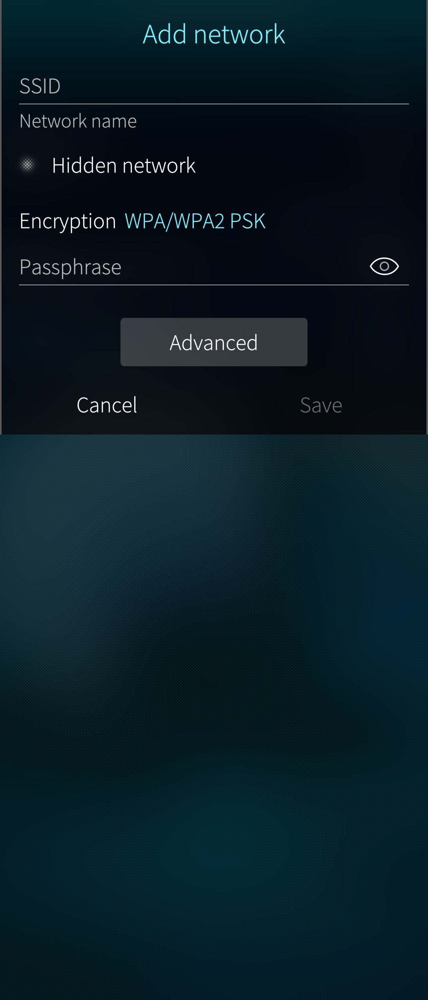
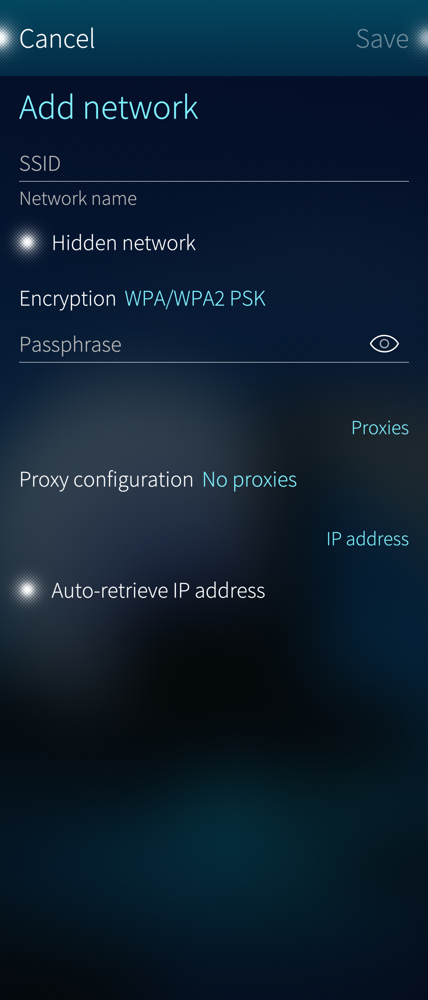
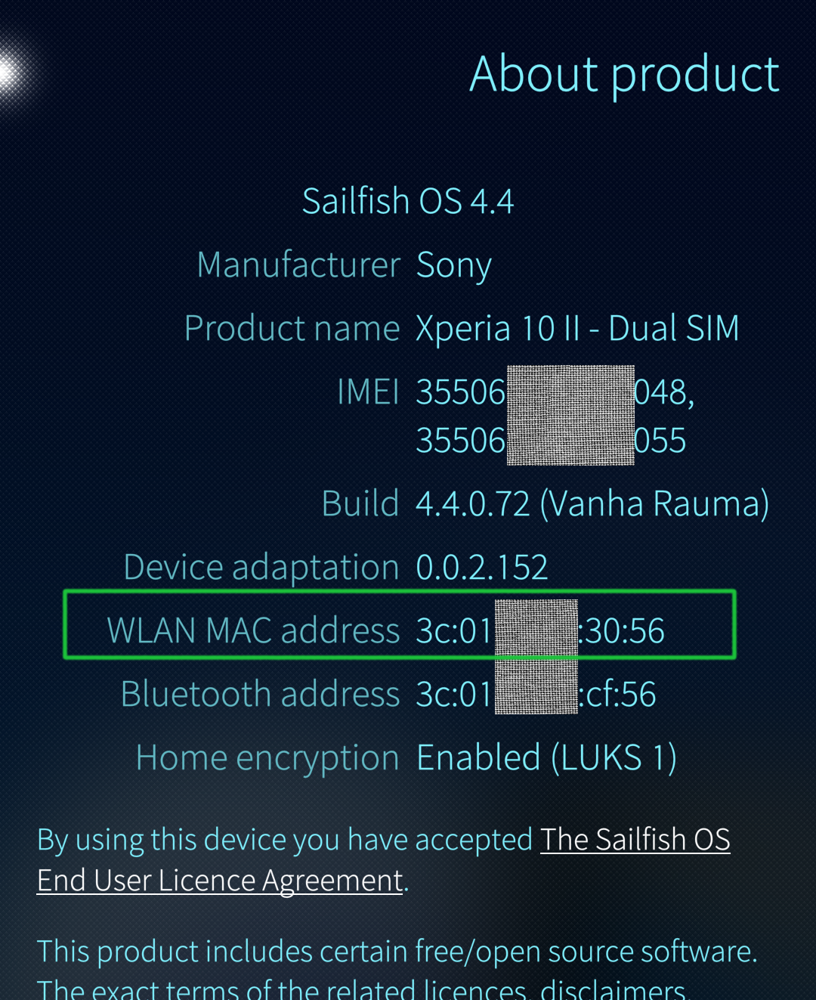

# How to solve problems preventing you from connecting to a WLAN network?

This article is meant for troubleshooting a WLAN connection that does not work.

To establish a WLAN (WiFi) connection, select "Settings > System > WLAN" and pull down "Connect to Internet". For more information on this, please see our detailed **[WLAN instructions](/Support/Help_Articles/Internet_Connections/)**.

This document gives you some hints on what to check if there are problems with WLAN connections.

# Restarting all network connections with Sailfish Utilities

**[Sailfish Utilities](/Support/Help_Articles/Tips_and_Tricks/#sailfish-utilities)** is a toolset that allows you to restart and refresh all wireless network connections on your device. The first item in the Utilities restarts the mobile and WLAN connection functionalities of your device

* 
  
  

Read more about Sailfish Utilities in **[this document](/Support/Help_Articles/Tips_and_Tricks/#restart-network-connections)**.

# If you get an "Unable to connect" error message upon connecting to WLAN
* Ensure that you are running **[the latest Sailfish OS version](/Support/Help_Articles/Updating_Sailfish_OS/)** in "Settings >  System > Sailfish OS updates". Read our instructions for this.
* If you could connect to this network previously, please long-press this network in "Settings > System > WLAN" and select "Forget network". Restart your phone. Then attempt connecting to the network again.

# If you are trying to connect to an open (public) WLAN network
Check if the network is a **captive portal** [^1] that requires a login on a web page. Captive portals are often used in hotels, restaurants and on venues.

If the network is organised as a captive portal, first connect to this network in the usual way in "Settings > System > WLAN". Then use the Sailfish Browser to open any webpage - the host of the captive portal will redirect you to the login page of this portal. Log in there using the credentials available from the host.

After that, the WLAN network should work in a normal way.

Sometimes, the tick boxes of the portal web page have not worked (i.e. the user of Sailfish Browser has not been able to set the tick boxes). A simple workaround is to first open a safe and unencrypted page in the browser, such as http://neverssl.com.  This will redirect you to the captive portal in the browser and accepting the conditions in the browser will work.

[^1]: [https://en.wikipedia.org/wiki/Captive_portal](https://en.wikipedia.org/wiki/Captive_portal)

# If you are trying to connect to a secure WLAN network
* Check that you typed the password right. The easiest way to ensure this is to tap the 'eye' button next to the text field when typing in the password.

* If you suspect or know that the password of the network has changed then reset the network as follows:
1. Go to "Settings  > System > WLAN"
2. Press and hold the network until a popup menu appears
3. Select "Forget network"
4. Pull down and select "Connect to Internet"
5. Select the network, type in the new password and tap "Connect"

* Check with your network administrator which encryption protocol the network uses. Sailfish OS supports **WEP, WPA/WPA2 PSK** and **WPA-EAP (WPA2-Enterprise)**.  Other encryptions are not yet supported. In addition, check if the network requires more advanced settings like proxies or IP addresses. Those can be tweaked by going to "Settings > System > WLAN", then pressing and holding the network until the popup menu opens and selecting "Edit".

* After pulling down "Connect to Internet" there is also the option to "Add network" which allows the manual configuration of a new network. Obviously, this requires a solid understanding of WLAN technology and detailed information on the characteristics of the WLAN network you are aiming to configure to your Sailfish device.

* 
  
  
* 
  
  
  Screen captures from searching and installing whatsapp 

# If you are trying to connect to a WLAN network using MAC filtering
As a measure of safety, it is possible to configure a WLAN access point (WLAN router, WLAN device) to accept connection requests only from devices that have their MAC addresses registered to the WLAN device.

If your WLAN device has the MAC address filtering enabled, you need to check the WLAN MAC address of your Sailfish OS device from the menu page "Settings > System > About product". Then add this address to your WLAN device.

The connection should work now.

* 
  
  

# Do not use WLAN channel 13
Android-based systems, including Xperia phones with Sailfish OS, cannot use WiFi channel 13. If the WiFi access point device is in your control, make sure that it does not offer channel 13 to connect to.

# Xperia XA2 and the 5 GHz frequency band
With version **[v17B](https://developer.sony.com/file/download/software-binaries-for-aosp-oreo-android-8-1-kernel-4-4-nile)** of the Sony vendor image, we have observed a decrease in the perceived signal strength of the 5GHz WLAN access points. Version **[v16](https://developer.sony.com/file/download/software-binaries-for-aosp-oreo-android-8-1-kernel-4-4-nile-v16/)** should work better in this respect. Therefore we would not recommend flashing v17B if you use WLAN networks in the 5GHz band.

Our flashing script allows you to use either of the two versions. You can change the vendor image later by reflashing just the vendor image of your choice (and not Sailfish OS) by following the instructions **[here](/Support/Help_Articles/Updating_Vendor_Image/)**.

