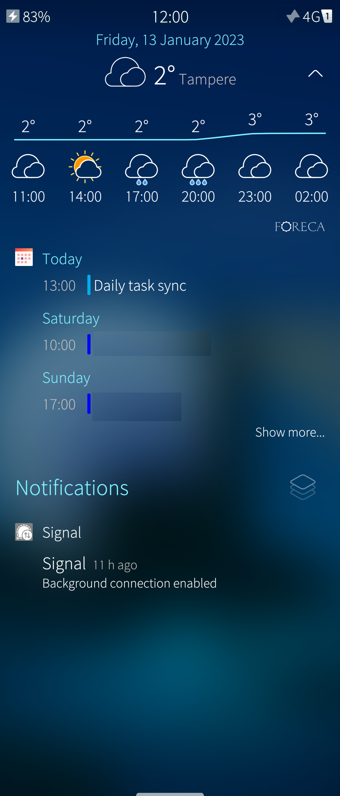
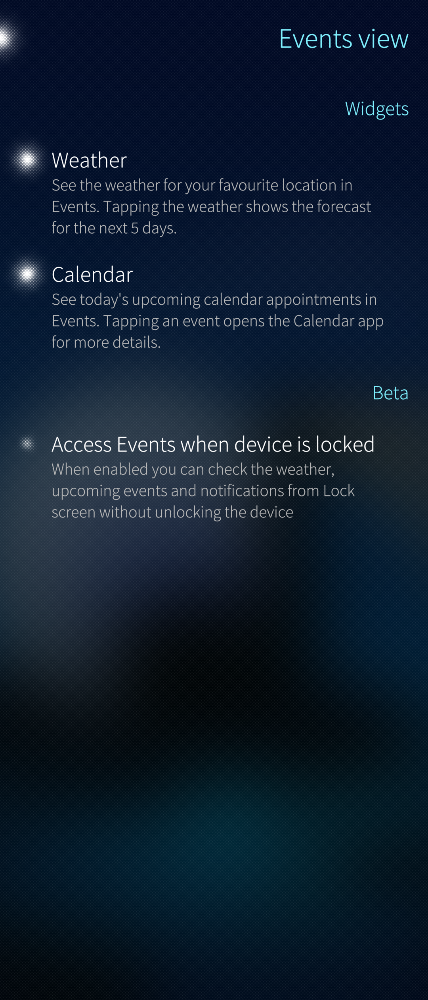
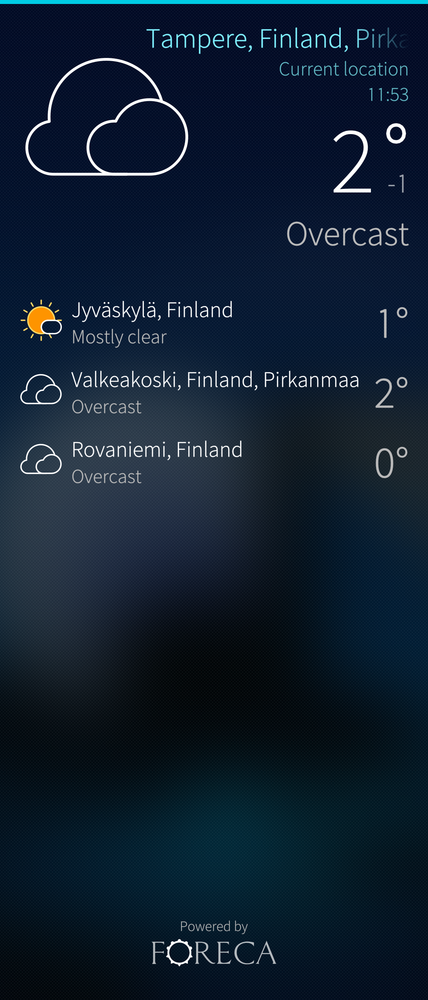
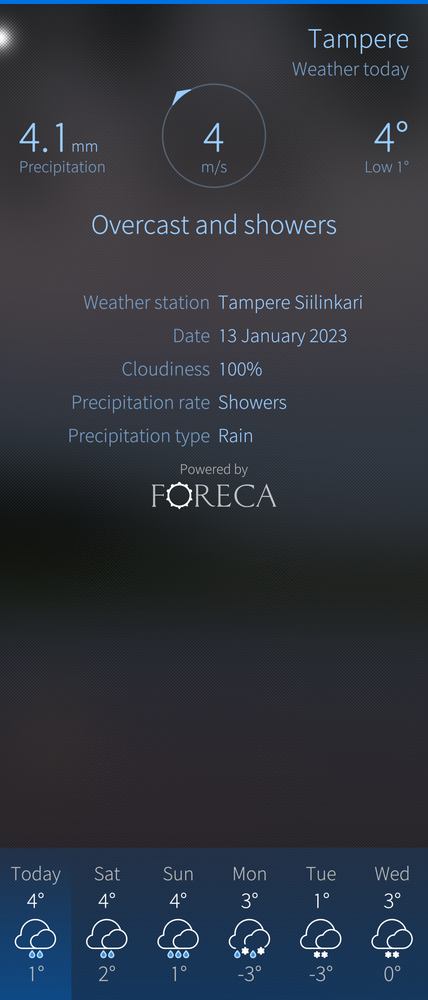

# Sailfish Weather
Sailfish Weather is an application you can download from the Jolla Store. It shows daily weather and a 6-day forecast for multiple locations. Daily and weekly weather of the main location can also be checked with a quick glance at the Events view.

* 
  
  

You can enable or disable the Weather in the Events view from Settings > System > Events view. By tapping the weather information in the Events view, you can toggle between the forecasts of the current day and the current week. You can also open the Weather application with long press on the events view since that open list which has "Open app" and "Reload" options.

* 
  
  

# Weather application
You can launch the Weather app from the application grid. In the main view of the application you can update the weather information and add a new locations from the pulley menu.

* 
  
  

Once you've added multiple favourite locations, you can press-and-hold on them to bring up a menu where you can find these options:

* Remove: Removes the location
* Set as current location: will make this location show up in Events view

## Detailed weather forecast
If you tap on one of your locations, you can see more detailed information on the weather forecast.

* 
  
  

You see a 6-day weather forecast at the bottom of the view. Touching one of them will reveal more information. To exit this view, swipe right.

This view also contains a pulley menu where you can find these options:

* More information: this opens the Browser and takes you to Foreca's website, where you will have more information and functions
* Update: You can manually check the weather information for updates
