Sailfish Browser is based on the well-known _Gecko_ engine from Mozilla. For Sailfish release 4.4.0, Sailfish Browser was upgraded to support Gecko ESR78.

In addition to the engine, the user interface of the Browser has been improved on the Sailfish 4 releases, bringing all the typical functions of mobile phone browsers to Sailfish.


  
# Several ways to open web pages

Tap the Browser launcher icon on the application grid. It is usually located on the top row.

<div class="flex-images" markdown="1">

* <a href="Browser_launch_icon.png">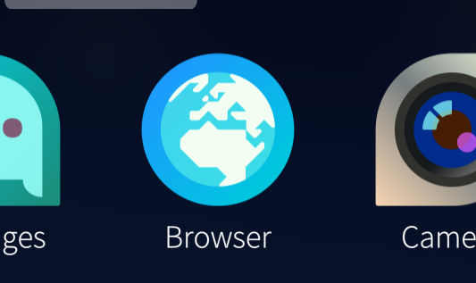</a>
  <span class="md_figcaption">
    Pic 1: Browser icon in app grid
  </span>
</div> 

**On the first launch** of the Browser after installing Sailfish, the Browser will open up to the two views below. First, you will need to give the required permissions for the app to work (all of them). Next, the view on the right appears. We call it the _Start view_. It has the cursor ready in the address & search box (if not, tap there) and the keypad is visible, so you can easily start typing the web address. Alternatively, it is possible to tap one of the bookmark icons in the middle.

<div class="flex-images" markdown="1">

* <a href="Browser_permissions.png">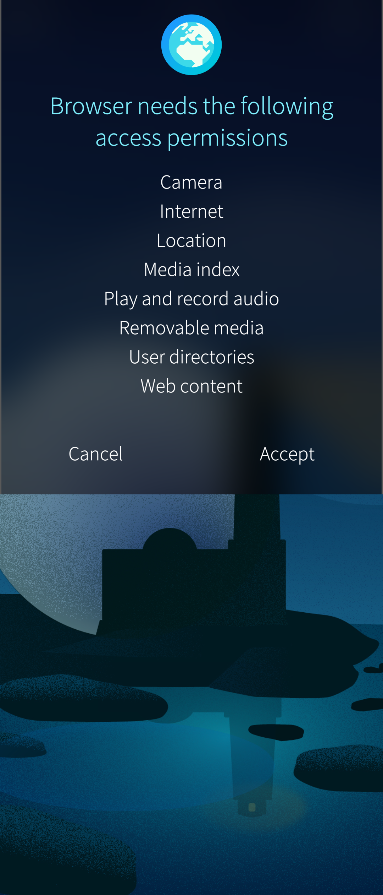</a>
  <span class="md_figcaption">
    Pic 2: Browser needs these permissions
  </span>
* <a href="Browser_start_view.png"></a>
  <span class="md_figcaption">
    Pic 3: Browser 'Start view'
  </span>
</div>

The next time you open the Browser, it will display the website visited the previous time, the home page you have set or the "Start view" (on the right above) - depending on the value of settings _"Home page",_ "_Close all tabs on exit_" and if the previously visited page has not been cleared yet.

The table below shows how it goes on Sailfish OS release 4.4.0 (there may be changes later).


| **Setting<br> "Close all tabs"<br>on exit** | **Browser has<br>the previously visited page<br>** | **Setting<br>"Home page"** | **Browser opens up<br>to this view** |
| --- | --- | --- | --- |
| OFF (default) | YES | "Start view" | Previously visited page |
| OFF (default) | YES | Home URL set by you | Previously visited page |
| OFF (default) | NO (history or tab cleared) | "Start view" | Start view  <br>(type URL or tap bookmark) |
| OFF (default) | NO (history or tab cleared) | Home URL set by you | Home URL set by you |
| ON  | _irrelevant_ | "Start view" | Start view  <br>(type URL or tap bookmark) |
| ON  | _irrelevant_ | Home URL set by you | Home URL set by you |

  
  
## Typing a web address (URL)

When you open the Browser, it will display (by default) the website visited the previous time (an example below on the left) or alternatively the _Start view_ (below on the right).

If you tap the black toolbar (see the picture below left), you will get to the picture on the right where the current web address (URL) is shown highlighted. This allows you to start typing directly - the first character typed will replace the whole highlighted URL.

<div class="flex-images" markdown="1">

* <a href="Browser_marine_finland.png">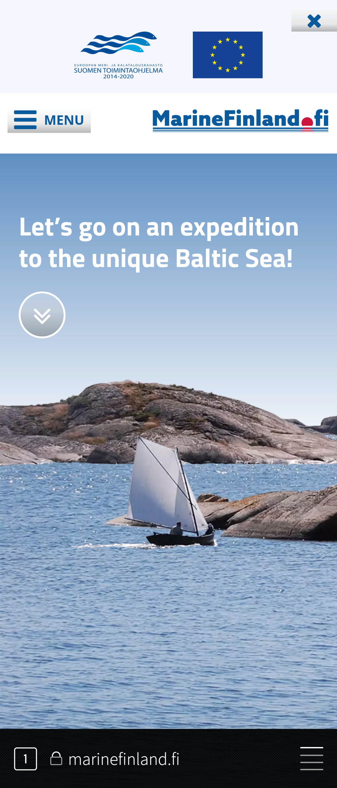</a>
  <span class="md_figcaption">
    Pic 4: Website marinefinland.fi
  </span>
* <a href="Browser_URL_marine_finland.png">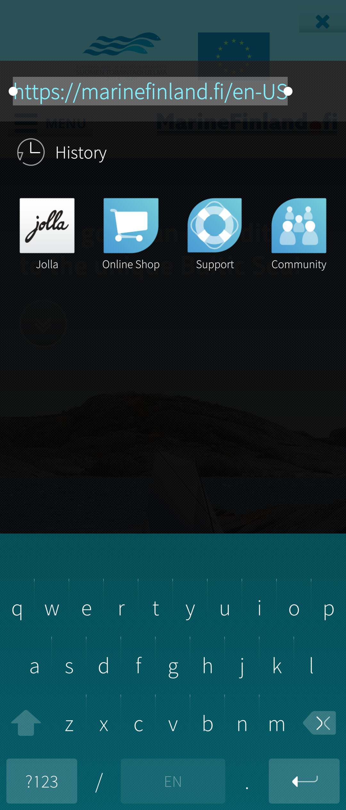</a>
  <span class="md_figcaption">
    Pic 5: URL shown in address box
  </span>
</div>

The _Start view_ usually has the cursor placed in the web address box ready for you, so that you can start typing directly. If the cursor is not there, simply touch the box to move it there.

Type in the **web address** you want (in the example of _Pic 6_ it is "visithelsinki.fi") and tap the "Enter" key (at the bottom right corner). Note that the web address does not need to be complete. The integrated search engines (Bing, Google, Yahoo, etc.) will help in finding the correct address, or at least they would list some potential addresses.

<div class="flex-images" markdown="1">

* <a href="Browser_typing_URL_visit_Helsinki.png"></a>
  <span class="md_figcaption">
    Pic 6: Typing URL visithelsinki.fi
  </span>
* <a href="Browser_website_Helsinki.png"></a>
  <span class="md_figcaption">
    Pic 7: Website visithelsinki.fi
  </span>
</div>

  
## Searching with a keyword
--------------------------------

Instead of writing the exact address of a web page, one can also write some **free keywords** and let the search engine (see chapter "_Web browser settings_" later in this article), e.g. _Google_, find and present some matching web pages for you. While writing, the browser shows potential matching results from your previous searches.

Once the search engine has presented the results, tap the one you want to open.

<div class="flex-images" markdown="1">

* <a href="Browser_searching_european_union.png">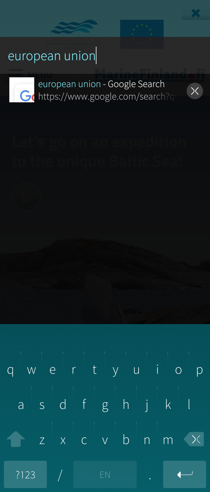</a>
  <span class="md_figcaption">
    Pic 8: Typing search keywords 'european union'
  </span>
* <a href="Browser_google_found_EU.png"></a>
  <span class="md_figcaption">
    Pic 9: Google search results on European Union
  </span>
</div>

  
  
## Open a bookmarked page

A handy way of opening frequently needed web pages is to use **bookmarks**. Your bookmarks appear as thumbnails under the row for writing the web address. In Pic 10 below, there are 6 bookmarks.

Simply, tap a bookmark to open the related web page.

The bookmarks have a context menu (tap and hold one of them - also shown in _Pic 10_) which helps you in managing your bookmarks - see the picture below in the middle. In particular, note the option "Add to app grid" which allows you to make some of your most-used web pages appear as icons in the app grid view - only one tap is required to browse those pages!

<div class="flex-images" markdown="1">

* <a href="Browser_bookmarks_popup_menu.png">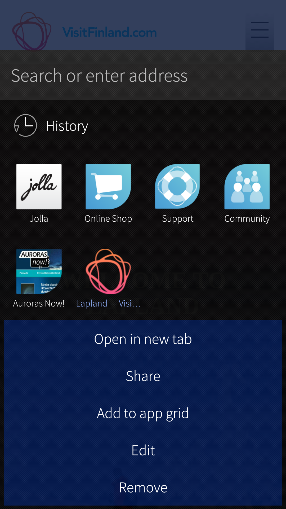</a>
  <span class="md_figcaption">
    Pic 10: Popup menu of a bookmark
  </span>
* <a href="Browser_bookmark_opened_Lappland.png"></a>
  <span class="md_figcaption">
    Pic 11: Website opened by tapping a bookmark
  </span>
</div>
  
  
## Open a browsing history item

Yet another quick way to open frequently used web pages is to open them in the browsing history.

The history resides in the lower part of the complete **[toolset](#toolbar-and-toolset)**.

<div class="flex-images" markdown="1">

* <a href="Browser_toolset_with_history.png" class="narrow-image">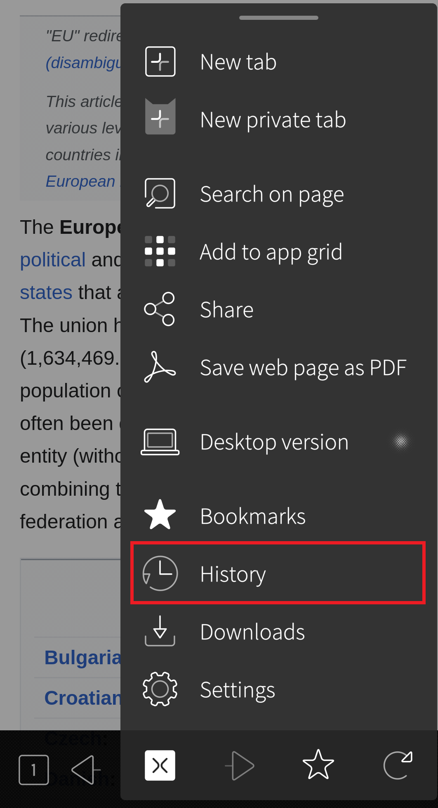</a>
  <span class="md_figcaption">
    Pic 12: History tool in browser toolset
  </span>
</div>

  
  
# Toolbar and toolset

The **toolbar** of the Sailfish Browser is located at the bottom of the screen. It is not visible all the time, to save display space, but you can always bring it back by swiping the display downwards.

The default toolbar is a one-liner (_Pic 13_), showing the total number of open tabs, the back arrow, the current website with the security icon and the button to access the whole toolset.

<div class="flex-images" markdown="1">

* <a href="Browser_toolbar.png" class="narrow-image"></a>
  <span class="md_figcaption">
    Pic 13: Basic toolbar
  </span>
</div>


Tap the "hamburger" button at the right end of the toolbar to open the complete **toolset**. You may need to push the tools window upwards to expose the last few items in the bar. The picture below shows the whole toolset.

<div class="flex-images" markdown="1">

* <a href="Browser_complete_toolset.png" class="narrow-image">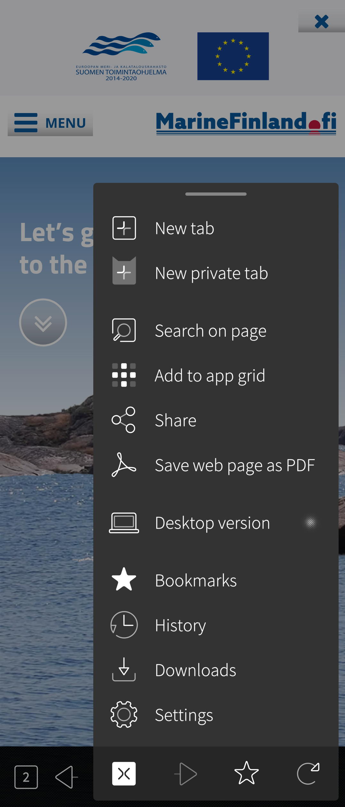</a>
  <span class="md_figcaption">
    Pic 14: Complete toolset
  </span>
</div>


Most of the tools are shown with meaningful names next to them. The lowest row has some tools without names. They are  from the left:

* Total number of open tabs
* Browsing to the previous page
* Closing the current tab
* Browsing to the next page
* Adding a bookmark for the current page
* Refreshing the page

  
  
# Tabs

Sailfish Browser allows multiple tabs. The number of the currently open tabs appears on the **tab icon**
(a small square at the left end of the toolbar). The example picture below shows that there are three tabs open.

<div class="flex-images" markdown="1">

* <a href="Browser_number_of_tabs_at_toolbar_is_3.png" class="narrow-image">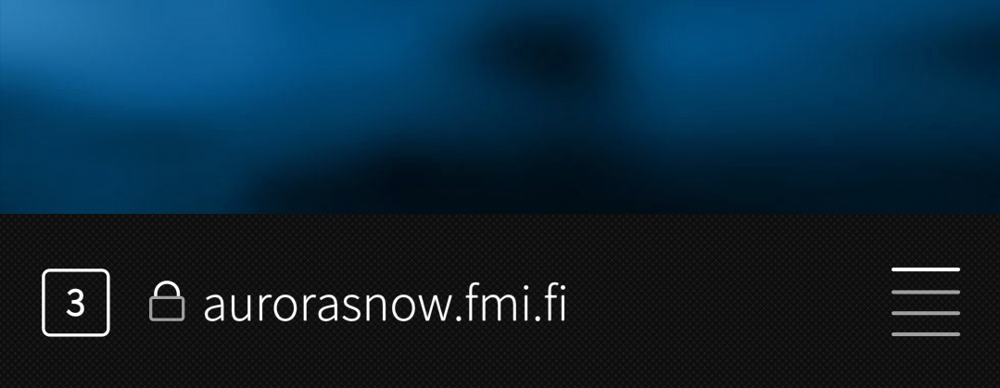</a>
  <span class="md_figcaption">
    Pic 15: Tab count is 3
  </span>
</div>

  
  
## Tabs view

You can invoke the display of all of your tabs by touching the tab icon at the bottom left corner (_Pic 16_).

The tabs appear as rectangles in the middle of the display (_Pic 17_). This view works as a switcher, too, so you can easily jump to another tab by touching it. 

Pay attention to the toolbar of this tabs view:
* Arrowhead takes you to the webpage of the previously used tab
* \+ button let's open a new webpage and a tab
* Hamburger button exposes the tab-specific context menu (see _Pic 18_)

In addition, note the two small icons at the display top (in the red rectangle) - they indicate the number of normal tabs and private tabs open currently. In this example, there are three normal tabs and one private.  Those two icons work also as a switcher between **normal browsing** and **private browsing**.
  
<div class="flex-images" markdown="1">

* <a href="Browser_website_opens_to_normal_tab_3_tabs.png">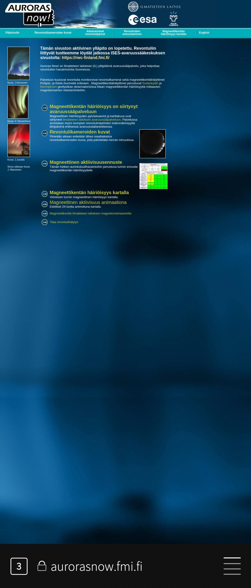</a>
  <span class="md_figcaption">
    Pic 16: Popup menu of a bookmark
  </span>
* <a href="Browser_3_normal_tabs_view.png">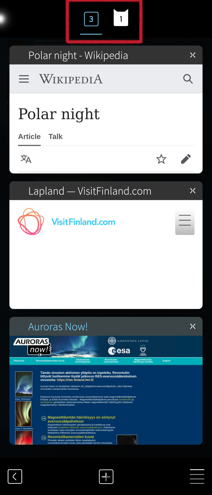</a>
  <span class="md_figcaption">
    Pic 17: Tab count icon (3) to be tapped to open the tabs view
  </span>
</div>

 
  
## Opening a new tab

Opening a web page **to a new tab** (instead of replacing a web page on the current tab) goes by touching the **\+ button** in the middle of the tabs toolbar, at the bottom of the display (_see the picture above, on the right_).

Alternatively, you can tap at the "hamburger" button at the right end of the tabs toolbar and select "New tab" in the popup menu then (_see below_).

<div class="flex-images" markdown="1">

* <a href="Browser_tabs_popup_menu.png" class="narrow-image">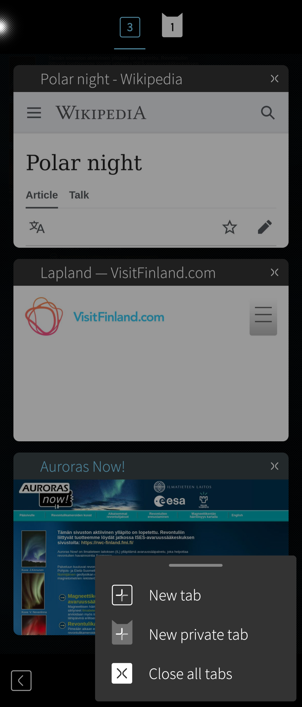</a>
  <span class="md_figcaption">
    Pic 18: Tab popup menu
  </span>
</div>
  
  
## Private browsing

Opening a **private tab** can be done via the same popup menu with "New private tab" (_Pic 18_). Another way to do it is to first tap the icon of private browsing at the top of the display (_the white icon with #1 on it at the top of in Pic 18 above_) followed by a tap on the **\+ button** in the middle of the tabs toolbar, at the bottom of the display.

Private tabs are always shown on a background of diagonal black and grey stripes. The same background is used in the toolbar of private browsing web pages.

<div class="flex-images" markdown="1">

* <a href="Browser_1_private_tab_and_3_normal_tabs_open.png">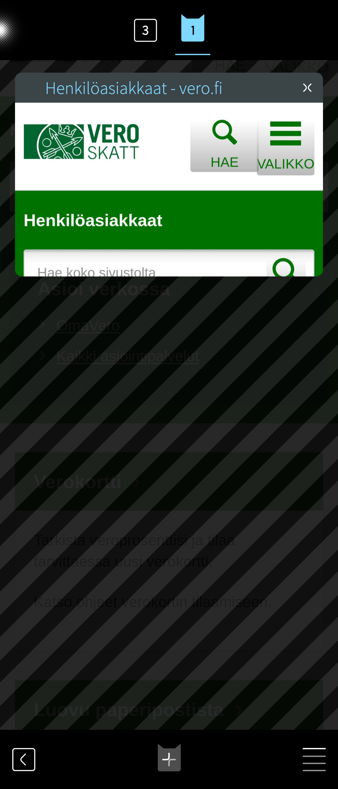</a>
  <span class="md_figcaption">
    Pic 19: One private tab shown (background striped)
  </span>
* <a href="Browser_website_opened_from_private_tab.png">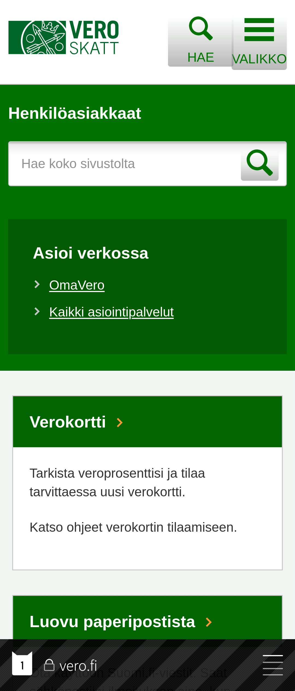</a>
  <span class="md_figcaption">
    Pic 20: Private website (striped toolbar) opened by tapping a private tab
  </span>
</div>

 
  
## Closing tabs

All open tabs can be closed at the popup menu shown below.

<div class="flex-images" markdown="1">

* <a href="Browser_tabs_toolbar_mini.png" class="narrow-image">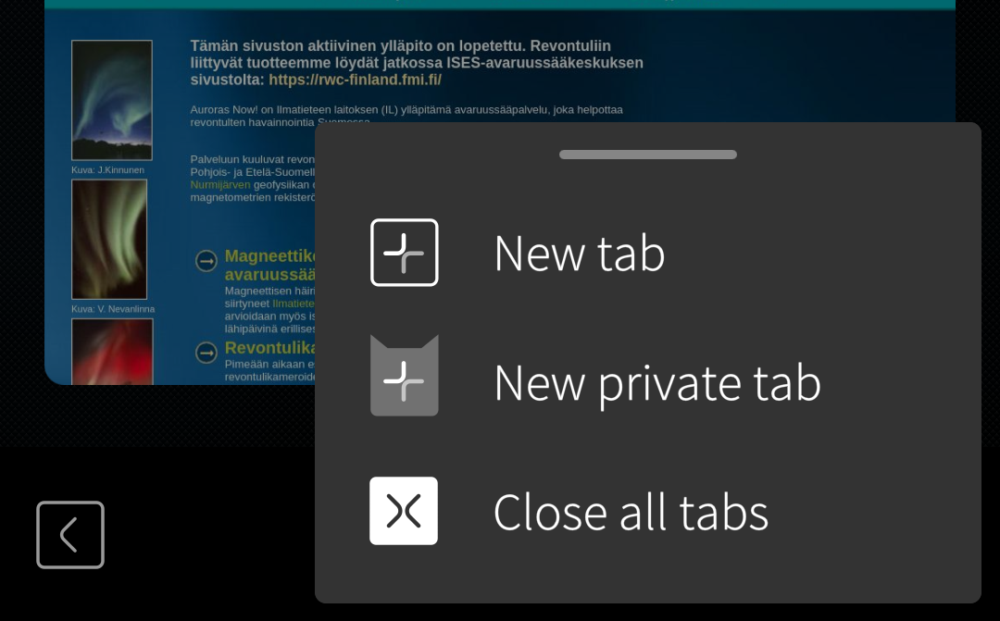</a>
  <span class="md_figcaption">
    Pic 21: Tab popup menu
  </span>
</div>

Another way is to let it happen automatically when closing the Browser app - there is the setting "_Close all tabs on exit_" in the **[Browser settings](#web-browser-settings-privacy-and-browsing-history)**.

Closing the current tab is done by invoking the toolset (with the hamburger button) and by tapping the close button at the toolbar. It is the white square with the 'x' on it in the picture below.

<div class="flex-images" markdown="1">

* <a href="Browser_toolbar_close_current_tab.png" class="narrow-image">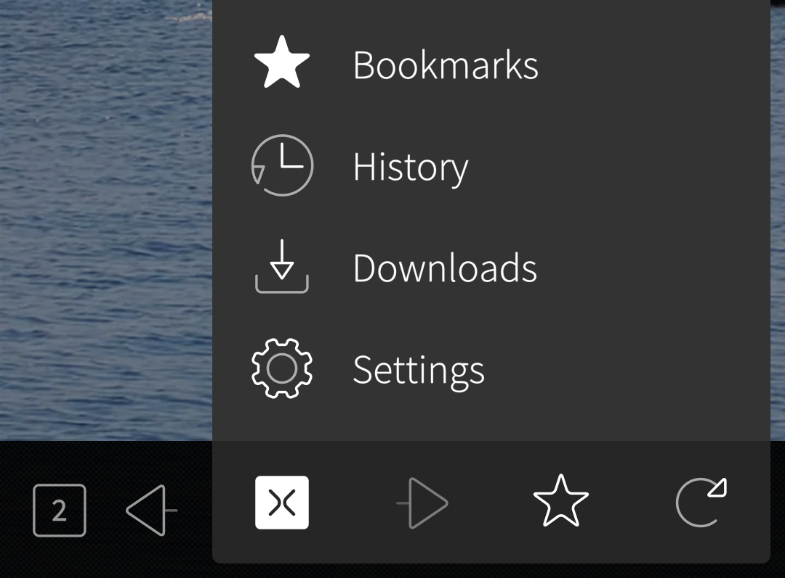</a>
  <span class="md_figcaption">
    Pic 22: Closing the current tab with the 'X' at the toolbar
  </span>
</div>
  
  
# Searching on a web page

It is possible to search for words on the web page (tab) currently on the display. Use the "Search on page" tool in the fully open toolset. Type the keyword and tap Enter. See the example below.
  
<div class="flex-images" markdown="1">

* <a href="Browser_search_on_page.png">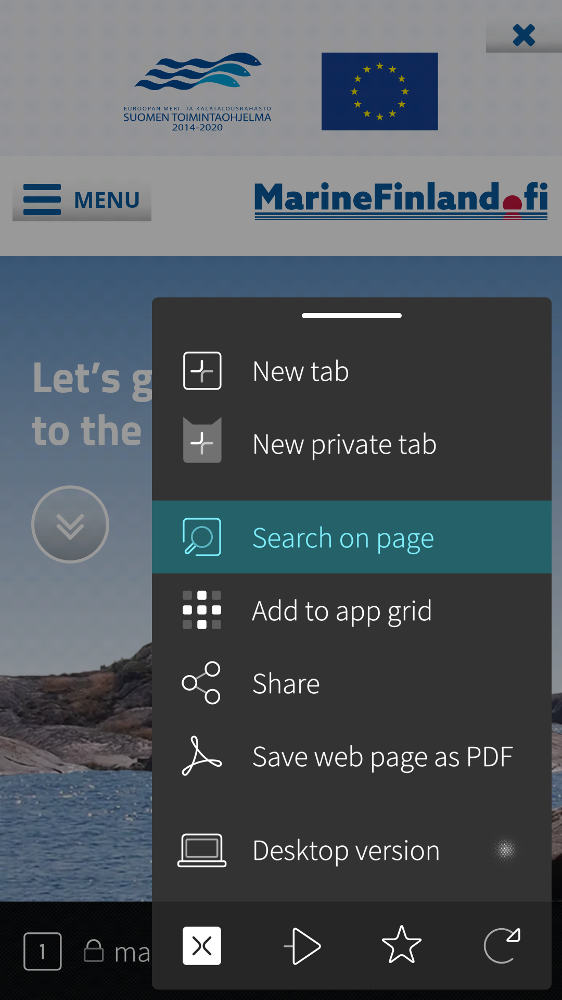</a>
  <span class="md_figcaption">
    Pic 23: Use toolset to start search on open webpage
  </span>
* <a href="Browser_type_search_keyword.png">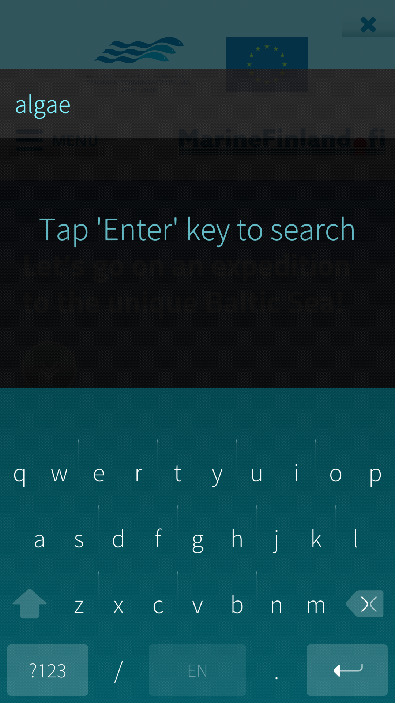</a>
  <span class="md_figcaption">
    Pic 24: Typing keyword for search on this webpage
  </span>
</div>

The searched keyword 'algae' was found on the currently open webpage - see _Pic 25_ below.

<div class="flex-images" markdown="1">

* <a href="Browser_keyword_found_on_page.png" class="narrow-image"></a>
  <span class="md_figcaption">
    Pic 25: Searched keyword found on page
  </span>
</div>

 
  
# The active cover of the browser

Like other apps, the Browser has an **application cover** (minimized view of an app on the Home Screen - see **[Home view](https://sailfishos.org/design/ux-framework/)**). The cover reflects the web page just appearing in the Browser. There is a plus button on the cover, making it easy to add a new tab and start typing a new URL.

<div class="flex-images" markdown="1">

* <a href="Browser_active_cover.png" class="narrow-image">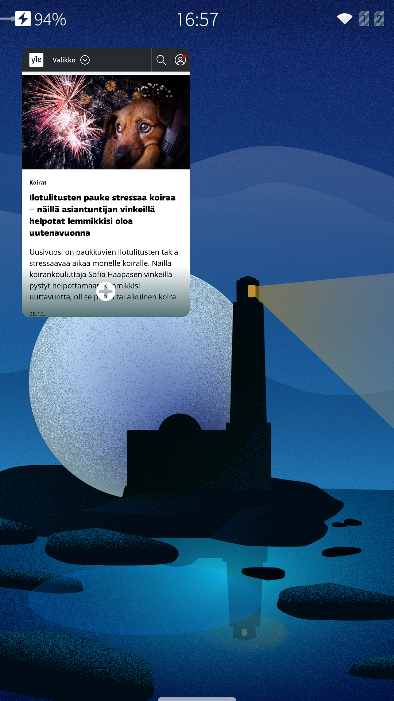</a>
  <span class="md_figcaption">
    Pic 26: An example of an active cover of the Browser app shown
  </span>
</div>

  
# Web browser settings, privacy and browsing history


## Getting to the settings

There are two ways to access the Browser settings:

a) At the Browser toolbar, tap the "hamburger" button at the right end of the bar. The tools menu opens up. Push it upwards to see the last item of it, "Settings". Tap it. See _Pic 30_.

b) Open the Settings app and select the Apps page at the top.  Tap "Browser" in the grid of apps. The view of _Pic 31_appears. Tap "Settings".

<div class="flex-images" markdown="1">

* <a href="Browser_settings_in_toolset.png">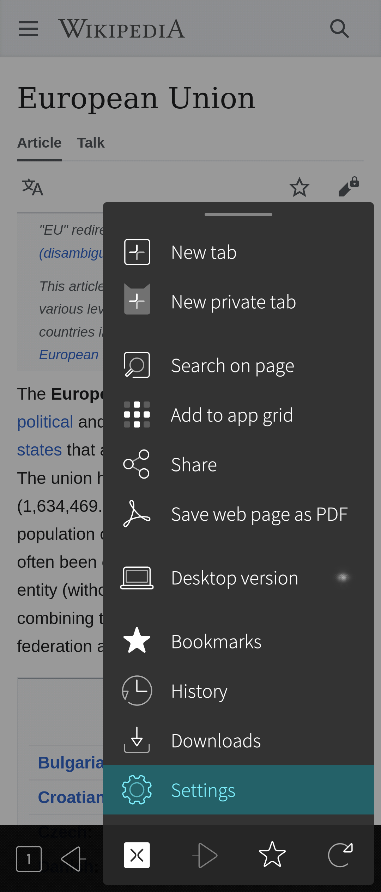</a>
  <span class="md_figcaption">
    Pic 30: Entry to Settings at the end of toolset
  </span>
* <a href="Browser_settings_apps.png">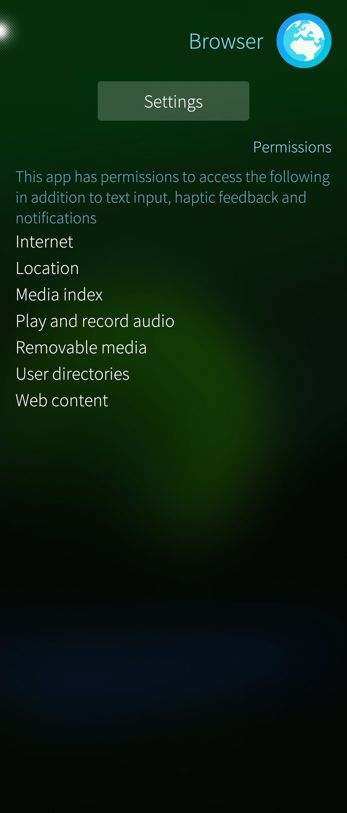</a>
  <span class="md_figcaption">
    Pic 31: Settings > Apps > Browser
  </span>
</div>

_Pic 32_ shows the Browser settings page with the default settings:

<div class="flex-images" markdown="1">

* <a href="Browser_app_settings_overview_default.png" class="narrow-image">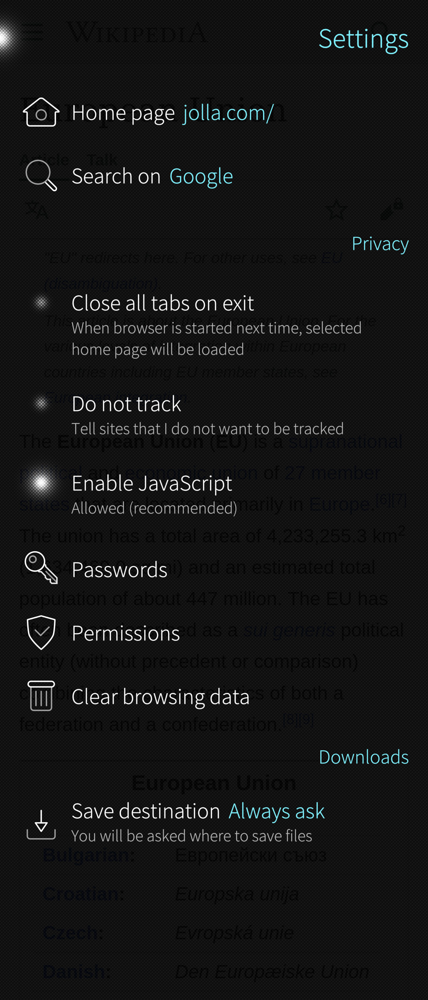</a>
  <span class="md_figcaption">
    Pic 32: Default settings of the Browser
  </span>
</div>


## Configuring the default home page

Type in the URL of the web page to which you want your browser to launch by default. The browser takes you to your home page when you launch it if you have closed all browser tabs before closing the browser app the previous time.

Alternatively, you might decide to stick to the "Start view". With this option, the Browser will open up to the view where you can type a web address (URL), tap a saved bookmark or use the browsing history to select the web page to view next.

<div class="flex-images" markdown="1">

* <a href="Browser_settings_home_page.png" class="narrow-image">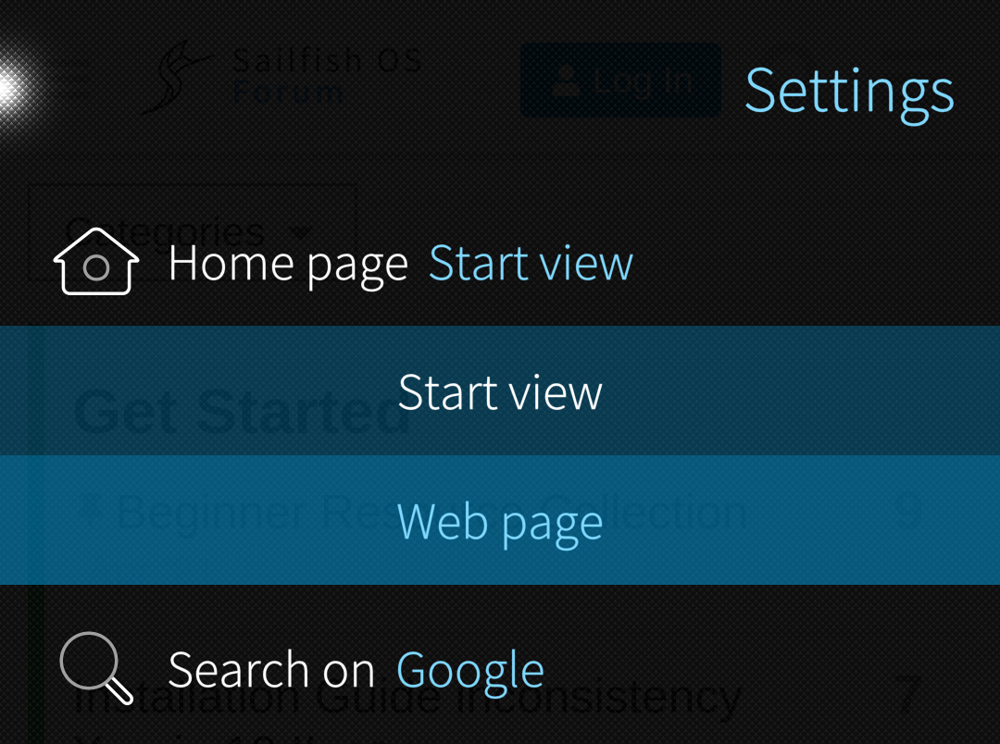</a>
  <span class="md_figcaption">
    Pic 33: Setting the Home page
  </span>
</div>

## Configuring the default search engine

At the "Search on" item, you can determine the default search engine.  To search using these search engines, you only need to type your search words into the address bar of the Sailfish browser.

Note that it is possible to configure the search to happen at one specific website only, for instance, at Sailfish OS Forum only (see the last item of the picture below).

<div class="flex-images" markdown="1">

* <a href="Browser_settings_search_engine.png" class="narrow-image">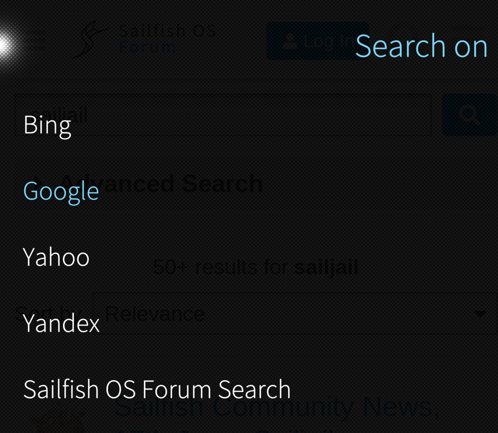</a>
  <span class="md_figcaption">
    Pic 34: Setting the Search engine
  </span>
</div>


## Configuring privacy and deleting history

In the section of Privacy settings, there are the following options:

<div class="flex-images" markdown="1">

* <a href="Browser_settings_privacy.png" class="narrow-image">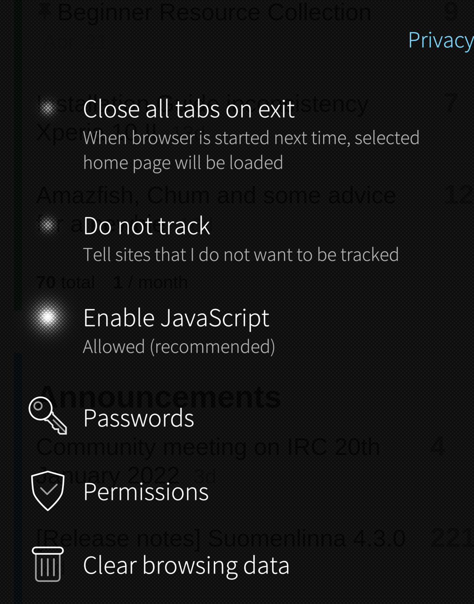</a>
  <span class="md_figcaption">
    Pic 35: Setting the privacy
  </span>
</div>


### Close all tabs on exit

With this option, all tabs are closed when you close the Browser app. When you open the app the next time, it will either show the home page set by view or the Start view.

### Do not track

When activated, this option adds a "Do not track" signal to your Browser’s header, telling other websites that you don’t want their tracking cookies. Many websites have refused to honour it, though.

### Enable JavaScript

Many web pages have been implemented (partly or fully) with JavaScript programming language. We recommend keeping this option enabled, i.e., allowing the execution of JavaScript on the visited pages, or else those pages may not work as intended.

### Passwords

Sailfish Browser keeps the website passwords saved by you here. You can check them, edit them or delete them.

### Permissions

Under Permissions, one can decide what resources the Browser app is allowed to use, even depending on the website.

For some resources (e.g. microphone), there can be site-dependent exceptions. For some others (e.g. cookies), it is possible to allow or block them and to set exceptions.

<div class="flex-images" markdown="1">

* <a href="Browser_settings_permissions.png">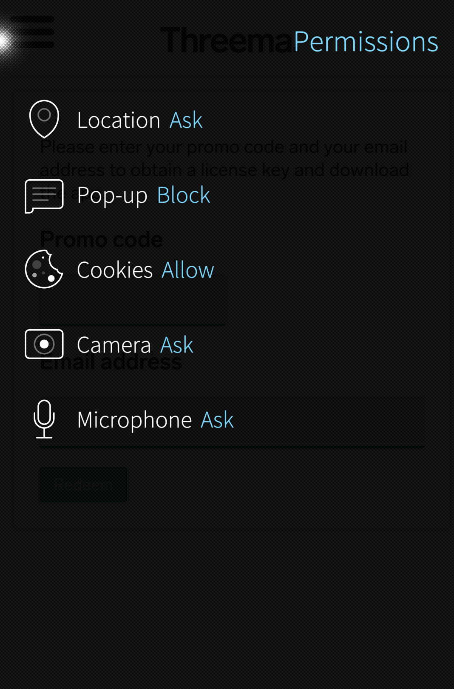</a>
  <span class="md_figcaption">
    Pic 36: Viewing permission settings
  </span>
* <a href="Browser_settings_permissions_cookies.png">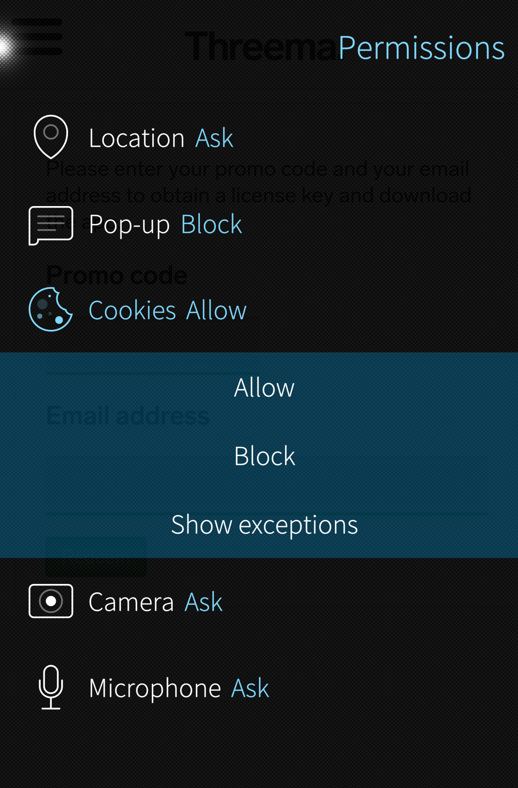</a>
  <span class="md_figcaption">
    Pic 37: Setting Cookies
  </span>
</div>


## Clearing browsing data

When you browse the web, some files and information are stored on your device to ensure for example the functioning of some website features, and to save you from typing the addresses of pages you visit often.

Under the heading "Clear private data", you can choose which data and from how long a period is to be cleared. Commit the action by pressing the "Clear" button at the bottom of the screen (_Pic 38_).

<div class="flex-images" markdown="1">

* <a href="Browser_settings_clear_private_data.png" class="narrow-image">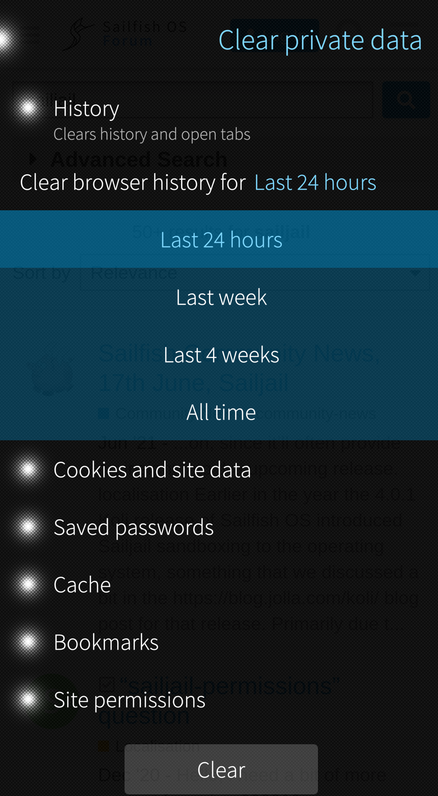</a>
  <span class="md_figcaption">
    Pic 38: Settings and actions for clearing private data
  </span>
</div>

After you press the "Clear" button at the end of this page, the confirmation dialogue (see below) is presented. After tapping "Clear" at the top right corner, the data are cleared for good.  The deleting process is irreversible.

<div class="flex-images" markdown="1">

* <a href="Browser_settings_confirm_clearing_private_data.png" class="narrow-image">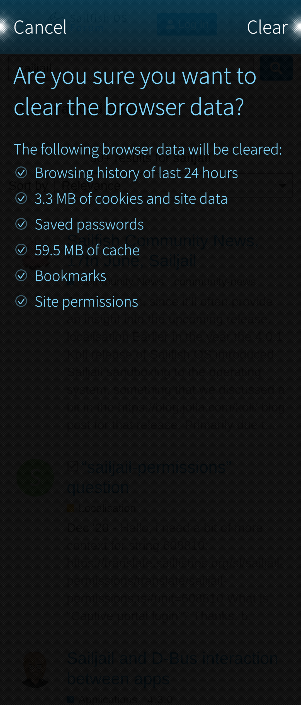</a>
  <span class="md_figcaption">
    Pic 39: Confirmation for clearing private data
  </span>
</div>


## Destination of downloads

The last item of the settings is for selecting how to deal with the files to be downloaded by the Browser. There are two options, either let the Browser always ask for the destination before starting the download, or select the folder you want to keep using for the downloads (_Pic 40_).

<div class="flex-images" markdown="1">

* <a href="Browser_settings_select_save_destination.png" class="narrow-image">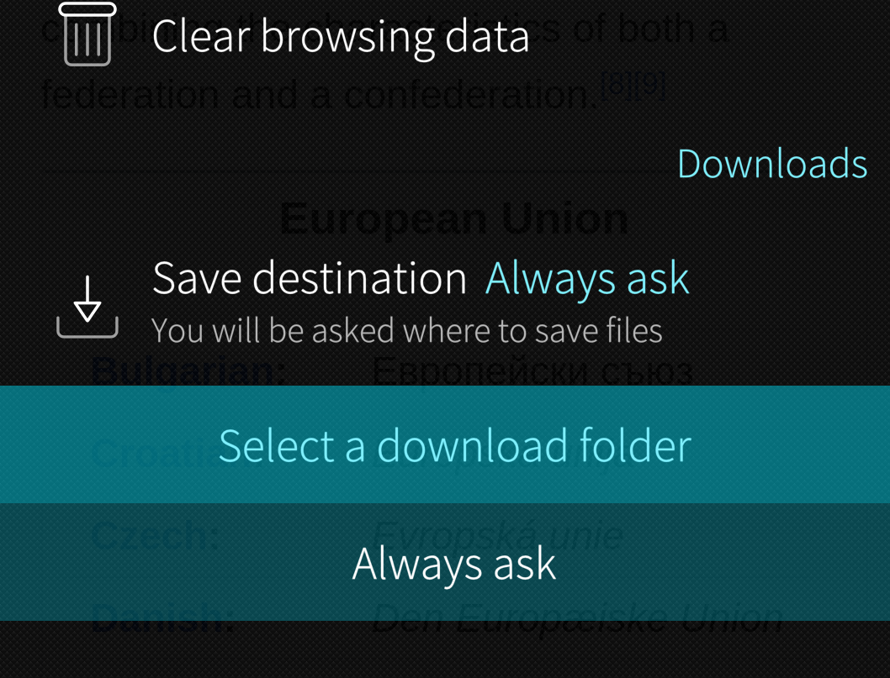</a>
  <span class="md_figcaption">
    Pic 40: Settings for downloads. Start selecting the folder
  </span>
</div>

In the latter case, use the "Select a download folder" option (_Pic 41_) and keep tapping the folder path until you are in the correct folder. Confirm the selection by tapping the "Download to" button at the top right corner (_Pic 41_).

_Pic 42_ shows how the Downloads folder in the device storage was selected for the Browser downloads.

<div class="flex-images" markdown="1">

* <a href="Browser_settings_save_destination_being_selected.png">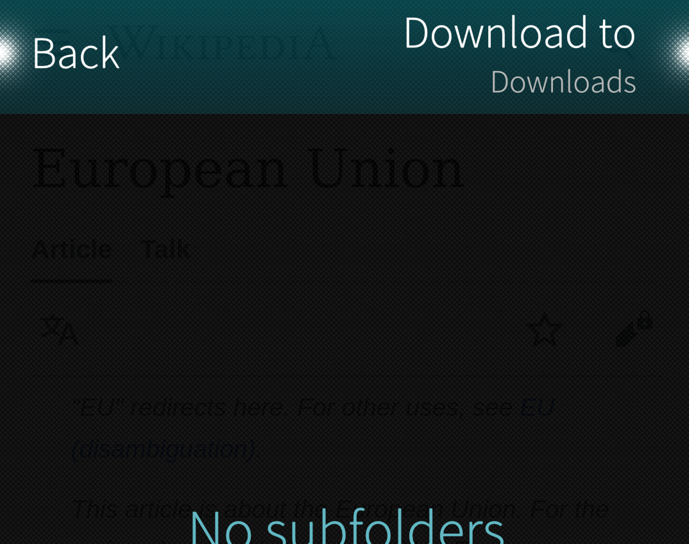</a>
  <span class="md_figcaption">
    Pic 41: Download folder selected
  </span>
* <a href="Browser_settings_save_destination_ready.png">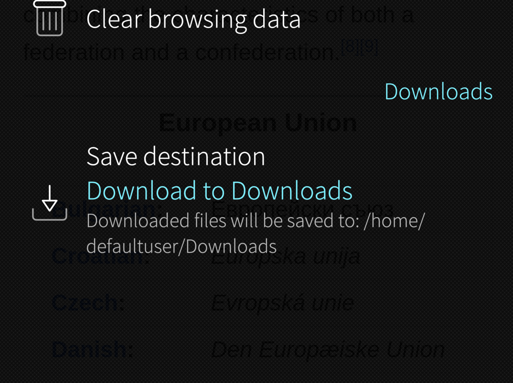</a>
  <span class="md_figcaption">
    Pic 42: Download setting ready
  </span>
</div>

# Resetting the Browser

The following procedure will reset the Browser if it should misbehave in a weird way. The saved passwords will be lost but the browsing history and bookmarks remain.

1. Close the Browser app
2. Enable the **[Developer mode](/Support/Help_Articles/Enabling_Developer_Mode/)** (if not done previously)
3. Open the Terminal app
4. Give the following commands:

```
cd $HOME
devel-su     ## SSH password needed here
  
rm -r .local/share/org.sailfishos/browser/.mozilla/
rm .local/share/org.sailfishos/browser/__PREFS_WRITTEN__ 

## Note: there are 2 underscore characters before and after "PREFS_WRITTEN"
```

Restart the device. Open the Browser and check that it works.


