Please note that the Sailfish OS must be in the very latest version in order for all features described in this article to work. Read about updating your software [**here**](/Support/Help_Articles/Updating_Sailfish_OS/). These instructions were updated for Sailfish OS version 4.1.0.

WhatsApp application (like most Android apps) get updates on a regular basis. We recommend installing these updates as after some time the app and Sailfish OS might become incompatible.

NOTE: The implementation of Android App Support varies by device. On the older devices, i.e., Jolla Phone, Jolla Tablet, Jolla C and Xperia X, Android App Support simulates Android version 4, whereas, in the case of the more recent products, Xperia XA2 and Xperia 10, the simulated Android version is 10 or higher.  Also, the related Sailfish menu pages for Android Support have some differences between those two support categories. Bear this in mind when reading [this chapter](#making-sure-whatsapp-gives-notifications-even-when-not-open).

# Downloading WhatsApp
If you have not used WhatsApp before you are reading the correct instructions here. Carry on.

However, if you have had WhatsApp on some phone previously and you would like to migrate it to a new phone then [jump here](#moving-your-whatsapp-data-to-a-new-phone).

## Download from Aptoide app store

1) Open **Aptoide Store** on your device. Aptoide Store icon (April 2021) is shown below. This app appears by the name **Store** in the Sailfish application grid.

<div class="flex-images" markdown="1">

* <a href="Aptoide-icon.png" class="narrow-image"></a>
  <span class="md_figcaption">
  </span>
</div>

You can [**install Aptoide Store**](https://jolla.zendesk.com/hc/en-us/articles/202442148#gettingstarted) from the Jolla Store if you don't already have it.

2) Open the Aptoide app. Tap the Search button at the footer of the Home view. Type "whatsapp".  In the search results, tap "WhatsApp Messenger" and install it.

<div class="flex-images" markdown="1">

* <a href="Search-WA.png">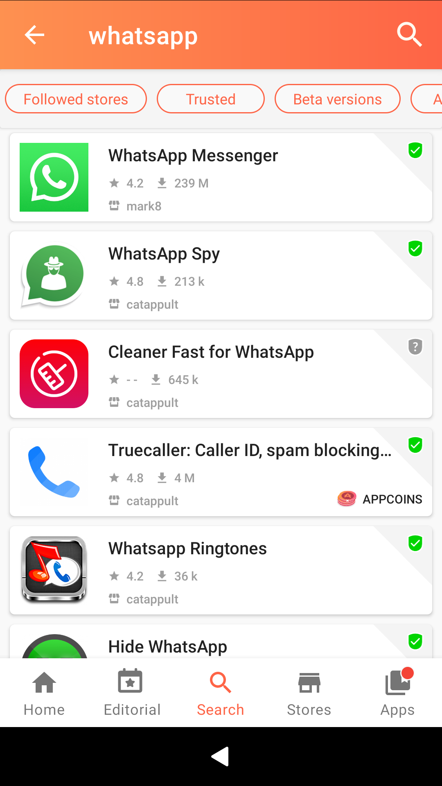</a>
  <span class="md_figcaption">
  </span>
* <a href="Install-WA.png">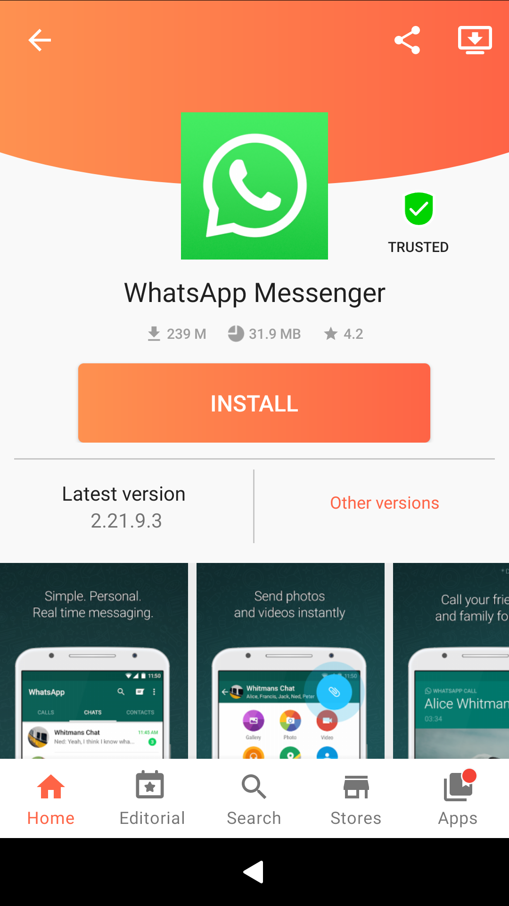</a>
  <span class="md_figcaption">
  </span>
  Screen captures from searching and installing whatsapp 
</div>

Note that the recent Aptoide app has advertisements which it tends to show (video clips) while installing apps. Try to ignore them somehow unless they appear interesting to you.

## Download directly from the WhatsApp website

1. Open Sailfish Browser
2. Browse to [https://www.whatsapp.com/android](https://www.whatsapp.com/android)
3. Tap "Package installer" (it is located to the right from the "Google Play" item)
    ==> whatsapp.apk is downloaded to your phone
4. Open "Settings > System > Transfers" and see the apk file at the top of the list
5. Install the apk by tapping it (if there is a warning about installing untrusted software, first go to "Settings > System > Untrusted software" and allow it.


After downloading and installing, you are required to activate WhatsApp before starting to use it.

# Activating WhatsApp service on your device
Next, we will activate WhatsApp on your Sailfish OS device. WhatsApp uses an automated text message system for verification. We will have to help it a little by hand though, as Android™ App Support of Sailfish OS may not be able to read the necessary info from the verification message sent by WhatsApp.

1. Please ensure that your device has a connection to the cellular network and that Mobile Data is enabled & functioning (see Settings > Mobile network > Use SIM card).  Note that although a mobile network connection (arranged with your SIM card) must be available in the registration phase, you can use WhatsApp service over a WiFi connection later on.

2. Open WhatsApp. Agree to the Terms and Conditions and fill in your country and phone number (without the leading zero), and press OK.

3. Next, you will be sent an SMS containing a 6-digit confirmation code (see the views below). Note that Sailfish OS may not detect the incoming SMS automatically but you may need to open the Messages app and check if you have received a text message from Whatsapp.

Before getting the SMS message, WhatsApp will prompt for your permission to send and view SMS messages. If you wish not to allow that then tap "Call me" and a computer will call you and tell your access code. In case 2-step verfication has been enabled for the WhatsApp account, then after entering the code from the SMS/call the two-step verification dialogue will appear. It requires typing of the 6-digit code.

<div class="flex-images" markdown="1">

* <a href="WA_003b.png">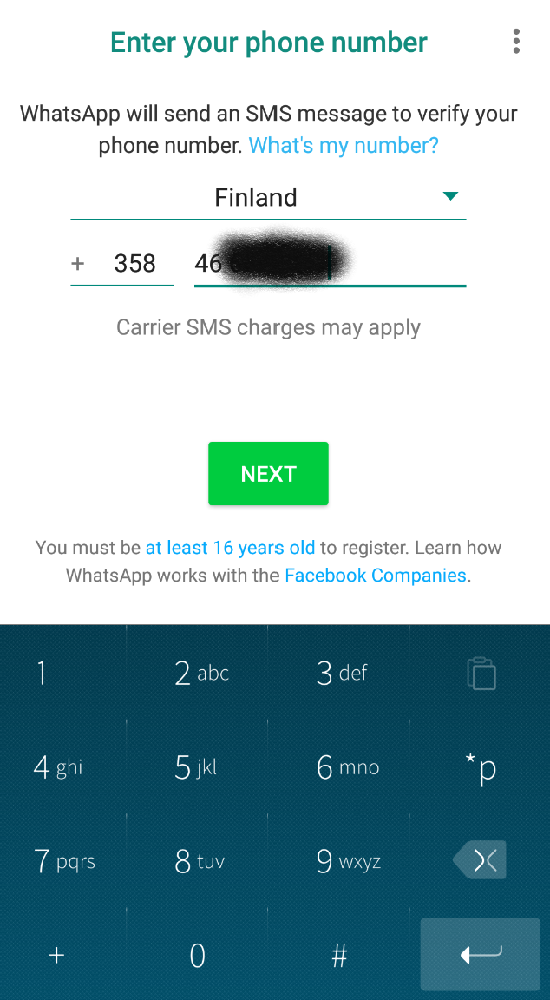</a>
  <span class="md_figcaption">
  </span>
* <a href="WA_006b.png">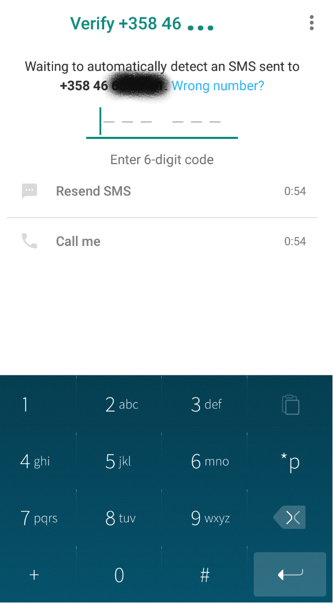</a>
  <span class="md_figcaption">
  </span>
  Screen captures from setting up the whatsapp 
</div>

# Making sure WhatsApp gives notifications even when not open
By default, notifications will not come through unless you have WhatsApp fully open or, at least, minimized to the Home screen.

Should you wish to be alerted of WhatsApp messages and calls whenever they might arrive, regardless the application is running, please do the following:

1) In Settings > Android App Support, enable the option "Start Android App Support on bootup". This keeps the Android system operational and ready for use. 

2) Go to Settings > Apps

3) Find WhatsApp from the grid of application icons:

<div class="flex-images" markdown="1">

* <a href="Apps.png" class="narrow-image">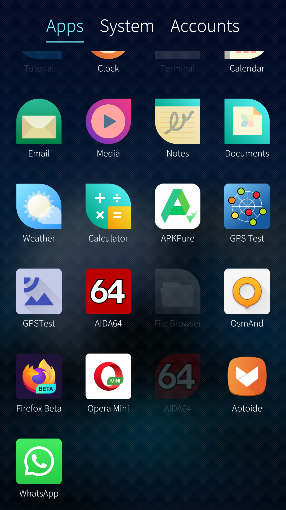</a>
  <span class="md_figcaption">
  </span>
</div>

4) Then, enable the option "Allow application background services to start on bootup". This makes Whatsapp's background processes start as soon as the device starts up:

<div class="flex-images" markdown="1">

* <a href="WA-settings.png" class="narrow-image">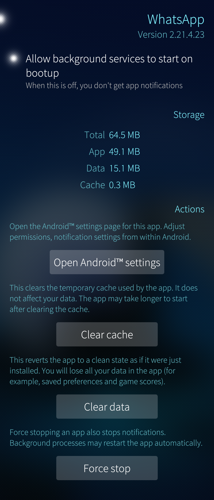</a>
  <span class="md_figcaption">
  </span>
</div>

The switch in this view will make WhatsApp's background processes run all the time on your Sailfish device, regardless of WhatsApp is open or not. While this means that you will be receiving messages whenever they arrive, it may also have an impact on battery life, making it shorter, unfortunately.

You may need to restart WhatsApp for this change to be applied.

Please also note the other controls for the Whatsapp application in the view above.

5) The button "Open Android ™ settings" (see the picture above) exists on Android App Support version 8.1 and later only, i.e. on Xperia XA2 and Xperia 10 devices.  

If you have a different device, go to step 6.

The settings button makes it possible to tune app the Android-specific settings of this app after it has been installed. For instance, consider allowing it to present notifications and permit you to use some resources of your phone (if not all - see the picture below right).

<div class="flex-images" markdown="1">

* <a href="Settings-home.png"></a>
  <span class="md_figcaption">
  </span>
* <a href="Settings-notifs.png">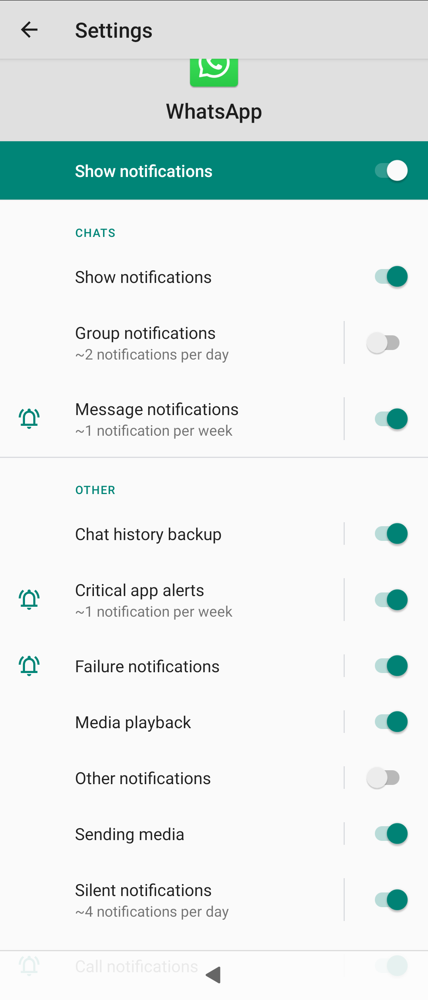</a>
  <span class="md_figcaption">
  </span>
  Screen captures from setting up the whatsapp 
</div>

<div class="flex-images" markdown="1">

* <a href="Settings-permissions.png" class="narrow-image">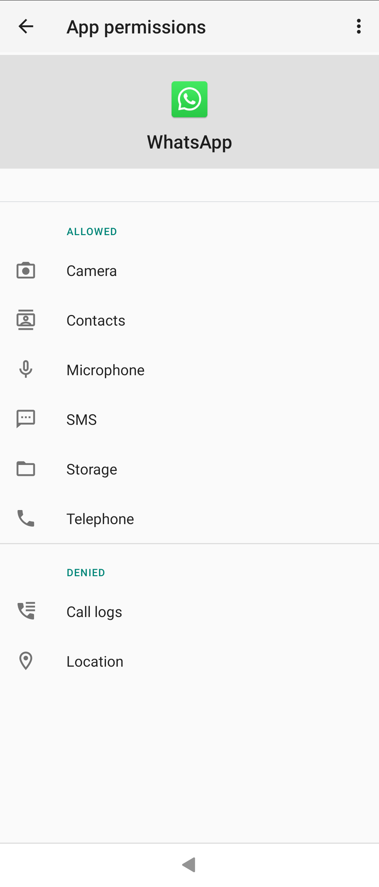</a>
  <span class="md_figcaption">
  </span>
</div>

6) Selecting ringing tones and notification tones

Open Whatsapp app. Tap the three dots near the top right corner and select Settings. Next, tap Notifications. On this menu page, you can select in which ways you want Whatsapp to alert you on incoming messages, group messages and calls.

# Moving your WhatsApp data to a new phone
You may want to copy your WhatsApp app with all of its messages from an old phone to a new one. The following steps should make it easier for you.

On Google Android devices, this happens automatically through Google Drive, but on SailfishOS some manual steps are needed.

## On the old phone
1. Open WhatsApp
2. Tap the 3 dots at the upper right corner of the home view of the app
3. Tap Chats
4. Tap Chat backup and let the app make a backup of your messages to your phone.
5. Close WhatsApp app

Connect your phone to your computer in MTP mode. On your computer, use the file manager to access your Sailfish phone.

1. Find folder "Mass storage > android_storage > Whatsapp"
2. Copy the Whatsapp folder over to your computer, to Downloads, for instance.
3. Disconnect the phone from the computer.

## On the new phone
1. Install WhatsApp application.
2. Open "Settings > Apps > WhatsApp"
3. If you have opened the Whatsapp app on this phone already then tap the "Clear data" button first. This will pave way for the data that we will copy to this phone soon.
4. Tap "Open Android settings"
5. Tap Permissions
6. Tap Storage to allow Whatsapp to read and write your previous (and future) data on the phone.
7. Tap all other items you need for using WhatsApp. For full service, you will need to give all permissions.  If you do not give the permissions now the app will keep prompting for them later. See the 
three pictures at step 5 of [this chapter](#making-sure-whatsapp-gives-notifications-even-when-not-open) above.

Connect this phone to your computer in MTP mode. On your computer, use the file manager to access your Sailfish phone.

1. Using the file manager, copy the WhatsApp folder
2. Find folder "Mass storage > android_storage" on your phone. Open it and delete the folder Whatsapp in it (created while installing the app)
3. Paste here the Whatsapp folder that you copied from your computer.
4. Disconnect the phone from the computer.

On the phone

1. Open Whatsapp
2. Type your phone number
3. Type the confirmation code that you received as a text message
4. Type the code of the potential 2-factor authentication
5. Whatsapp should offer to restore your backup now. Let it do it.

<div class="flex-images" markdown="1">

* <a href="Restore-WA-backup.png" class="narrow-image">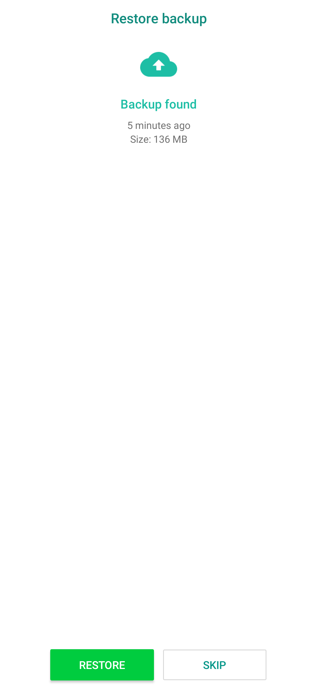</a>
  <span class="md_figcaption">
  </span>
</div>

The idea here was to do everything with the graphical UI of the computer and the phone. It seems (*), however, that we cannot fully avoid the command line. Namely, when we copy the Whatsapp folder, its ownership gets changed. This prevents the app from saving anything to the phone. To fix this, you will need to enable the [**Developer mode**](/Support/Help_Articles/Enabling_Developer_Mode/)  on the phone and give the following commands on the Terminal app:

```
cd $HOME
devel-su
chown -R media_rw:media_rw android_storage/WhatsApp
```

Done.
________

(*) We are looking for alternative ways to do this easily.

# Troubleshooting

**Q: I can't get all my contacts to show in WhatsApp. Some show names, but some just show the phone number**

On Sailfish 4 and on the latest releases of Sailfish 3, the contacts saved in the People app should automatically appear in WhatsApp, given that you have given the permission for this in the settings of WhatsApp.

A1: If you have an Xperia XA2 or Xperia 10, then follow step #5 in [this chapter](#making-sure-whatsapp-gives-notifications-even-when-not-open) to give the required permissions. Should this not help, carry on reading the instructions just below the next two pictures.

A2: If you have an Xperia X, Jolla C, Jolla Tablet or Jolla Phone, then this is for you.
First, please make sure that you have given Android applications permission to access your contacts in Settings > Android ™ App Support - the pictures below represent the Sailfish settings for Android App Support on Jolla1, JollaC and Xperia X devices:

<div class="flex-images" markdown="1">

* <a href="AAS-4.4-1.png"></a>
  <span class="md_figcaption">
  </span>
* <a href="AAS-4.4-2.png"></a>
  <span class="md_figcaption">
  </span>
  Screen captures from setting up the whatsapp 
</div>

If activating this setting does not solve the issue, please read on.

Below is a list of everything you can try to jostle up WhatsApp to find all your contacts. You don't have to try all of them, but we recommend you start from the first suggestion that is least intrusive and easy, and continue down the list only if the issue isn't solved for you.

* Go to WhatsApp "Settings" > "Contacts" (i.e. touch the 3 dots at top right corner; then touch Contacts). Activate "Show all contacts" option.
* Return to the home view of the app.
* Tap on the green “New Chat” button at the lower right corner of WhatsApp main view. Select the three dots (top-right) and select "Refresh". This is great for updating your WhatsApp contacts with changes made to their e.g. phone numbers in the People app.
* Restart (stop and start) Android ™ App Support from the Android ™ App Support page in Settings (see screenshots above).
* Restart WhatsApp
* Restart your device.
* Try the troubleshooting steps provided by WhatsApp in the WhatsApp application. You can find them as follows:

1) Press the New Chat button:

<div class="flex-images" markdown="1">

* <a href="Screenshot-17-03-27-16-33-15.png" class="narrow-image">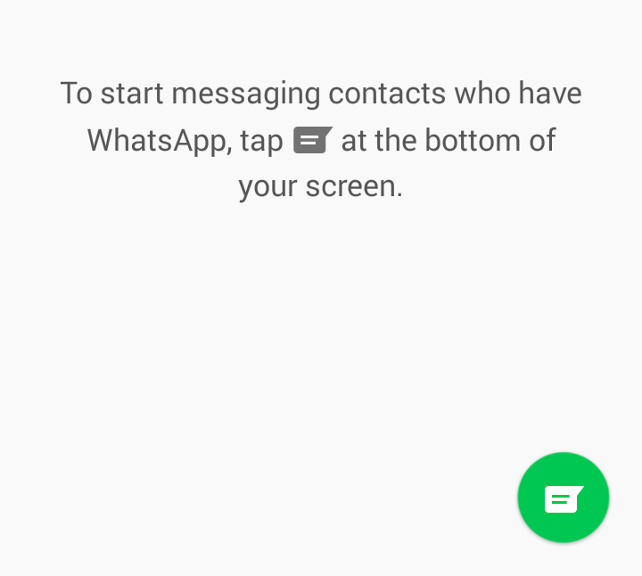</a>
  <span class="md_figcaption">
  </span>
</div>

2) In the next view, press the three dots top-right and select Help:

<div class="flex-images" markdown="1">

* <a href="Screenshot-17-03-27-16-36-20.png" class="narrow-image">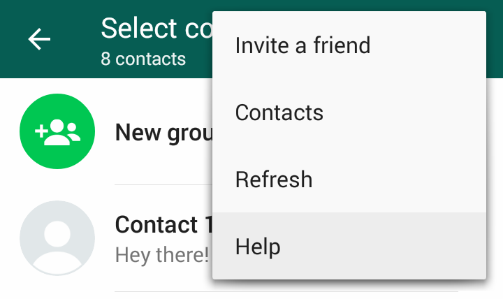</a>
  <span class="md_figcaption">
  </span>
</div>

3) Please try out the steps suggested in the next view.

If your problems continue even after these steps, we can only suggest you check in the People app that contact information for these certain contacts are in order (e.g. no multiple numbers, incorrect numbers).

**Q: I can't send pictures or videos. Whatsapp reports "this picture does not exist in the phone memory"**

Did you forget to run the commands at the end of [this chapter](#moving-your-whatsapp-data-to-a-new-phone)? That should help.
