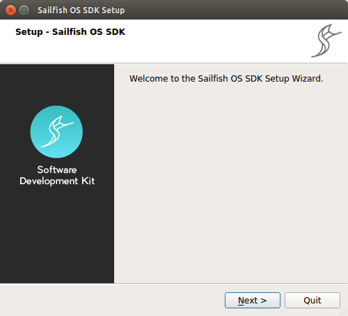
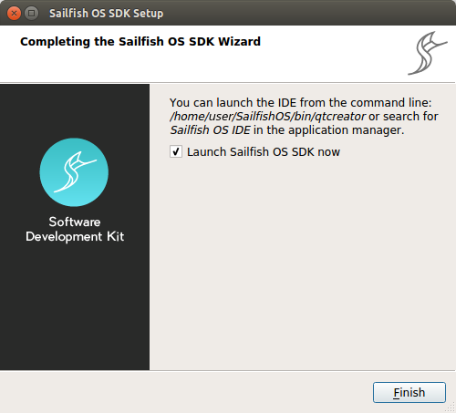

We provide a graphical installer to make it easy to setup the Sailfish SDK.

## Supported Environments

Sailfish SDK functionality has been verified on the following systems:

  - Ubuntu 18.04 64 bit
  - Windows 10 64 bit
  - OS X 10.12.6

Sailfish SDK should work on other Linux flavours as well, but at this stage, its functionality on other host environments has not been fully verified.

## Common pre-requisites

  - Virtualization platform. On Linux and Windows, both Oracle VirtualBox (version 4.1.18 or higher) and Docker (version 18.09.3 or higher) are supported. On MacOS, only VirtualBox is supported. On Linux, you should install the virtualization platform packages supplied by your distribution. On other operating systems, we recommend using installation packages from <http://www.virtualbox.org> or <https://hub.docker.com/search/?q=&type=edition>
  - For emulator you need Oracle VirtualBox regardless of your choice of virtualization for the build engine
  - Git is a prerequisite for the Sailfish SDK on Windows. Git for Windows can be obtained Git from <https://git-scm.com/download/win>
  - About 15GB of free disk space for the default component selection
  - 4GB of RAM or more is recommended.
  - libtinfo.so.5 is required on Linux - not all distributions ship this library by default
      - On Ubuntu 20.04, the package libtinfo5 may be installed.
      - On Fedora the package ncurses-compat-libs may be installed
      - If you find no way to fix libtinfo.so.5 on your system, you may try creating it as a symbolic link to your system libncurses.so.5 (or even libncurses.so.6 or libtinfo.so.6)

See also [Sailfish SDK Known Issues](/Tools/Sailfish_SDK/Known_Issues).

### SDK Installer on Linux

1.  [Download](/Tools/Sailfish_SDK#latest-sdk-release) the run file
2.  Open the Terminal application on your host system.
3.  Provide executable permissions to it: `$ chmod +x ~/Downloads/<installer_name>`
4.  Run the installer as a normal user (i.e. not as root user). By default it will install to `SailfishOS/` in your home directory.
    ```
    $ ./Downloads/<installer_name>
    ```

### SDK Installer on Windows

1.  [Download](/Tools/Sailfish_SDK#latest-sdk-release) SDK Installer application to your downloads folder and locate it with Explorer.
2.  Open SDK installer by double-clicking the SDK Installer application.

### SDK Installer on OS X

1.  [Download](/Tools/Sailfish_SDK#latest-sdk-release) SDK Installer package.
2.  Open SDK Installer package by double-clicking the icon.
3.  Open the SDK Installer application found from the package.

## Common installation flow

The SDK installer window will open as shown below. The installation itself is pretty simple.

<a href="Installer_01.png" style="width:30em;display:block">
    
</a>

Click **Next**, follow the setup wizard and read and accept the license agreement. The default values are usually OK. If you wish, you can see the details of the files being installed. After a successful installation you should see a window like the one shown below.

<a href="Installer_02.png" style="width:30em;display:block">
    
</a>

Click **Finish**. The Sailfish IDE launches automatically once the setup wizard exits.

## Launching the Sailfish IDE

  - The SDK will be added to your system menus and a launch icon will be available for future sessions.
  - On Linux you can launch the Sailfish IDE from desktop launcher by typing `Sailfish IDE` and choosing the appropriate icon. Alternatively, you can stat it from command line by running `~/SailfishOS/bin/qtcreator`.
  - On Windows you can launch the Sailfish IDE by pressing Start and typing `Sailfish IDE` and choosing the appropriate application.
  - On OS X you can launch the Sailfish IDE by opening Launchpad and typing `Sailfish IDE`. (With Spotlight it can be found by typing `Qt Creator`.)
  - Once SDK is installed, proceed to creating your first application!
