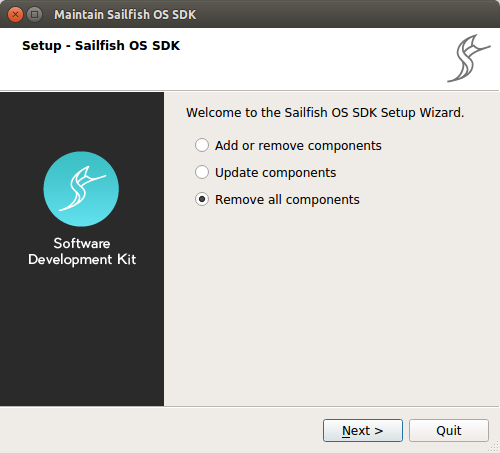
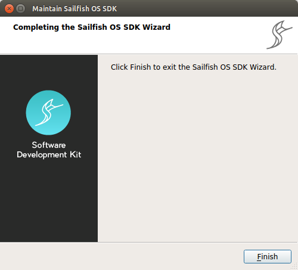

## SDK Uninstallation

The Sailfish SDK comes with a maintenance tool, named `SDKMaintenanceTool` that can be used to remove the complete installation (for Windows 8 read [known issues](/Tools/Sailfish_SDK/Known_Issues)). You can find it listed in your host distribution’s system menu or directly in the installed directory, for example in Linux `~/SailfishOS`.

### Pre-requisites

  - The emulator and build engine virtual machines are powered off.
  - The VirtualBox software is not running.
  - The Sailfish IDE (Qt Creator) is not running.

### Uninstallation

Run the SDKMaintenanceTool

  - On Linux open terminal and type `$ ~/SailfishOS/SDKMaintenanceTool`
  - On Windows press Start and type `SDKMaintenanceTool`
  - In OS X open Spotlight (cmd+space) and type `SDKMaintenanceTool`

Select **Remove all components** and click **Next**.

Follow the instructions on the wizard. Once the uninstallation has completed successfully, you will see the following screen. Click **Finish** to exit the wizard.

