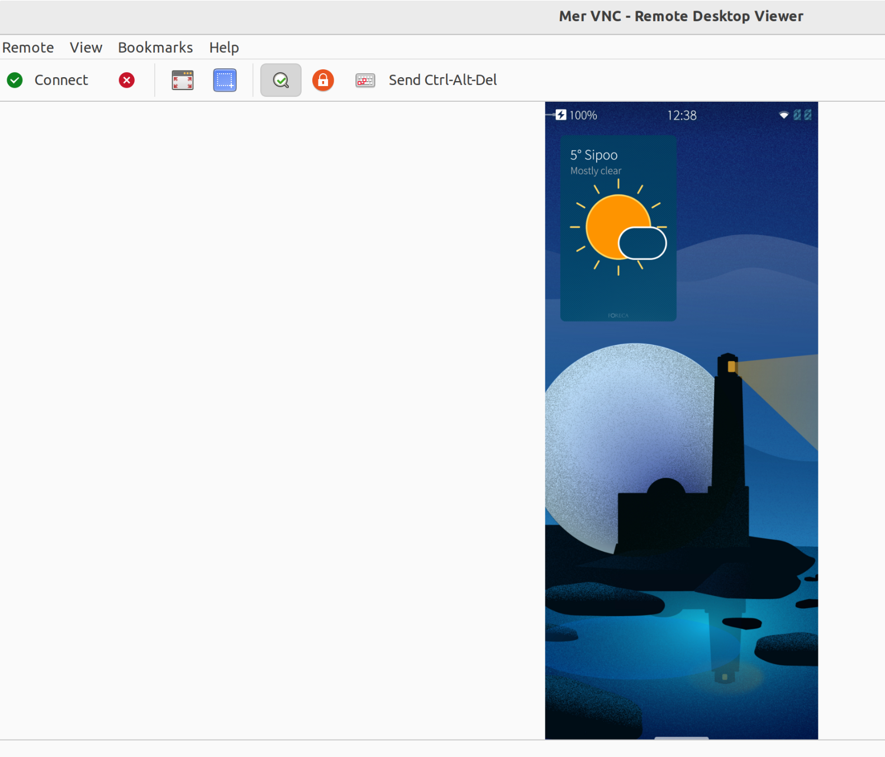
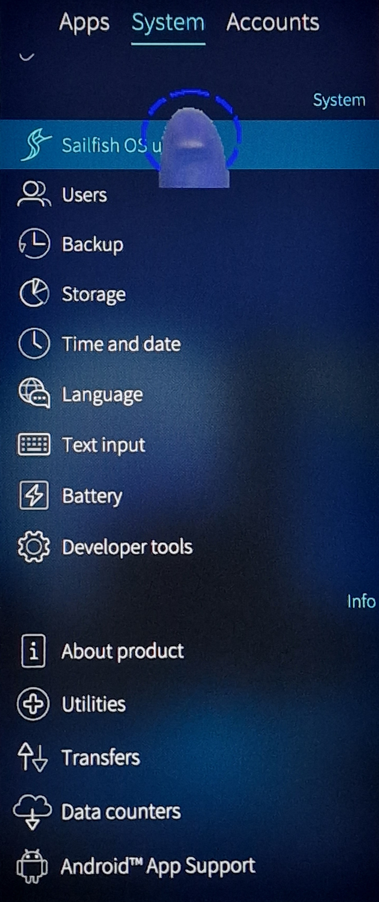

# Overview

**[Virtual Network Computing (VNC)](https://en.wikipedia.org/wiki/Virtual_Network_Computing)** is a graphical desktop program and protocol that allows to remotely control another networked device, in this context a Sailfish OS device.

This document describes how to prepare a Sailfish device for VNC and how to connect to it from a VNC client running on a desktop computer.

# Installing VNC server to Sailfish device

**NOTE: Don't install this package if you care about security. There is no protection in this VNC server.**

Do the following with the root permissions:

 ```
devel-su
pkcon refresh

pkcon install lipstick2vnc

  The following packages have to be installed:
  libvncserver-0.9.10+git2-1.2.3.jolla.aarch64	a library to make writing a vnc server easy
  lipstick2vnc-0.10.0-1.5.1.jolla.aarch64	A VNC server for Sailfish OS QA
  Proceed with changes? [N/y] y

reboot
 ```
The VNC server is installed now. 
  
# Connecting from VNC client on a desktop to Sailfish device

There are many options for VPN clients available. When writing this document, Vinagre was used on a Ubuntu desktop. 

Before a connection from Vinagre to the Sailfish device can be made the systemd **socket listener** must be started - do it as the 'defaultuser':

 ```
 systemctl --user start vnc.socket
 ```
 
 Connect the Sailfish device with a USB cable to the desktop computer. Choose "Developer mode" at the moment of connection. This assigns the default address of 192.168.2.15 for the Sailfish OS devide.
 
 On Ubuntu Vinagre (or another VNC client), choose "VNC" for the protocol. Next, open the Connect dialogue and type the following host address:
 
  ```
 192.168.2.15:5900
 ```
 
 Click 'Connect'.
 
 If you want to connect over WLAN (instead of USB), you will need to check the WLAN address of the Sailfish device in the menu "Settings > System > Developer tools > WLAN IP addess". Use the same port number, i.e. 5900. 
 
 
# Sailfish display on desktop screen
 
 The current view on the Sailfish display should appear on the desktop screen, too. 
 
 The first picture shows the Vinagre user-interface with the projection of the Sailfish display. 
 
 <div class="flex-images" markdown="1">

* <a href="Vinagre_phone_view_no_thumb.png"></a>
  <span class="md_figcaption">
    Vinagre has a connection to a Sailfish device
  </span>
</div>


The picture below introduces the thumb-shaped cursor that appears when the desktop cursor is moved above the Sailfish display. 
It is possible to control the phone remotely by clicking the Sailfish items with the desktop mouse, even type some text with the Sailfish virtual keypad. Edge-swiping may be difficult but possible in theory.

<div class="flex-images" markdown="1">

* <a href="Vinagre_phone_view_thumb.png" class="narrow-image"></a>
  <span class="md_figcaption">
    Thumb cursor
  </span>
</div>

# Removing the VNC server

 ```
devel-su
pkcon remove lipstick2vnc libvncserver
pkcon refresh
 ```
 
 Check that the removal worked - the command below should not print anything:
 ``` 
 rpm -qa |grep vnc
 ``` 
 
 
 

 
